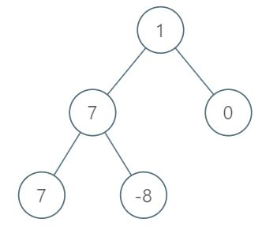
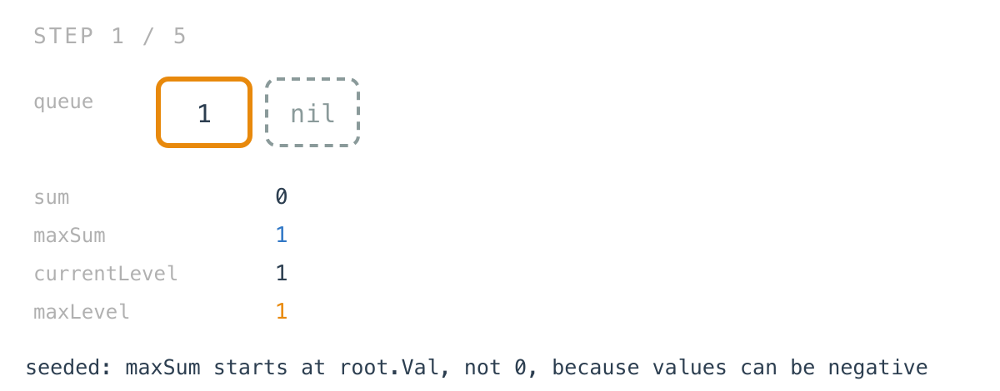
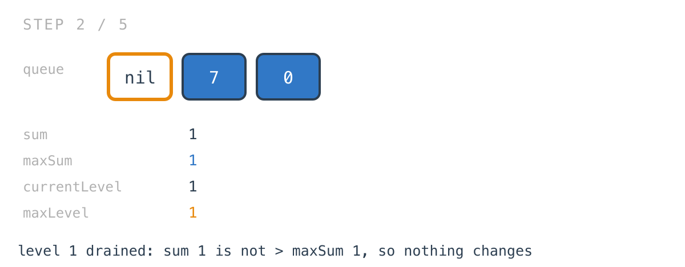
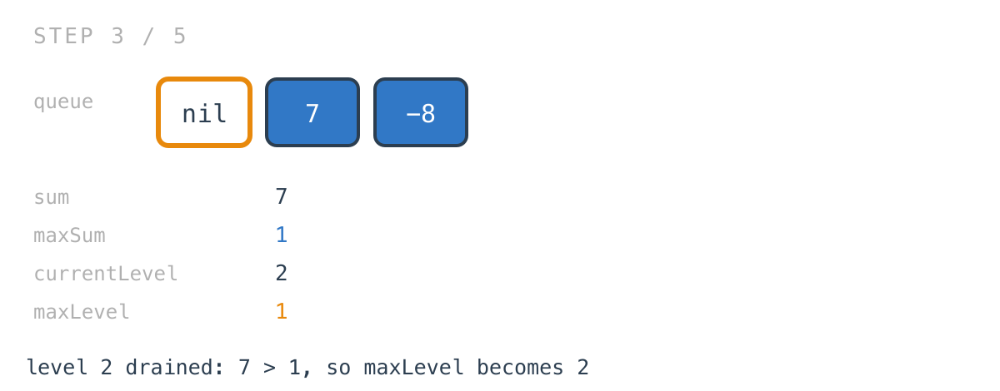
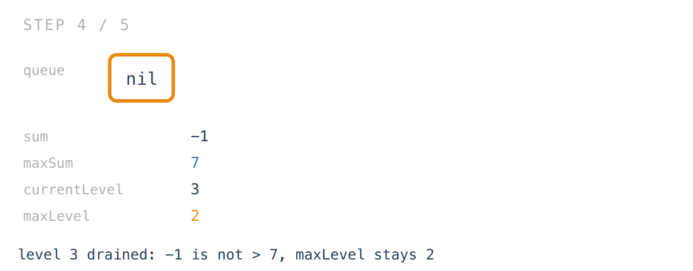
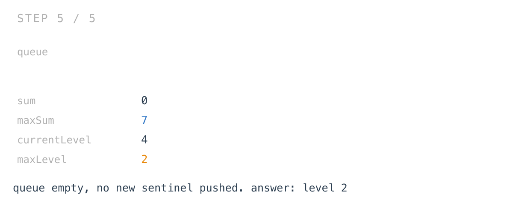

# Maximum Level Sum of a Binary Tree

*365 Days of LeetCode Challenge — Day 20/365*

🔗 [LeetCode #1161](https://leetcode.com/problems/maximum-level-sum-of-a-binary-tree/) · Difficulty: Medium

Most of the difficulty in this problem is not in the algorithm. The traversal is one you have
now written three times this week, and the aggregation is addition.

The difficulty is in a single word in the problem statement, and in whether you noticed that
your solution already handles it, already gets it wrong, or handles it by accident.

### The problem

The root is level 1, its children level 2, and so on. Return the smallest level `x` such
that the sum of all values at level `x` is maximal.



### The intuition

Two things have to be true at once here, and only one of them is about sums.

The first is the obvious part: add up each level, keep the biggest total. That's the same
per-level aggregation as Day 14, over the same nil-sentinel BFS as Day 16 — push a `nil`
behind the root, and every time it surfaces a level has finished and its running total is
complete.

The second requirement is in the wording, and it's easy to skim: return the *smallest*
level whose sum is maximal. Ties go to the shallower level.

That isn't handled with extra code. It falls out of one character — the comparison is
`sum > maxSum`, strictly greater. A later level matching the current best doesn't beat it,
so `maxLevel` keeps the earlier value. Write `>=` instead and the function still returns a
level with the maximum sum, but the wrong one whenever there's a tie.

There's a second quiet decision doing real work: `maxSum` starts at `root.Val`, not at
zero. Node values can be negative, and on a tree whose every level sums negative a zero
start would never be beaten, leaving `maxLevel` at its initial value by luck rather than by
comparison. Seeding from the root makes the first real comparison one between two actual
level sums.

The level counter starts at 1 rather than 0, because the problem numbers levels from 1.
Worth noticing only because the previous few days all indexed from 0, and this is the kind
of off-by-one that survives testing on symmetric examples.

### Builds on

- [Day 16: Binary Tree Zigzag Level Order Traversal](https://github.com/architagr/leetcode_solutions/blob/main/medium_problems/101_200/binary_tree_zigzag_level_order_traversal/) — the nil sentinel in the queue, used the same way to know when a level's total is final
- [Day 14: Average of Levels in Binary Tree](https://github.com/architagr/leetcode_solutions/blob/main/easy_problems/601_700/average_of_levels_in_binary_tree/) — aggregating one number per level rather than collecting the nodes
- [Day 15: Binary Tree Level Order Traversal](https://github.com/architagr/leetcode_solutions/blob/main/medium_problems/101_200/binary_tree_level_order_traversal/) — level order as the underlying shape, here without needing to keep the values

### The solution

```go
func maxLevelSum(root *TreeNode) int {
	queue := make([]*TreeNode, 0)
	// push and pop closures elided - see the repo
	currentLevel := 1
	maxLevel := 1
	maxSum := root.Val
	sum := 0
	push(root)
	push(nil)
	for len(queue) > 0 {
		node := pop()
		if node == nil {
			if sum > maxSum {
				maxLevel = currentLevel
				maxSum = sum
			}
			currentLevel++
			sum = 0
			if len(queue) > 0 {
				push(nil)
			}
			continue
		}
		sum += node.Val
		if node.Left != nil {
			push(node.Left)
		}
		if node.Right != nil {
			push(node.Right)
		}
	}
	return maxLevel
}
```

Tracing `[1,7,0,7,-8,null,null]`: root `1` with children `7` and `0`; the left `7` has
children `7` and `-8`. Level sums are `1`, `7`, `-1`, so the answer is level `2`.

Nothing stores a level. Four variables carry all the state, and once a level's total is
folded in, its values are gone.



Level 1's total is `1`, which is not strictly greater than the seeded `maxSum` of `1`, so
nothing changes — correctly, since level 1 is already the answer so far.



Level 2 sums to `7` and does beat it.



Negative levels lose without any special handling.



The re-push guard is the same one as Day 16: the fresh sentinel only goes on if the queue
still holds nodes, or the final sentinel would be re-added forever.



Only non-nil children are ever pushed, which is what lets `node == nil` mean "level
boundary" unambiguously rather than "a child that happened to be missing."

And the function returns `maxLevel`, not `maxSum` — the problem asks which level, not how
much. Easy to get backwards on a first read.

O(n) time, every node pushed and popped once and contributing one addition. Space is O(w)
for the queue, where w is the width of the widest level; the output is a single int.

---

It is worth being able to point at the line that satisfies each clause of a problem statement.
Here, "maximal" is the if-statement and "smallest" is the greater-than sign inside it, and if
you cannot say which character does which, a passing test suite is telling you less than you
think.

Full code and the step-by-step walkthrough:
[maximum_level_sum_of_a_binary_tree](https://github.com/architagr/leetcode_solutions/blob/main/medium_problems/1101_1200/maximum_level_sum_of_a_binary_tree/SOLUTION.md)

---

*Solution and code by Archit Agarwal. Write-up drafted with AI assistance from the code and problem statement.*
