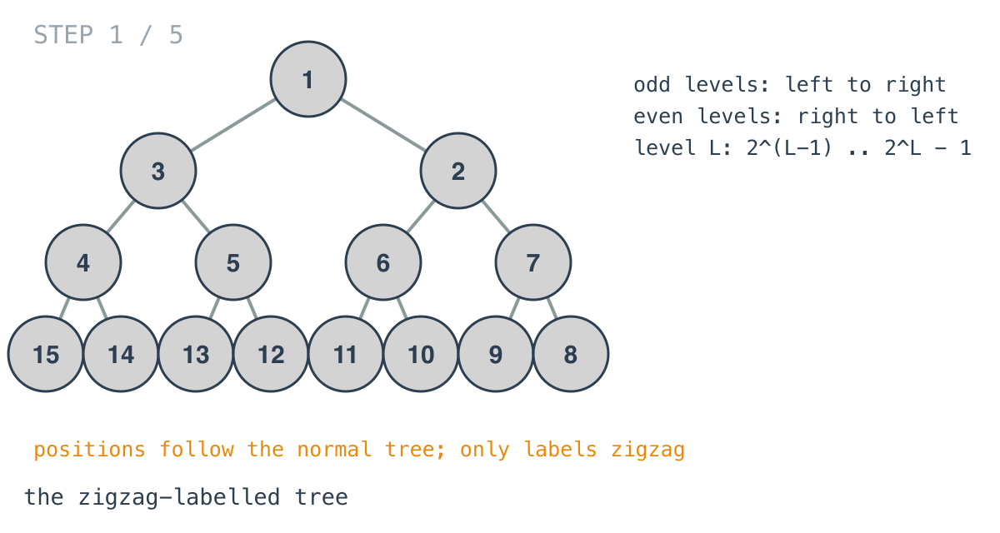
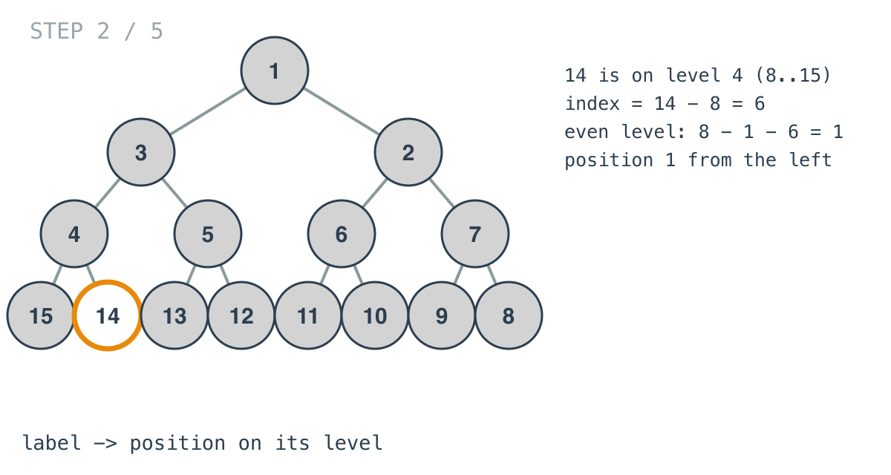
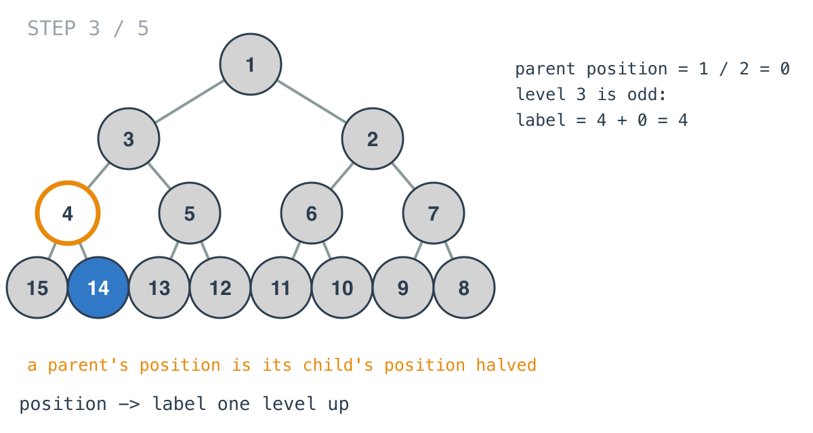
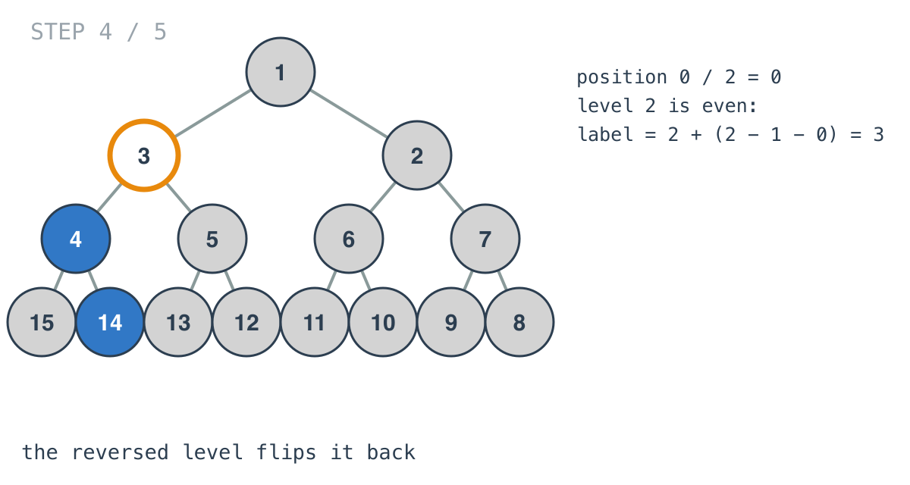
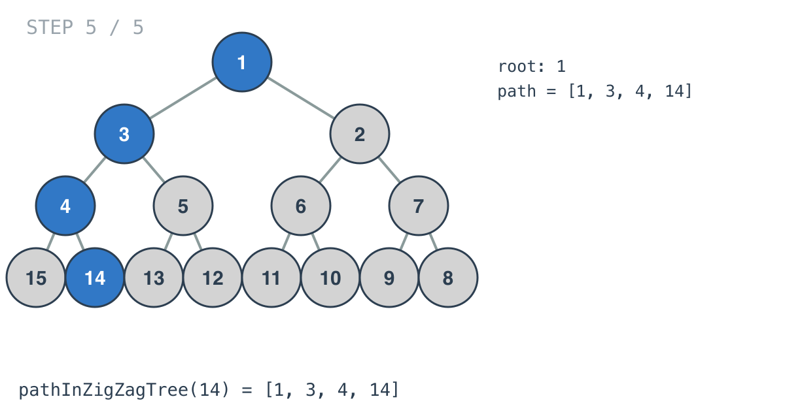

## Solution walkthrough

`pathInZigZagTree(label int) []int` in `main.go` finds the row the label is on, turns the
label into a position within that row, and climbs to the root by halving positions and
turning each back into a label.

We'll trace Example 1: `label = 14`, expected `[1,3,4,14]`.

1. **The tree.** Row `L` holds labels `2^(L-1)` to `2^L - 1`. Odd rows count left to right;
   even rows right to left.

   

2. **Which row.** `findLevel` finds the smallest `level` with `2^level > label`: 14 is on
   row 4, which spans 8 to 15.

3. **Label to position.** `index := label - levelStartVal` is `14 - 8 = 6`. Row 4 is even,
   so it's counted from the right: `index = levelStartVal - 1 - index = 8 - 1 - 6 = 1`.
   14 is second from the left.

   

4. **Climb one row.** `index /= 2` gives the parent's position, 0. Row 3 is odd, so its
   label is `pow2(level-1) + tempIndex = 4 + 0 = 4`.

   

5. **The flip on even rows.** Position `0 / 2 = 0` on row 2. Row 2 is even, so
   `tempIndex = pow2(level-1) - 1 - tempIndex = 1`, and the label is `2 + 1 = 3`.

   

6. **The root.** Row 1 gives 1. The path, filled from the back, is `[1, 3, 4, 14]`.

   

**Complexity:** O(log label) time and space.
