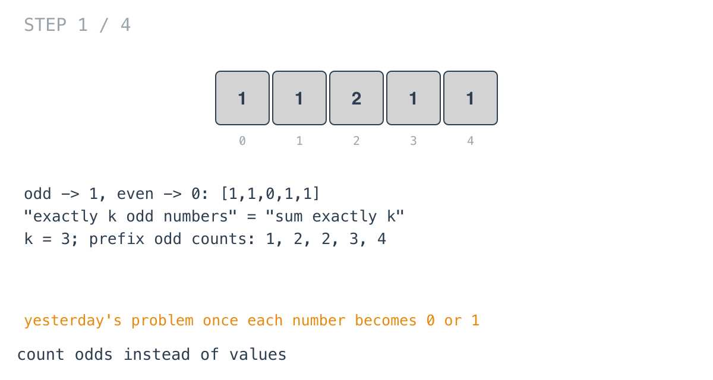
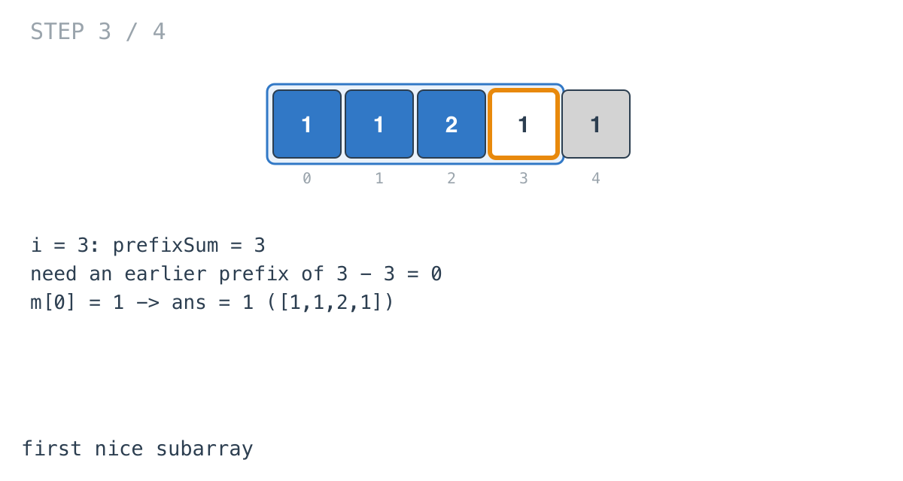
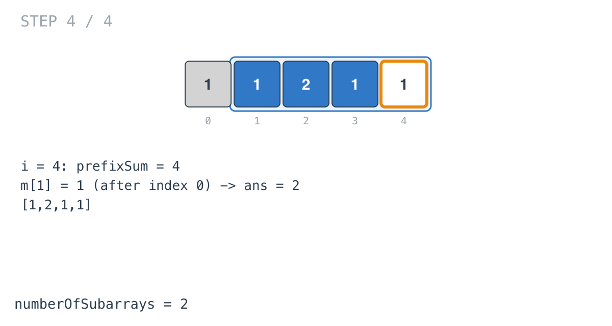

## Solution walkthrough

`numberOfSubarrays(nums []int, k int) int` in `count_number_of_nice_subarrays.go` keeps a
running count of odd numbers and a map of how many times each count has appeared.

We'll trace Example 1: `nums = [1,1,2,1,1]`, `k = 3`, expected `2`.

1. **Odds as ones.** `if nums[i]%2 == 1 { prefixSum++ }`. The running odd counts are
   1, 2, 2, 3, 4. A subarray `(j, i]` has `prefixSum[i] - prefixSum[j]` odd numbers.

   

2. **Seed the empty prefix.** `m[0]++` before the loop: before index 0, zero odd numbers
   have been seen. Without it, subarrays starting at index 0 would never be counted.

   ![Step 2: m[0] = 1](images/walkthrough-2.png)

3. **Look up, then record.** Each step does `ans += m[prefixSum-k]`, then `m[prefixSum]++`.
   At `i = 3` the count is 3, and `m[0] = 1`: the subarray `[1,1,2,1]` from the start.
   `ans = 1`.

   

4. **One more.** At `i = 4` the count is 4, and `m[1] = 1` (the count after index 0):
   `[1,2,1,1]`. `ans = 2`.

   

The lookup happens before `m[prefixSum]++`, so the current position is never paired with
itself; with `k >= 1` that couldn't match anyway, but it's the order that keeps the logic
right for any `k`.

**Complexity:** O(n) time, O(n) space.
