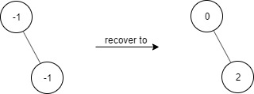
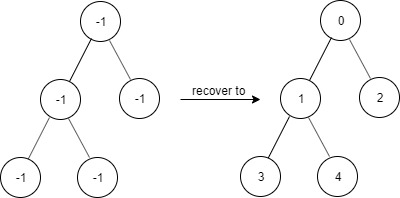
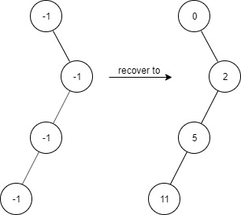

# Find Elements in a Contaminated Binary Tree

Difficulty: Medium

[LeetCode #1261](https://leetcode.com/problems/find-elements-in-a-contaminated-binary-tree/)

Given a binary tree with the following rules:

1. `root.val == 0`
2. For any `treeNode`:
   1. If `treeNode.val` has a value `x` and `treeNode.left != null`, then
      `treeNode.left.val == 2 * x + 1`
   2. If `treeNode.val` has a value `x` and `treeNode.right != null`, then
      `treeNode.right.val == 2 * x + 2`

Now the binary tree is contaminated, which means all `treeNode.val` have been changed to
`-1`.

Implement the `FindElements` class:

- `FindElements(TreeNode* root)` Initializes the object with a contaminated binary tree and
  recovers it.
- `bool find(int target)` Returns `true` if the `target` value exists in the recovered
  binary tree.

## Example 1



```
Input
["FindElements","find","find"]
[[[-1,null,-1]],[1],[2]]
Output
[null,false,true]
```

## Example 2



```
Input
["FindElements","find","find","find"]
[[[-1,-1,-1,-1,-1]],[1],[3],[5]]
Output
[null,true,true,false]
```

## Example 3



```
Input
["FindElements","find","find","find","find"]
[[[-1,null,-1,-1,null,-1]],[2],[3],[4],[5]]
Output
[null,true,false,false,true]
```

## Constraints

- `TreeNode.val == -1`
- The height of the binary tree is less than or equal to `20`
- The total number of nodes is between `[1, 10^4]`
- Total calls of `find()` is between `[1, 10^4]`
- `0 <= target <= 10^6`
