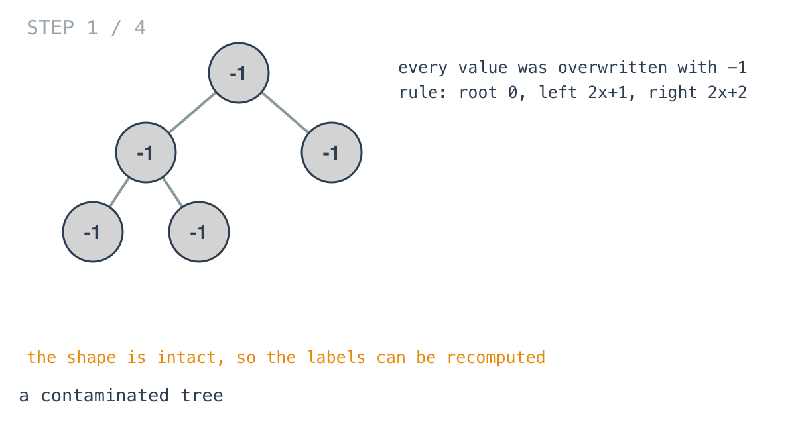
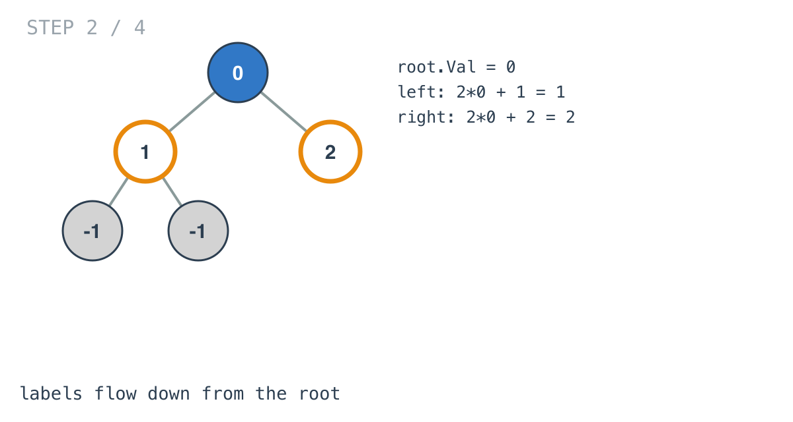
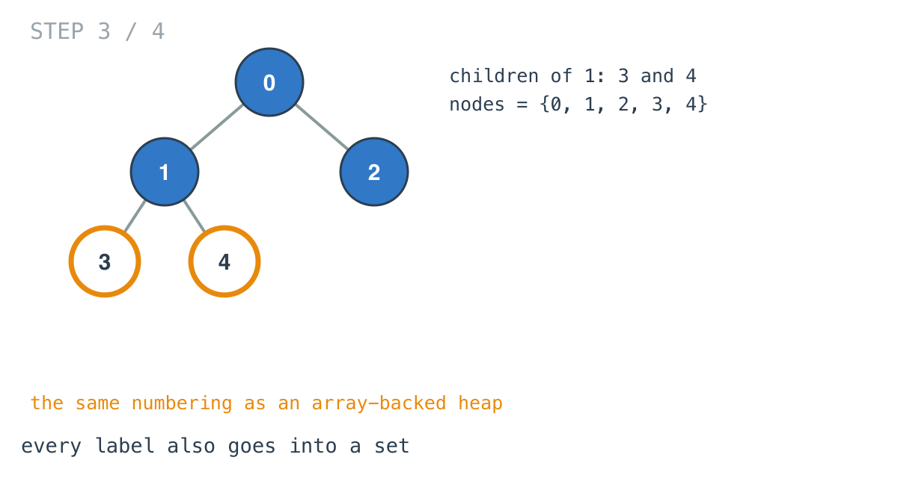
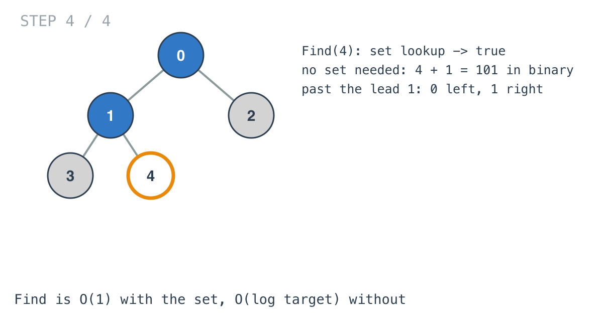

## Solution walkthrough

`Constructor(root)` in `main.go` recomputes every value with `updateNode` and records each
one in a set; `Find` looks the target up.

We'll trace Example 2: `[-1,-1,-1,-1,-1]` with finds for 1, 3 and 5.

1. **A contaminated tree.** Every value is -1, but the shape is intact.

   

2. **Start from the root.** `root.Val = 0`, and 0 goes into `data`. `updateNode` then
   applies the rule to each child: `node.Left.Val = 2*node.Val + 1`,
   `node.Right.Val = 2*node.Val + 2`. The root's children become 1 and 2.

   

3. **All the way down.** Node 1's children become 3 and 4. Every value set is also added
   to `data`, which ends up as `{0, 1, 2, 3, 4}`.

   

4. **Find is a lookup.** `_, ok := this.nodes[target]`. 1 and 3 are present, 5 isn't. The
   labels also encode paths (target + 1 in binary, after the leading 1: 0 = left, 1 =
   right), so a set isn't the only way; see INTUITION.md.

   

**Complexity:** O(n) to build, O(1) per `Find`, O(n) space.
