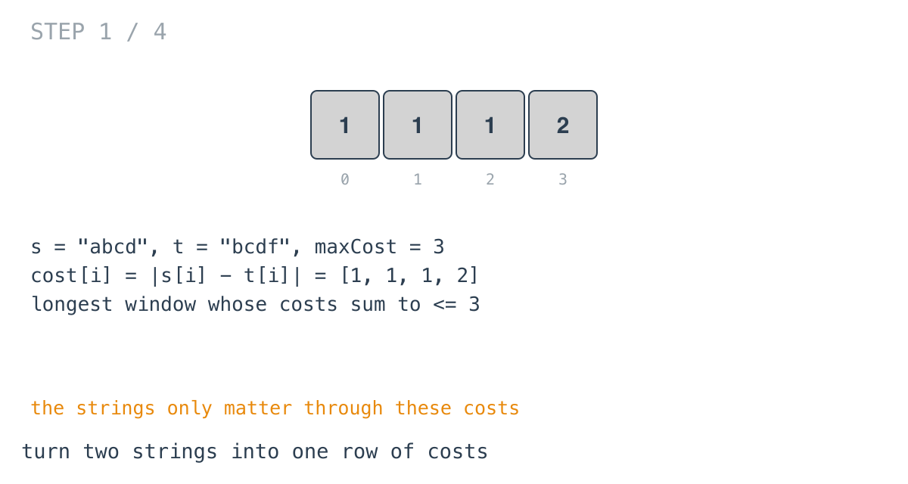
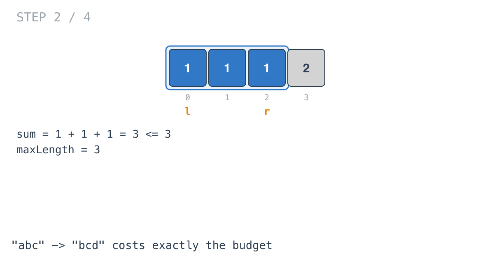
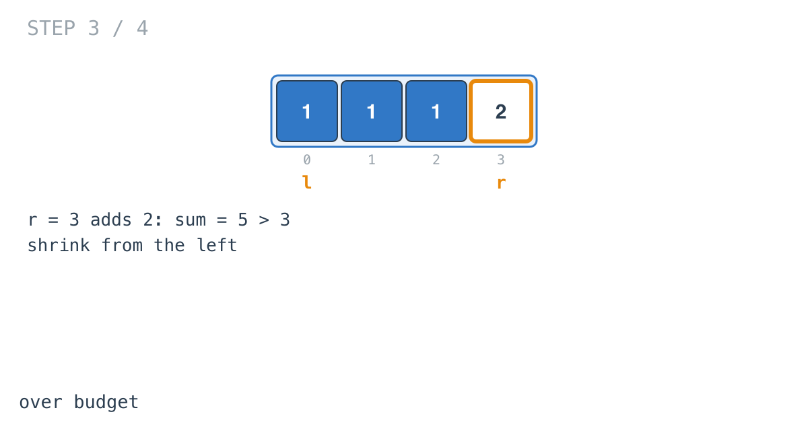
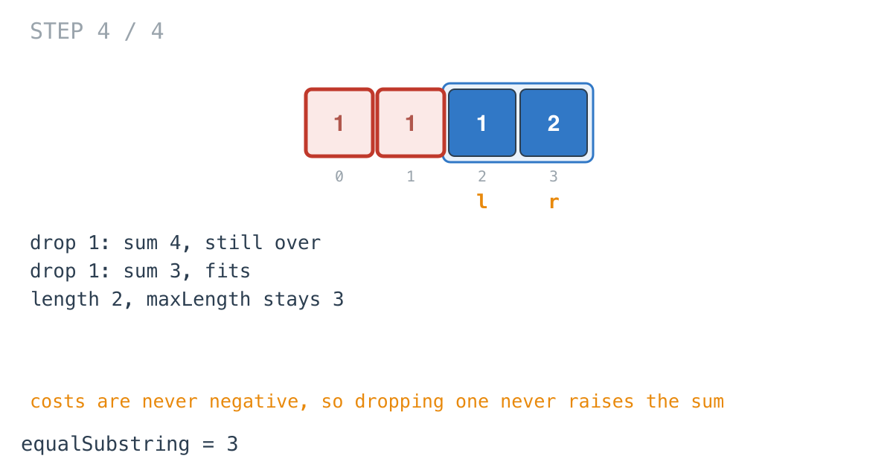

## Solution walkthrough

`equalSubstring(s, t string, maxCost int) int` in `get_equal_substrings_within_budget.go`
slides a window over the per-position costs `|s[i] - t[i]|` and keeps the longest one that
fits the budget.

We'll trace Example 1: `s = "abcd"`, `t = "bcdf"`, `maxCost = 3`, expected `3`.

1. **Costs, computed on the fly.** `absDiff(s[r], t[r])` is the cost of position `r`.
   Here the costs are `[1, 1, 1, 2]`. Nothing else about the strings matters.

   

2. **Grow and record.** `sum += absDiff(s[r], t[r])`, then after any shrinking,
   `maxLength = maxVal(maxLength, r-l+1)`. The first three positions sum to exactly 3, so
   `maxLength = 3`.

   

3. **Over budget.** At `r = 3` the cost 2 pushes `sum` to 5.

   

4. **Shrink from the left.**

   ```go
   for sum > maxCost {
       sum -= absDiff(s[l], t[l])
       l++
   }
   ```

   Dropping the first cost leaves 4, still over; dropping the second leaves 3. The window
   is `[2..3]`, length 2. `maxLength` stays 3.

   

**Complexity:** O(n) time, O(1) space.
