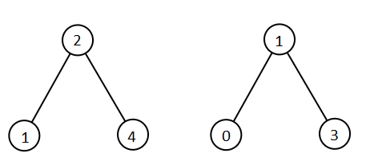

# All Elements in Two Binary Search Trees

Difficulty: Medium

[LeetCode #1305](https://leetcode.com/problems/all-elements-in-two-binary-search-trees/)

Given two binary search trees `root1` and `root2`, return *a list containing all the
integers from both trees sorted in **ascending** order*.

## Example 1



```
Input: root1 = [2,1,4], root2 = [1,0,3]
Output: [0,1,1,2,3,4]
```

## Example 2


```
Input: root1 = [1,null,8], root2 = [8,1]
Output: [1,1,8,8]
```

## Constraints

- The number of nodes in each tree is in the range `[0, 5000]`.
- `-10^5 <= Node.val <= 10^5`
