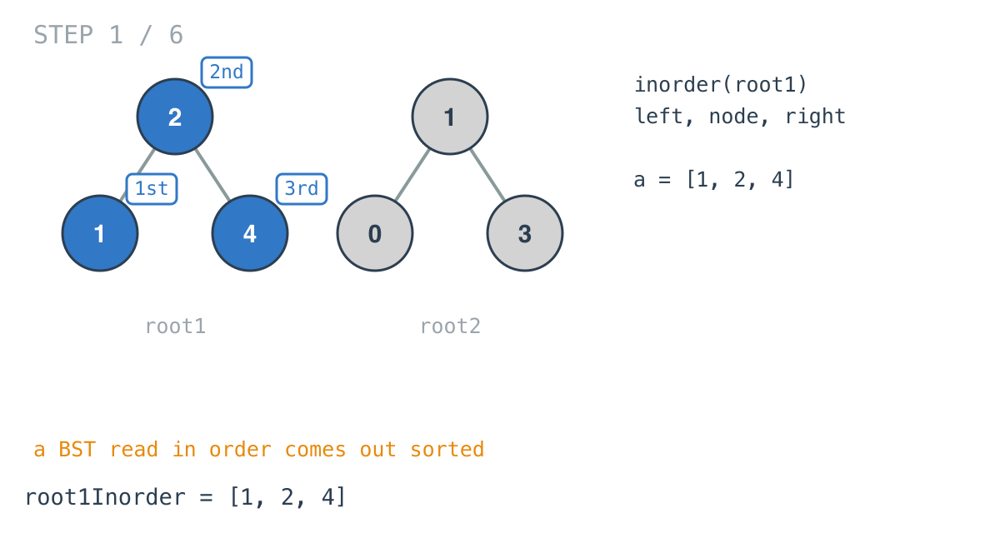
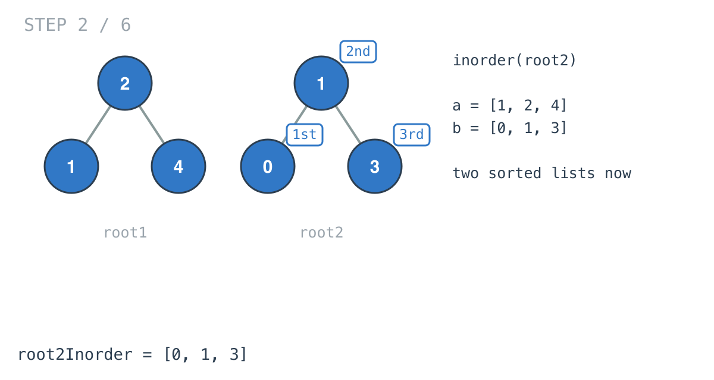
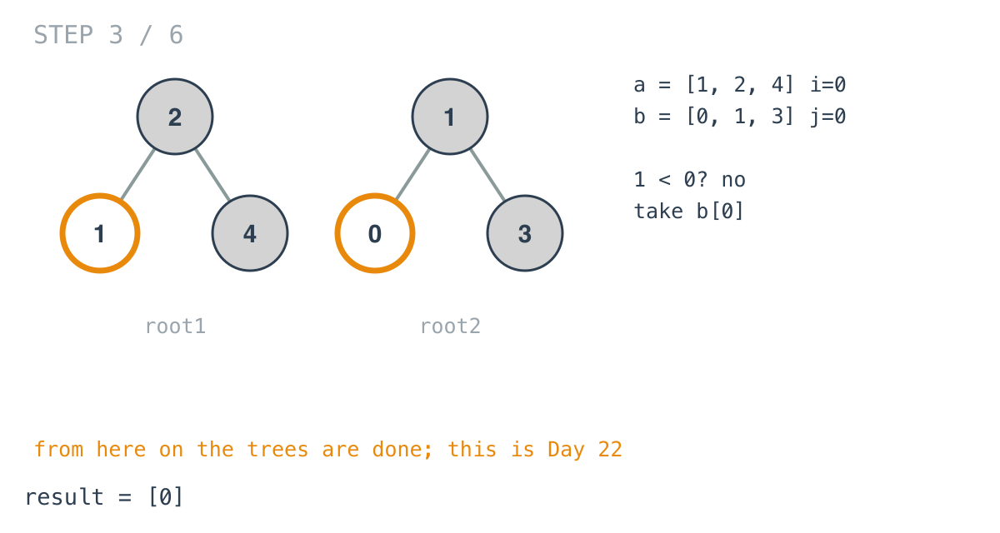
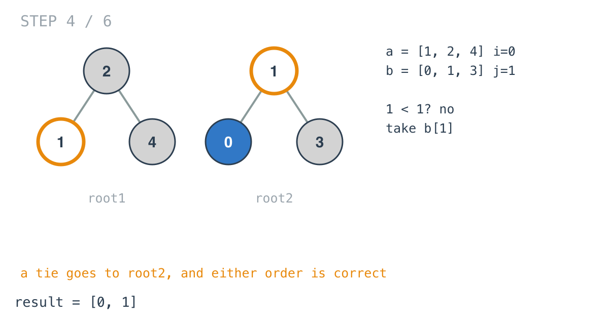
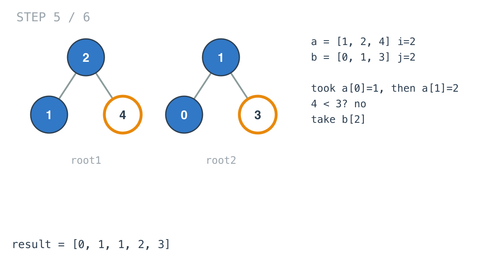
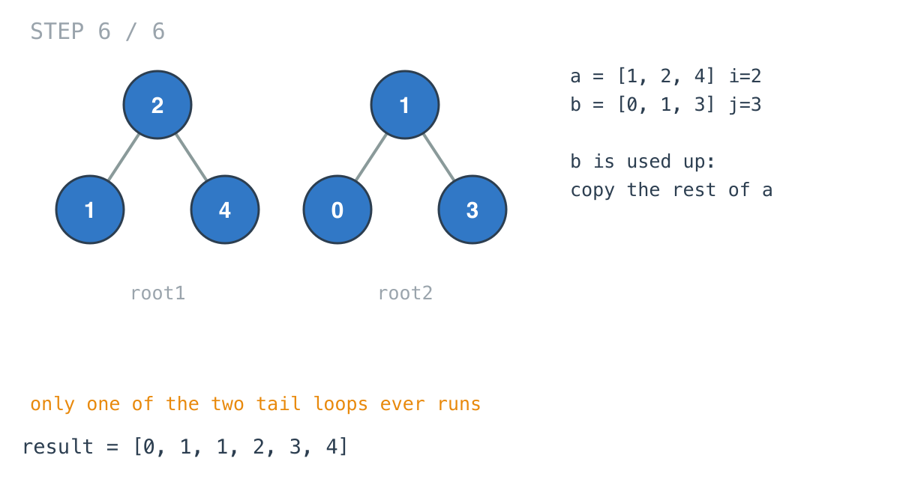

## Solution walkthrough

`main.go` has two functions: `inorder`, which flattens one BST into a sorted slice, and
`getAllElements`, which calls it on both trees and merges the results.


We'll trace Example 1: `root1 = [2,1,4]`, `root2 = [1,0,3]`, expected
`[0,1,1,2,3,4]`.

1. **`inorder` threads one slice through the recursion.**

   ```go
   arr = inorder(root.Left, arr)
   arr = append(arr, root.Val)
   arr = inorder(root.Right, arr)
   return arr
   ```

   Left subtree, then the node, then the right subtree. Because `append` can reallocate,
   each call returns the slice and the caller keeps the returned one; appending to a
   copy and throwing it away would lose values. For `root1` this produces `[1, 2, 4]`.

   

2. **Same for the second tree.** `root2Inorder` is `[0, 1, 3]`. From here on the trees
   are never looked at again. What's left is merging two sorted slices.

   

3. **Preallocate the output.** `make([]int, 0, len(root1Inorder)+len(root2Inorder))`
   sizes the result exactly, so none of the appends that follow have to grow it.

4. **Merge while both sides have values.** `i` and `j` index the two slices. Each round
   appends the smaller of `root1Inorder[i]` and `root2Inorder[j]` and advances that
   index. First round: `1 < 0` is false, so `0` comes from the second tree.

   

5. **Ties go to the second tree.** Next round compares `1` with `1`. `1 < 1` is false,
   so the `else` branch takes root2's `1`. Either order gives the same output here.

   

6. **Keep going until one side runs out.** root1's `1` and `2` are both smaller than
   `3` and go in next. Then `4 < 3` is false, so `3` goes in and `j` reaches the end of
   `root2Inorder`. The loop condition fails.

   

7. **Copy whatever is left.** Two tail loops follow, one per slice. Only root1's has
   anything left, the single `4`, and it's bigger than everything already in `result`,
   so it's appended as is. Final answer `[0, 1, 1, 2, 3, 4]`.

   

**Complexity:** O(n + m) time: two linear walks and one linear merge. O(n + m) extra space
for the two in-order slices, and O(h) stack depth during each walk.
