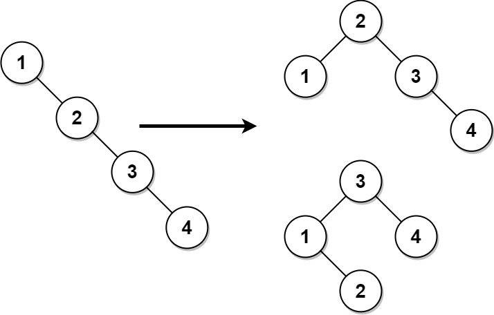
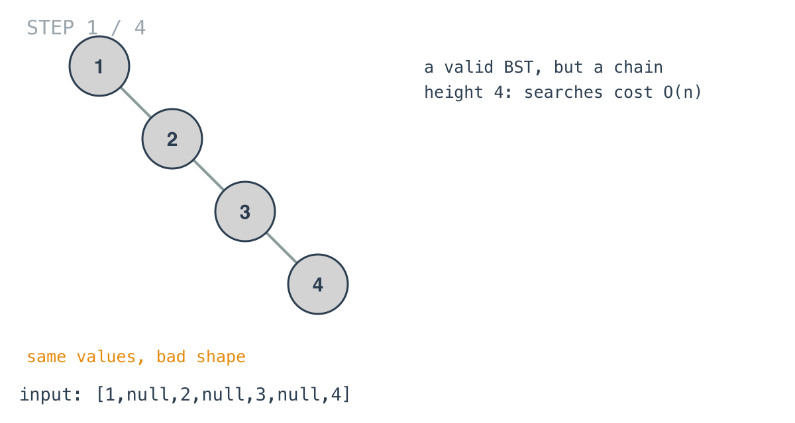
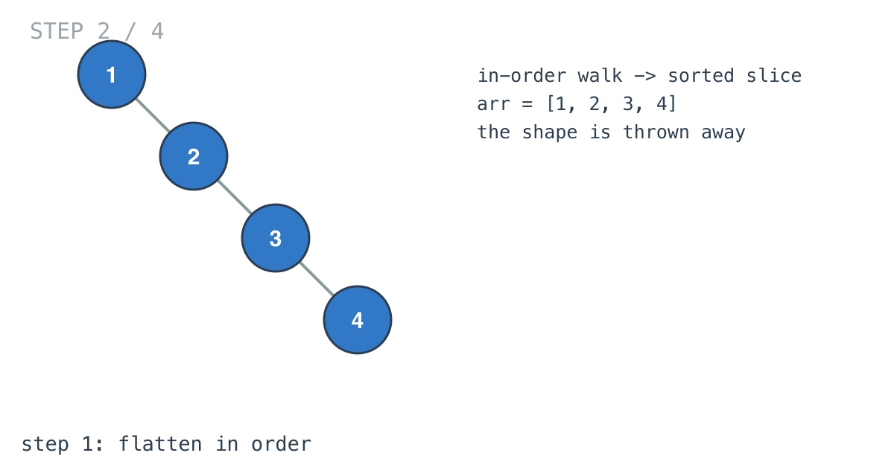
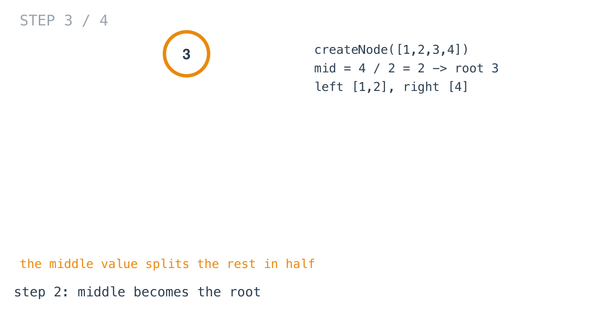
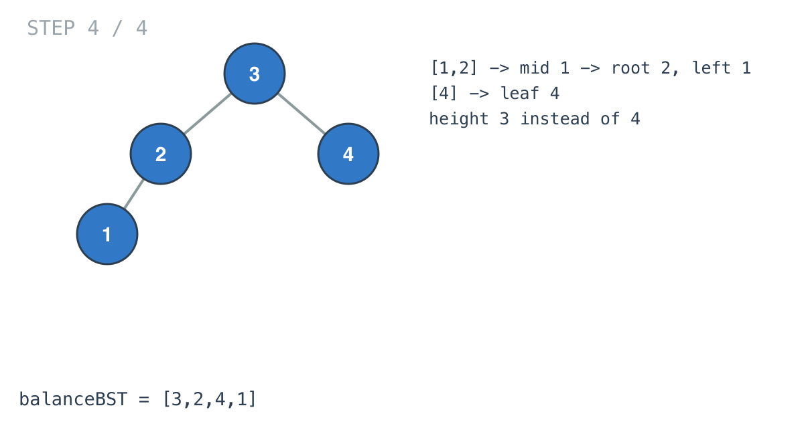

## Solution walkthrough

`balanceBST(root *TreeNode) *TreeNode` in `main.go` flattens the tree in order, then builds
a new tree from the middle out.



We'll trace Example 1: the chain `[1,null,2,null,3,null,4]`.

1. **A valid BST with a bad shape.** Every node has only a right child: height 4.

   

2. **Flatten.** `inOrder` appends values left, node, right: `[1, 2, 3, 4]`. Sorted,
   because it's a BST; the shape is no longer needed.

   

3. **Middle as root.** `createNode` takes `mid := len(arr) / 2`. For four values that's
   index 2, value 3. The left half `[1,2]` and right half `[4]` become its subtrees.

   ```go
   return &TreeNode{
       Val:   arr[mid],
       Left:  createNode(arr[:mid]),
       Right: createNode(arr[mid+1:]),
   }
   ```

   

4. **Recurse.** `[1,2]` has middle index 1, so 2 is the root there with 1 on its left. `[4]`
   becomes a leaf. The result, `[3,2,4,1]`, has height 3, and every node's subtrees differ
   by at most one level. It's a different tree from the example's output, and the problem
   accepts any balanced answer.

   

**Complexity:** O(n) time, O(n) space.
