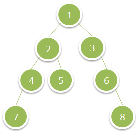
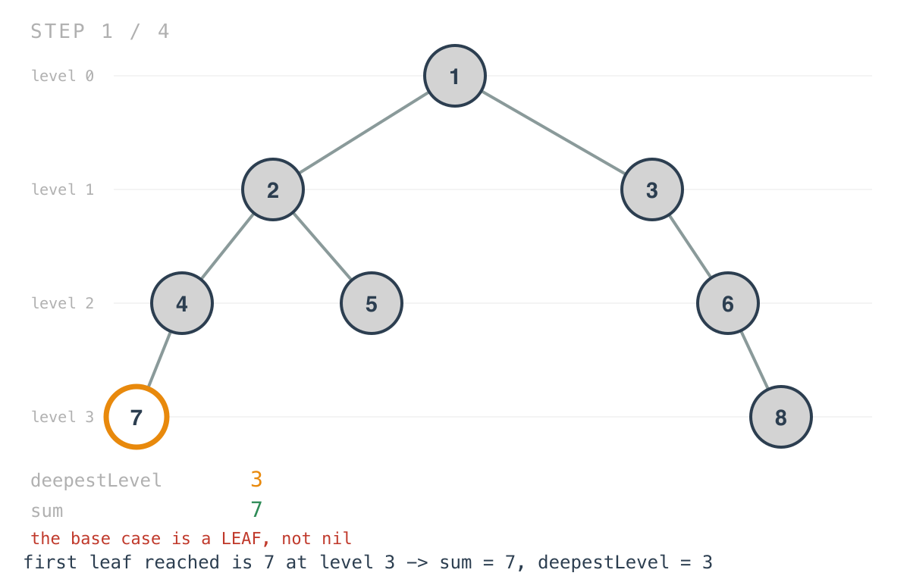
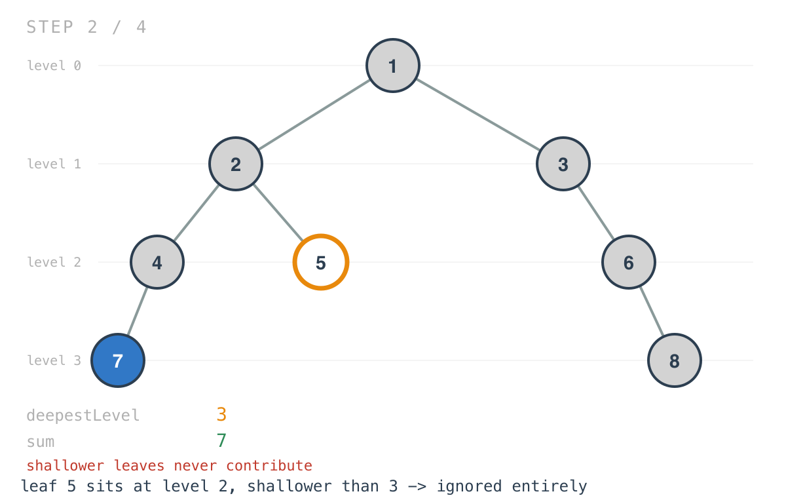
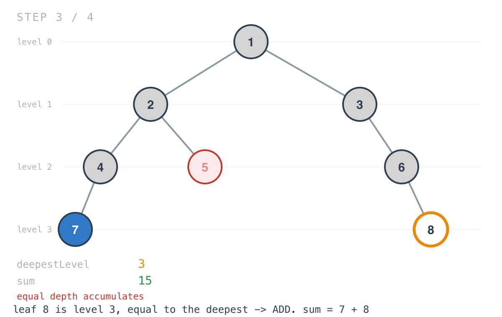
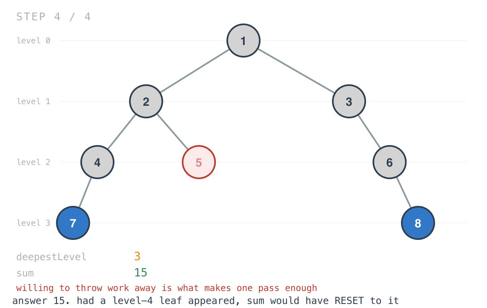

## 365 Days of LeetCode Challenge — Day 51/365

# Deepest Leaves Sum

🔗 https://leetcode.com/problems/deepest-leaves-sum/ · Difficulty: Medium

### The problem

Given the root of a binary tree, return the sum of the values of its deepest leaves.



### The intuition

The obvious solution is two passes: find the maximum depth, then walk again adding up
everything at that depth. Both halves are things this batch has already built.

One pass is enough, and the trick is being willing to throw work away.

Carry the depth down as a parameter, and keep two values: the deepest level seen so far and
the running sum for that level. At every leaf, compare. Deeper than anything seen before?
Everything accumulated so far belonged to a shallower level and is now worthless, so replace
the sum with this leaf's value and record the new depth. Exactly equal to the deepest so
far? Add to the sum. Shallower? Ignore it entirely.

The replacement is the whole idea. You never need to know the final depth in advance,
because any discovery of a deeper leaf invalidates the previous answer and starts over.
Whatever survives to the end was accumulated at the true maximum depth.

### Builds on

- [Day 1: Maximum Depth of Binary Tree](https://github.com/architagr/leetcode_solutions/blob/main/easy_problems/101_200/maximum_depth_of_binary_tree/) — finding the deepest level, which the two-pass version would do first and this one discovers as it goes
- [Day 14: Average of Levels in Binary Tree](https://github.com/architagr/leetcode_solutions/blob/main/easy_problems/601_700/average_of_levels_in_binary_tree/) — accumulating a number per level during a depth-first walk

### The solution

```go
func deepestLeavesSum(root *TreeNode) int {
	deepestLevel := 0
	sumOfDeepestLevel := 0
	var foo func(node *TreeNode, level int)
	foo = func(node *TreeNode, level int) {
		if node.Left == nil && node.Right == nil {
			if level > deepestLevel {
				sumOfDeepestLevel = node.Val
				deepestLevel = level
			} else if level == deepestLevel {
				sumOfDeepestLevel += node.Val
			}
			return
		}
		if node.Left != nil {
			foo(node.Left, level+1)
		}
		if node.Right != nil {
			foo(node.Right, level+1)
		}
	}
	foo(root, 0)
	return sumOfDeepestLevel
}
```

Tracing `[1,2,3,4,5,null,6,7,null,null,null,null,8]`. The deepest leaves are `7` and `8` at
level 3, so the answer is `15`.

Two ints hold the whole answer — no map, no slice of levels, regardless of how wide the tree
gets.









The order doesn't matter. Had `8` been reached before `7`, the same two additions would
happen in the other order — and had a level-4 leaf existed anywhere, whichever branch found
it first would have reset the sum and thrown the level-3 work away.

Two structural details are worth noticing, because they're unusual for this batch.

The base case is a leaf, not nil. Almost every recursion in this series bottoms out at
`if node == nil`. This one checks for a leaf instead and never recurses into a nil child —
the calls are guarded. That's consistent: only leaves contribute to the answer, so a leaf is
the meaningful terminal case, and nil never needs representing.

The consequence is that `foo` dereferences `node` immediately without checking it. That's
safe only because the constraints guarantee at least one node, so `root` is never nil.
Change the constraint to allow an empty tree and this panics on the first line — worth
knowing, since the same function written with a nil base case would have been robust to it
for free.

O(n) time, every node visited once, in one pass rather than two. Space is O(h) for the
recursion stack; the answer itself is two ints.

Full code and the step-by-step walkthrough:
[deepest_leaves_sum](https://github.com/architagr/leetcode_solutions/blob/main/medium_problems/1301_1400/deepest_leaves_sum/SOLUTION.md)

#DSA #LeetCode #100DaysOfCode #CodingInterview #BinaryTree #DFS #Golang

---

*Solution and code by Archit Agarwal. Write-up drafted with AI assistance from the code and problem statement.*
