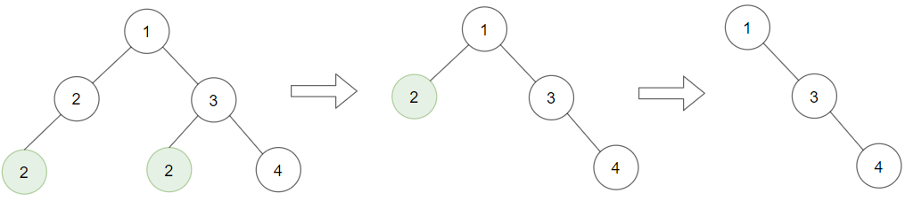
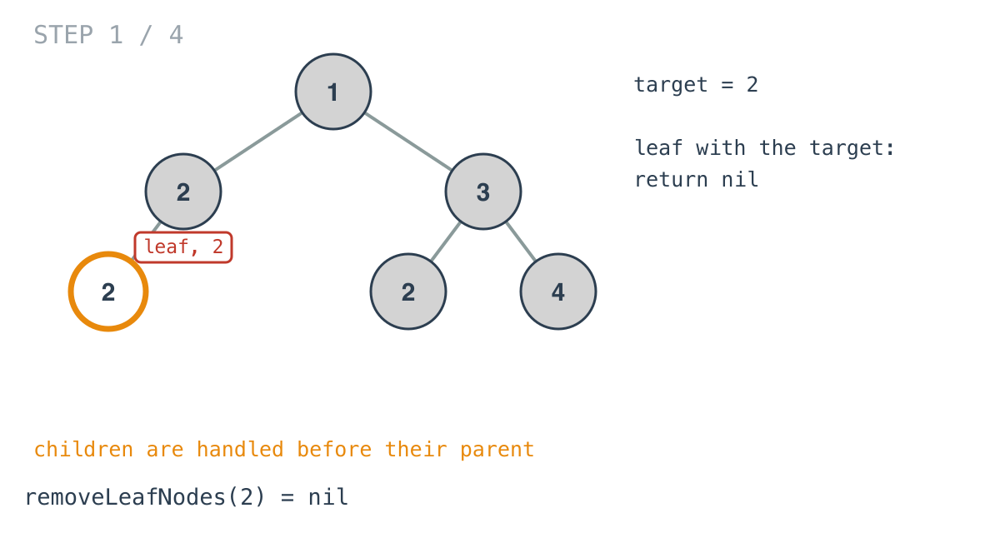
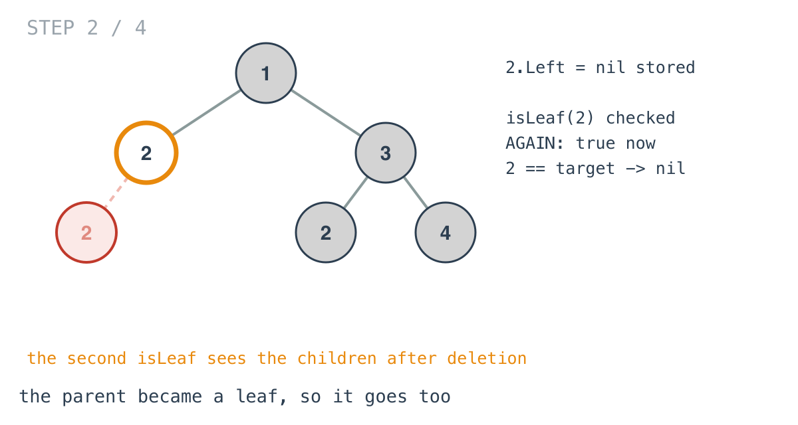
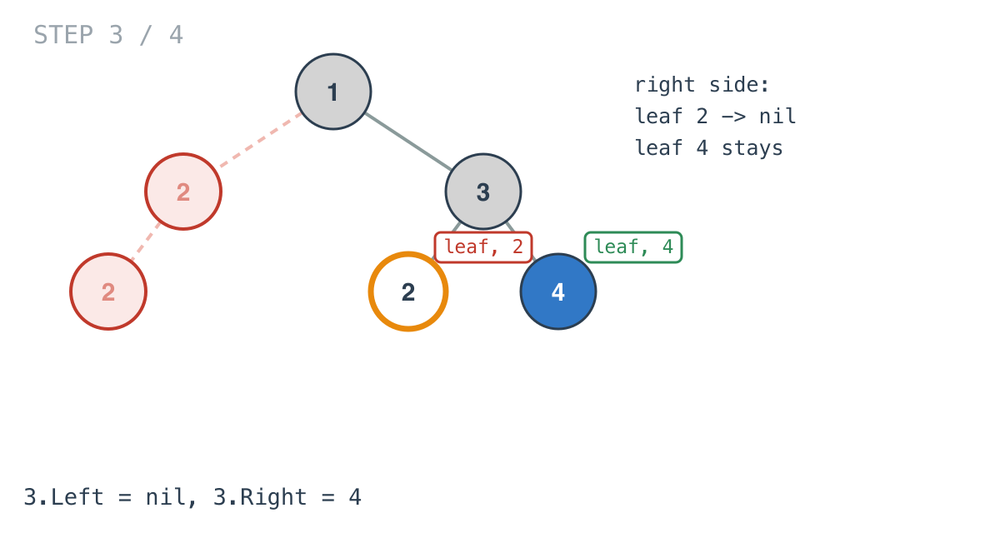
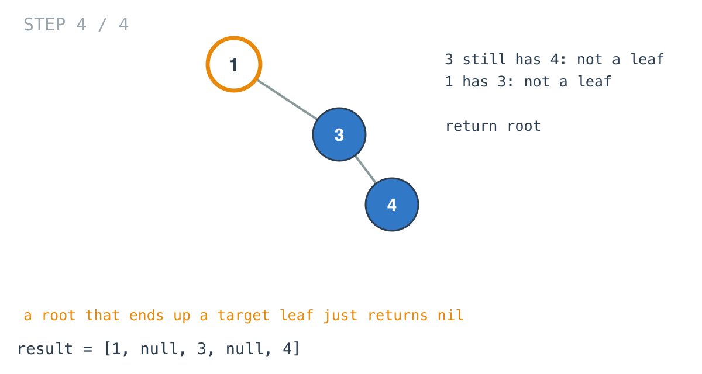

## Solution walkthrough

`removeLeafNodes(root, target)` in `main.go` returns the subtree with target leaves
removed, or nil if the whole subtree goes. `isLeaf` is a small helper that is nil-safe.



We'll trace Example 1: `[1,2,3,2,null,2,4]`, target `2`, expected `[1,null,3,null,4]`.

1. **Recurse into children first, and store what comes back.**

   ```go
   if !isLeaf(root) {
       if root.Left != nil {
           root.Left = removeLeafNodes(root.Left, target)
       }
       ...
   }
   ```

   The first `isLeaf` only decides whether there's anything to recurse into. The first
   node to be fully handled is the bottom-left `2`: a leaf, equal to the target.

2. **A target leaf returns nil.**

   ```go
   if isLeaf(root) && root.Val == target {
       return nil
   }
   ```

   The caller stores that nil into its `Left`, which is the deletion.

   

3. **The second `isLeaf` is the cascade.** Back at its parent, the other `2`, the same
   check runs again, but now `Left` is nil. It's a leaf with the target value, so it
   returns nil too, and the root's `Left` becomes nil. No second pass over the tree was
   needed; the node simply checked itself after its children were done.

   

4. **Leaves that aren't the target stay.** Under `3`, the `2` is removed and the `4`
   returns itself.

   

5. **Internal nodes survive.** `3` still has `4`, and `1` still has `3`, so neither is a
   leaf and both return themselves. The result is `[1,null,3,null,4]`.

   

   If every node had been a removable target, as in `[2,2,2]` with target `2`, the root
   itself would become a leaf and return nil, with no wrapper needed.

**Complexity:** O(n) time, one visit per node. O(h) space for the recursion stack.
