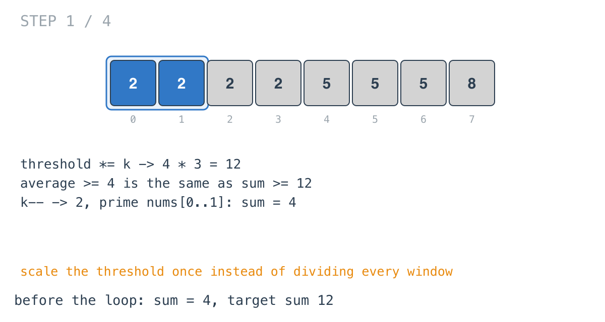
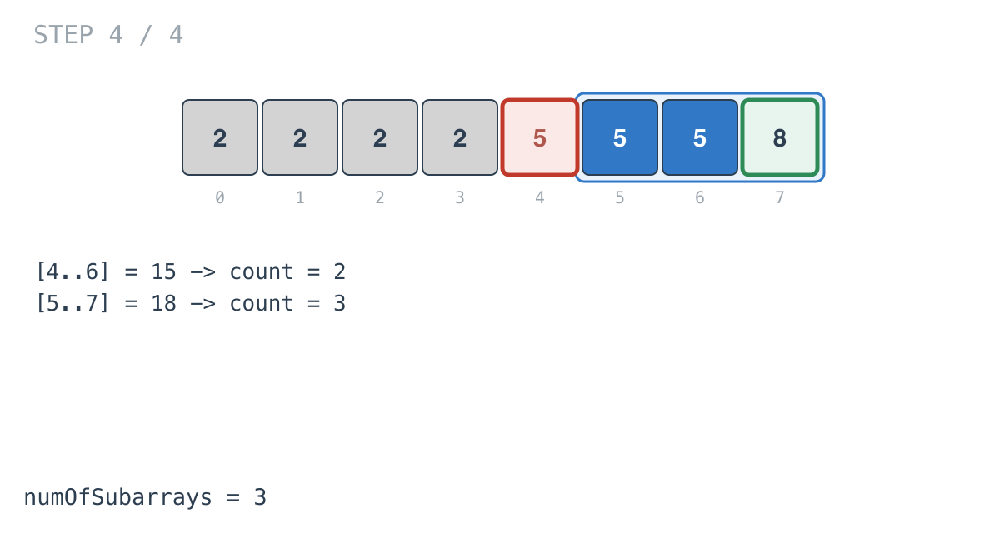

## Solution walkthrough

`numOfSubarrays(arr []int, k int, threshold int) int` in
`number_of_sub_arrays_of_size_k_and_average_greater_than_or_equal_to_threshold.go` counts
windows of length `k` whose sum reaches `threshold * k`.

We'll trace Example 1: `arr = [2,2,2,2,5,5,5,8]`, `k = 3`, `threshold = 4`, expected `3`.

1. **Turn the average test into a sum test.** `threshold *= k` makes it 12. An average of
   at least 4 over 3 elements is a sum of at least 12, and that's what the loop compares
   from now on.

2. **Offset and prime.** `k--` makes `k = 2`. The first loop adds `arr[0] + arr[1] = 4`,
   one short of a full window.

   

3. **Add, count, remove.** At `i = 2` the window `[0..2]` sums to 6, below 12. The window
   `[1..3]` is also 6.

   ![Step 2: window [0..2] sums to 6](images/walkthrough-2.png)

4. **The first window that counts.** `[2..4]` sums to 9. `[3..5]`, which is
   `2 + 5 + 5`, reaches exactly 12, and `sum >= threshold` includes equality, so
   `count = 1`.

   ![Step 3: window [3..5] reaches 12](images/walkthrough-3.png)

5. **The rest.** `[4..6]` is 15 and `[5..7]` is 18, both counted. Final answer 3.

   

**Complexity:** O(n) time, O(1) space.
