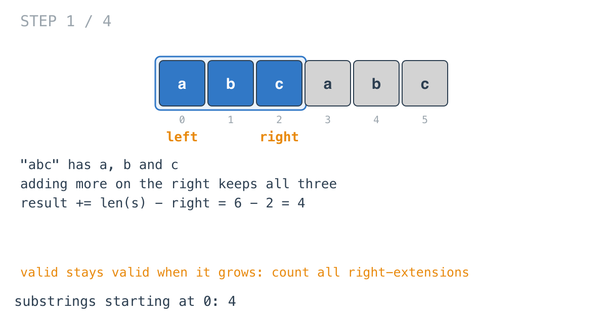
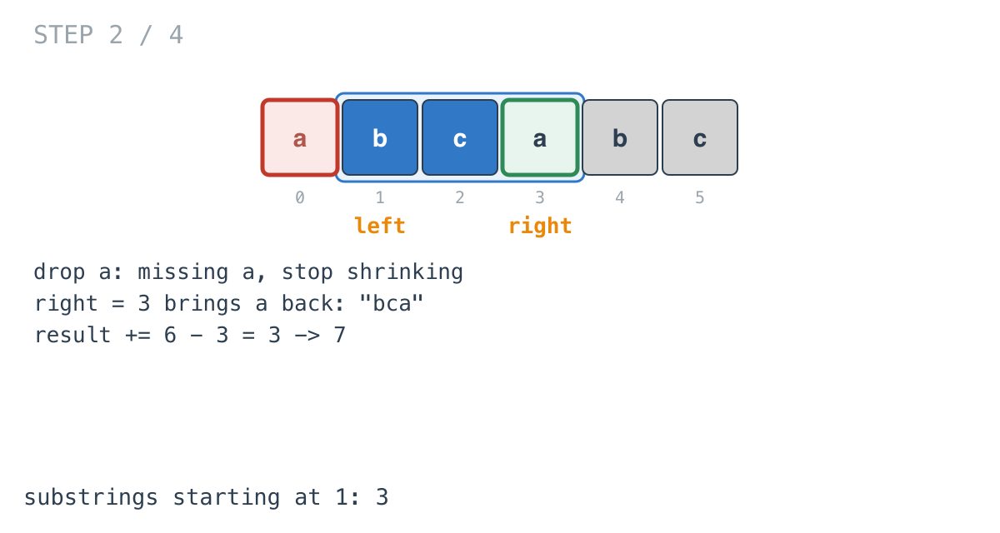
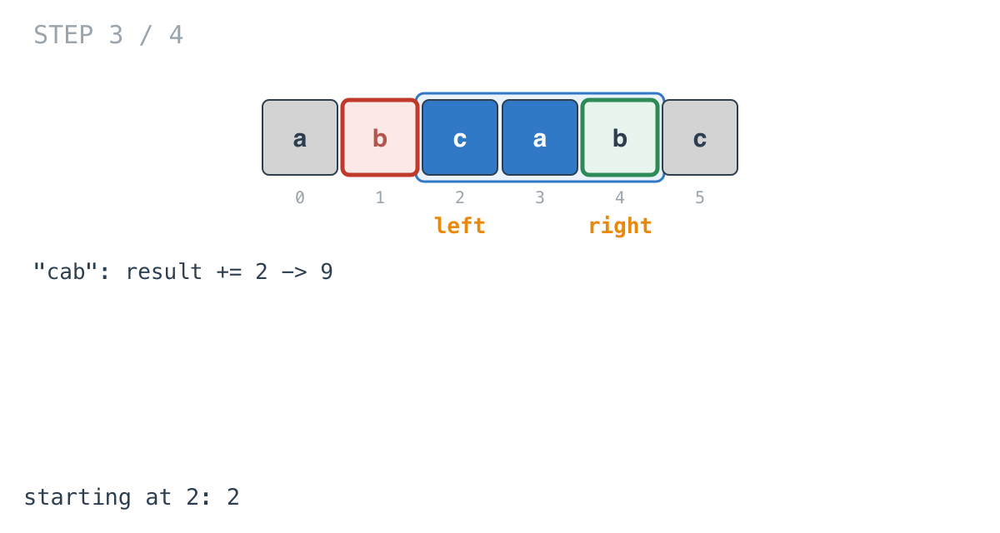
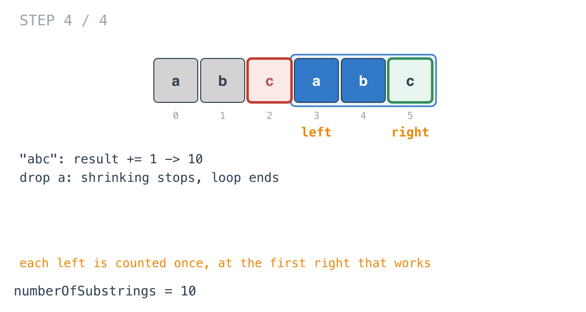

## Solution walkthrough

`numberOfSubstrings(s string) int` in
`number_of_substrings_containing_all_three_characters.go` counts, for each start position,
all the valid substrings beginning there in one addition.

We'll trace Example 1: `s = "abcabc"`, expected `10`.

1. **Grow until all three are present.** `counts[s[right]-'a']++`. At `right = 2` the
   window `"abc"` has one of each.

2. **Count every extension at once.**

   ```go
   for counts[0] > 0 && counts[1] > 0 && counts[2] > 0 {
       result += len(s) - right
       counts[s[left]-'a']--
       left++
   }
   ```

   A substring starting at `left = 0` and ending anywhere from index 2 to 5 contains all
   three letters: `len(s) - right = 4` of them. Then `s[0] = 'a'` leaves, the window is
   missing `a`, and the loop stops.

   

3. **The next start.** `right = 3` brings an `a` back: `"bca"`. Three valid substrings
   start at 1. Total 7.

   

4. **And the next.** `"cab"` at `right = 4`: +2, total 9.

   

5. **The last.** `"abc"` at `right = 5`: +1, total 10. Removing `a` ends the inner loop,
   and the outer loop is done.

   

Each start is counted exactly once: at the first `right` where its window becomes valid,
which is the moment the inner loop reaches it.

**Complexity:** O(n) time, O(1) space.
