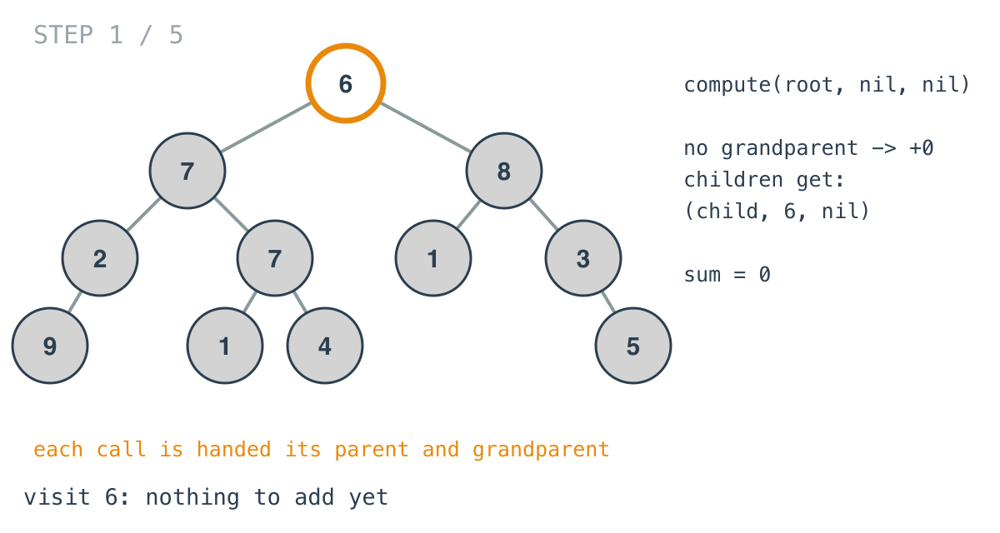
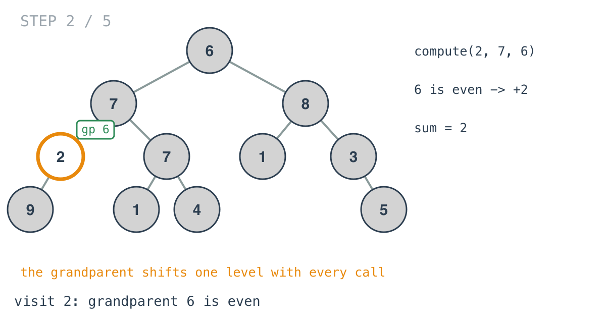
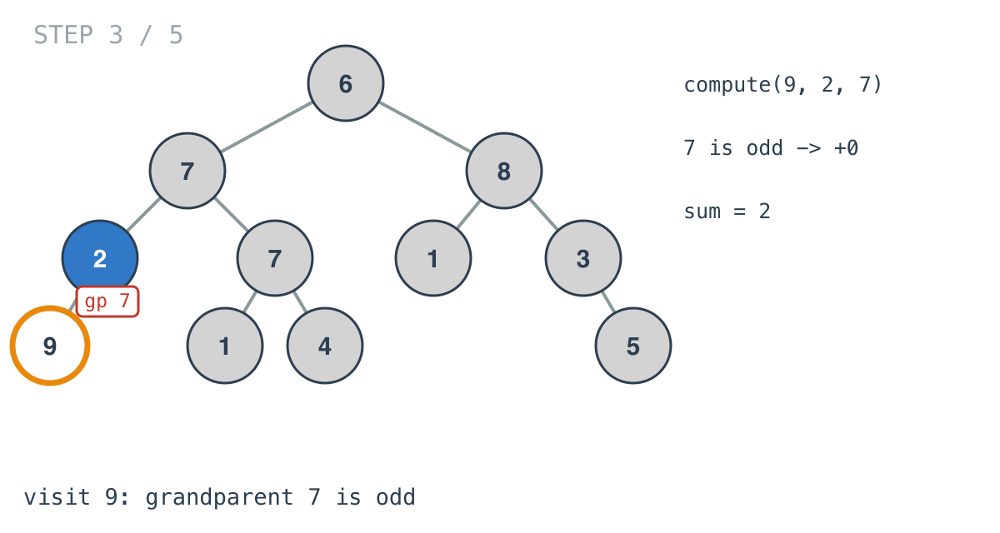
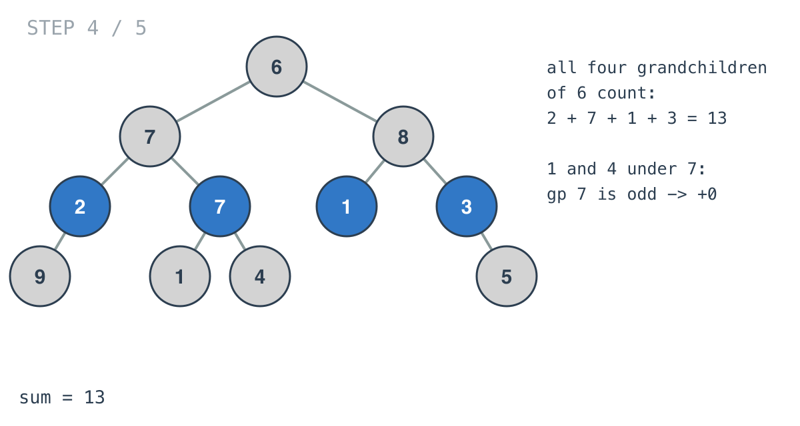
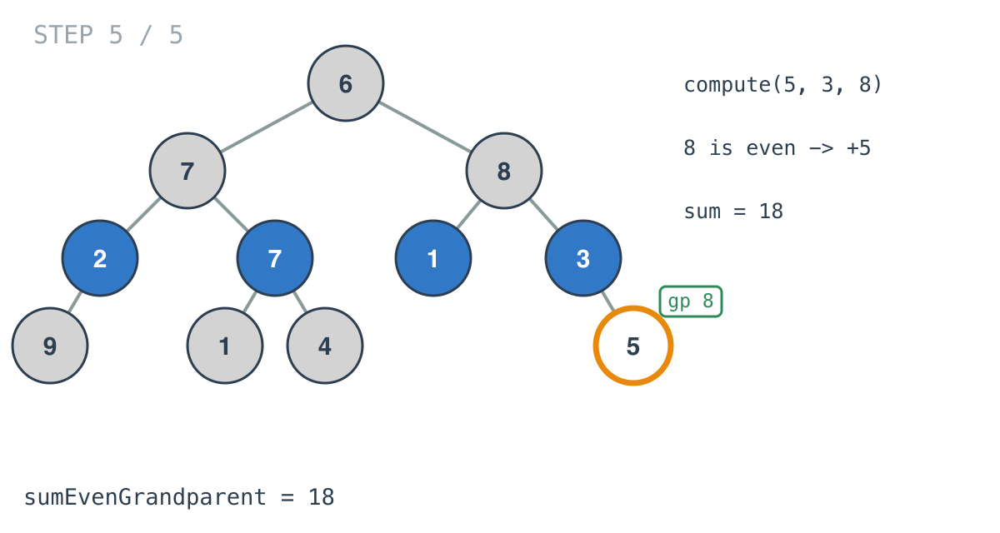

## Solution walkthrough

`sumEvenGrandparent` in `main.go` calls `compute(root, nil, nil)`. `compute(node, parent,
grandParent)` adds the node's value if its grandparent is even, then recurses with the
window shifted down by one.


We'll trace Example 1, `[6,7,8,2,7,1,3,9,null,1,4,null,null,null,5]`, expected `18`.

1. **The root has no parent or grandparent.** Both arguments are nil, so the check can't
   pass and the root adds nothing. Its children will be called with `(child, 6, nil)`: a
   parent, still no grandparent.

   

2. **Shift the window.**

   ```go
   sum += compute(node.Left, node, parent)
   sum += compute(node.Right, node, parent)
   ```

   At `7`, the call into `2` passes `node = 7` as the parent and `parent = 6` as the
   grandparent. `6` is even, so `2` adds itself.

   

3. **Nil-safe check.** `if grandParent != nil && grandParent.Val%2 == 0`. The nil test
   comes first, and Go's `&&` doesn't evaluate the second half when the first is false, so
   `grandParent.Val` is never read on nil. Node `9`'s grandparent is `7`, which is odd, so
   it adds nothing.

   

4. **All four grandchildren of 6.** `2`, `7`, `1` and `3` each receive `6` as their
   grandparent and add themselves: 13. The `1` and `4` under the second `7` have `7` as
   their grandparent and add nothing.

   

5. **A second even grandparent.** `5` sits under `3`, under `8`. Its grandparent is `8`,
   even, so it adds 5. Nil children return 0, and the sums add up to 18.

   

**Complexity:** O(n) time, one call per node. O(h) space for the recursion stack.
