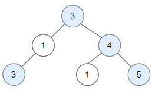
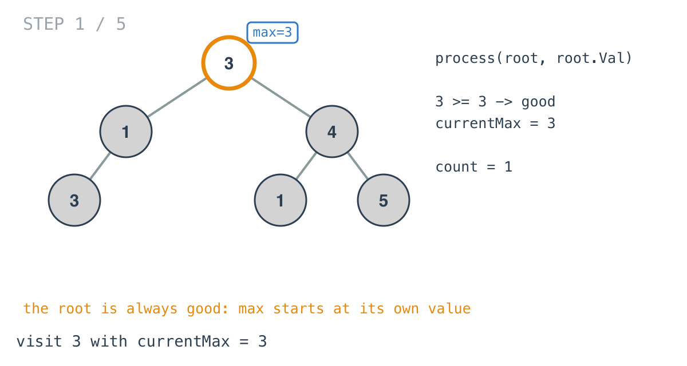
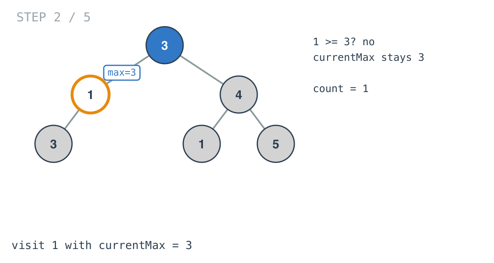
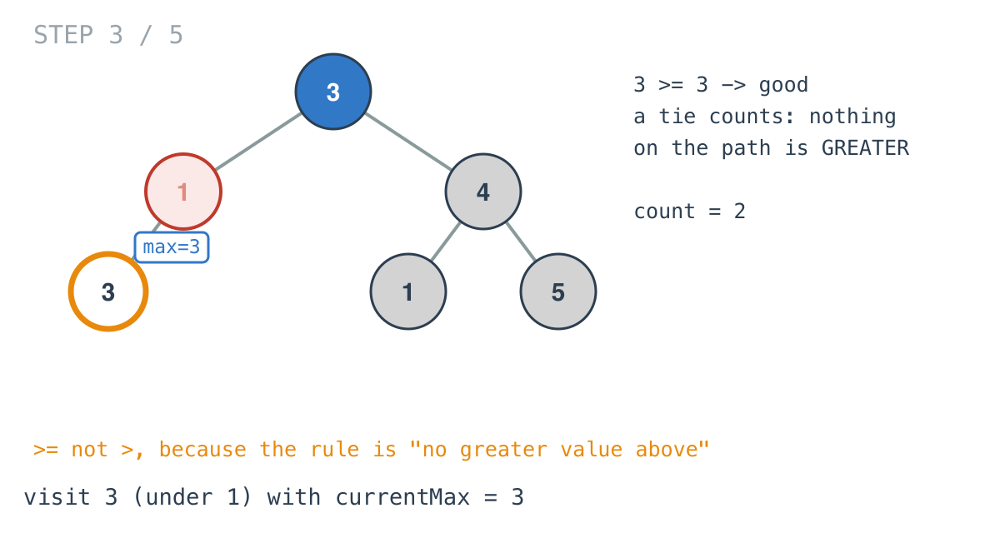
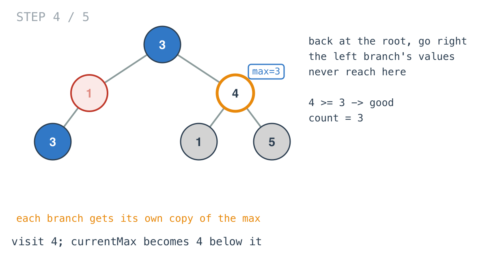
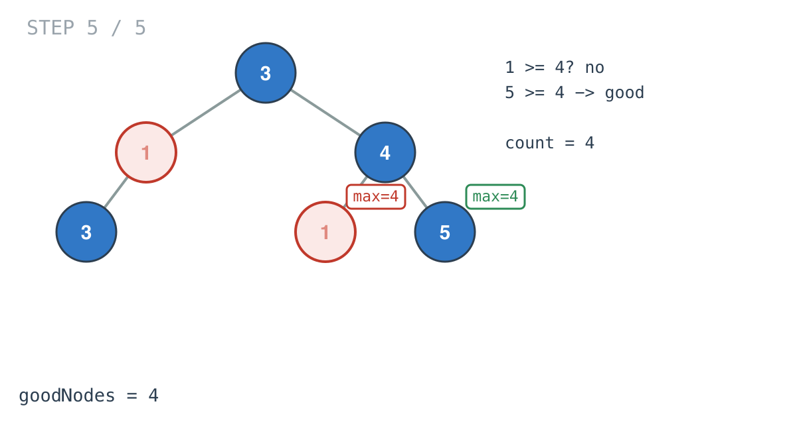

## Solution walkthrough

`goodNodes` in `main.go` starts the recursion, and `process(node, currentMax)` does the
work: it counts the node if it's good, raises the max, and adds its children's counts.



We'll trace Example 1, `[3,1,4,3,null,1,5]`, expected `4`.

1. **Seed the max with the root.** `return process(root, root.Val)`. Starting the max at
   the root's own value means the root always passes the check below. This relies on the
   tree being non-empty, which the constraints guarantee.

   

2. **Compare, then raise.** At each node:

   ```go
   if node.Val >= currentMax {
       res++
   }
   currentMax = maxVal(currentMax, node.Val)
   ```

   Node `1` arrives with `currentMax = 3`. `1 >= 3` is false, so it isn't counted, and the
   max stays 3 for its children.

   

3. **A tie is good.** The `3` under `1` arrives with max 3, and `3 >= 3` is true. The
   rule is that no node on the path is *greater*, so equal is fine. Using `>` here would
   miss this node, and the root as well, since the max is seeded with the root's own
   value. The answer would come out as 2.

   

4. **Each branch has its own max.** Back at the root, the call goes right. `currentMax` is
   a parameter, so the root's value, 3, is what the right child receives; nothing from the
   left branch leaks across. `4 >= 3` is good, and `4` passes max 4 to its children.

   

5. **Sum on the way back.** `return res + process(node.Left, currentMax) +
   process(node.Right, currentMax)`. Under `4`, the `1` isn't good and the `5` is. Nil
   children return 0. The counts add up to 4.

   

**Complexity:** O(n) time, one visit per node. O(h) space for the recursion stack; a tree
of 10^5 nodes in a single chain would recurse 10^5 deep, which Go's growable stacks handle.
