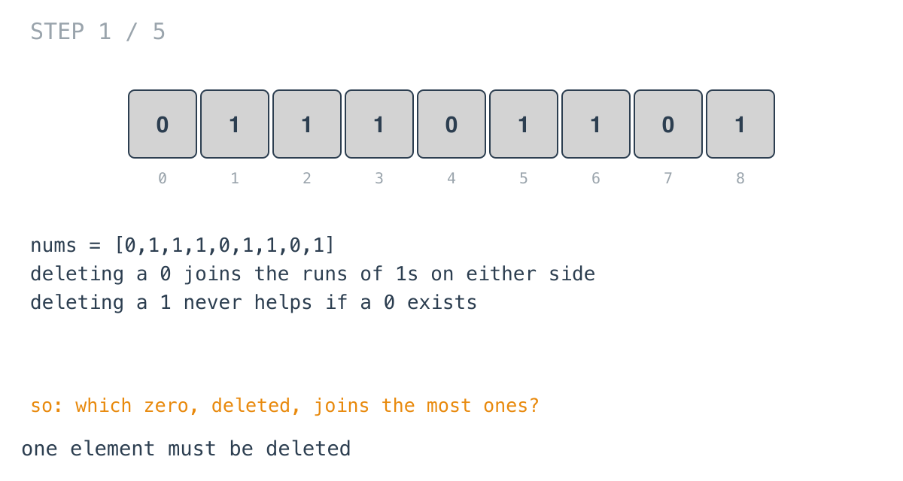
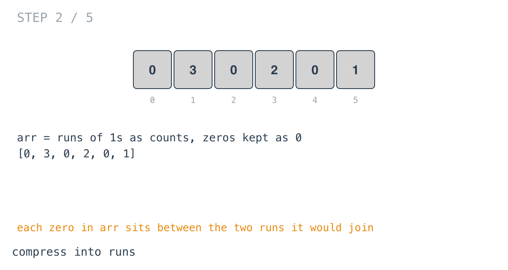
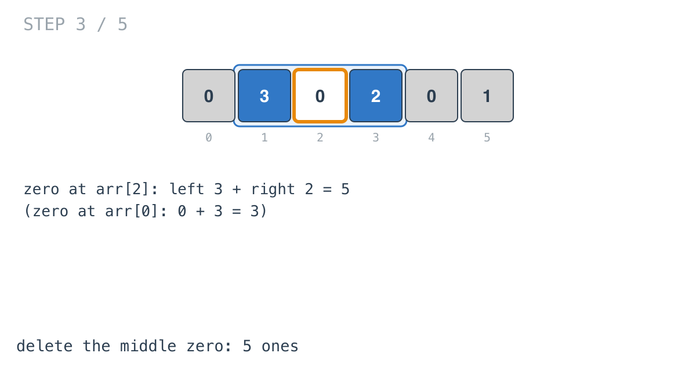
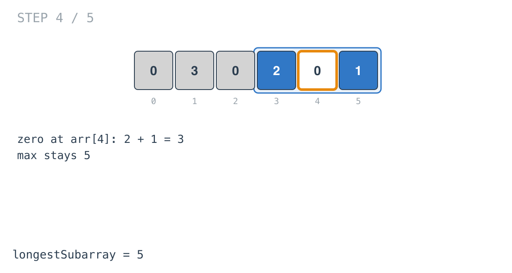
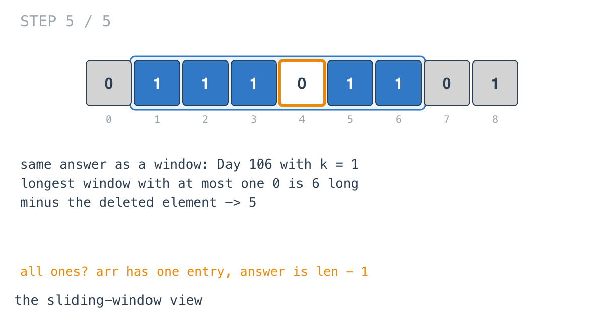

## Solution walkthrough

`longestSubarray(nums []int) int` in `main.go` compresses the array into runs, then checks
what deleting each zero would join.

We'll trace Example 2: `nums = [0,1,1,1,0,1,1,0,1]`, expected `5`.

1. **Delete a zero, not a one.** Removing a zero merges the ones on each side of it.
   Removing a one only ever shortens something, so when zeros exist, the best deletion is
   one of them.

   

2. **Compress into runs.** The first loop builds `arr`: consecutive ones accumulate in
   `sum`, which is appended when a zero arrives, and each zero is appended as `0`. A
   trailing run is appended after the loop. The result is `[0, 3, 0, 2, 0, 1]`.

   

3. **No zero to delete.** `if len(arr) == 1 { return len(nums) - 1 }`. That's an array of
   all ones, where one of them must go, or a single `[0]`, where the answer is 0. Either
   way it's `len(nums) - 1`.

4. **Each zero joins its neighbours.** For every `0` in `arr`, `left` is `arr[i-1]` (or 0
   at the start) and `right` is `arr[i+1]` (or 0 at the end). The zero at `arr[2]` joins 3
   and 2: 5. The zero at `arr[0]` only has 3 on its right.

   

5. **The best.** The zero at `arr[4]` joins 2 and 1: 3. The maximum is 5.

   

6. **The same thing as a window.** The longest window with at most one 0 in
   `[0,1,1,1,0,1,1,0,1]` is indices 1-6, length 6. Deleting its zero leaves 5 ones.

   

**Complexity:** O(n) time, O(n) space for `arr`.
