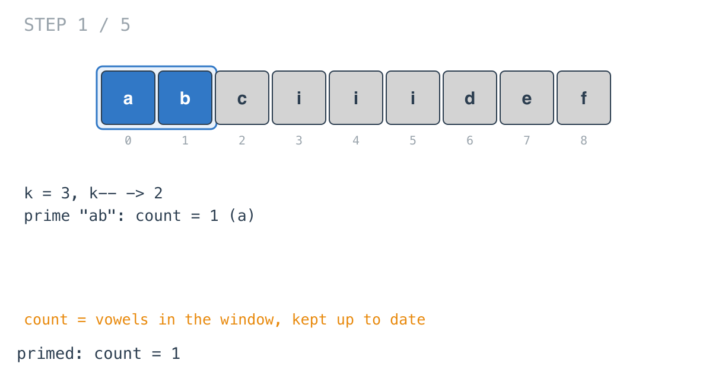
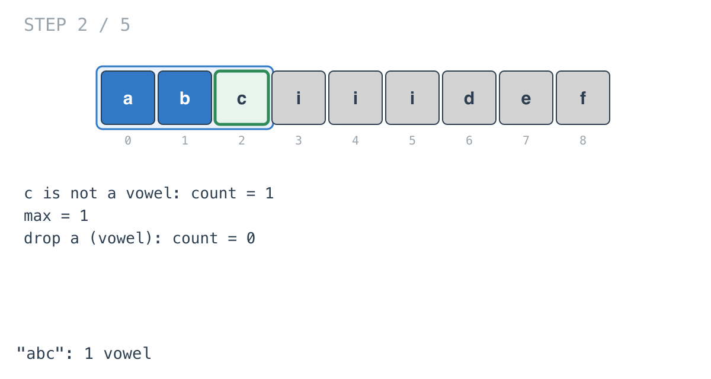
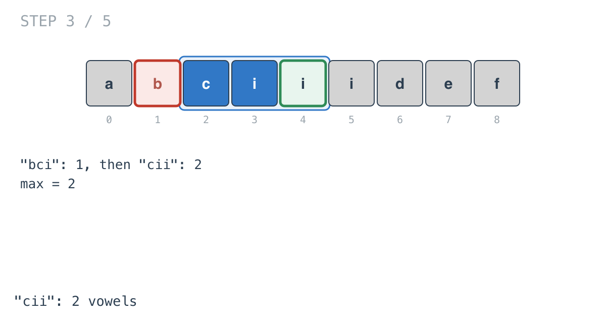
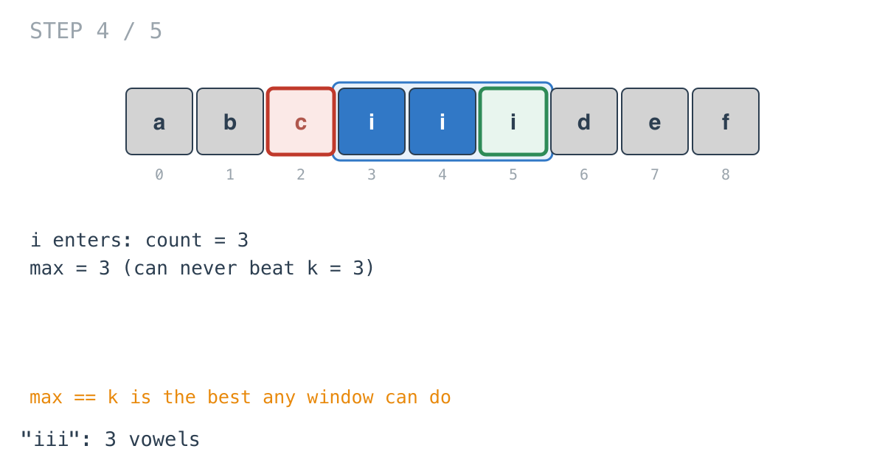
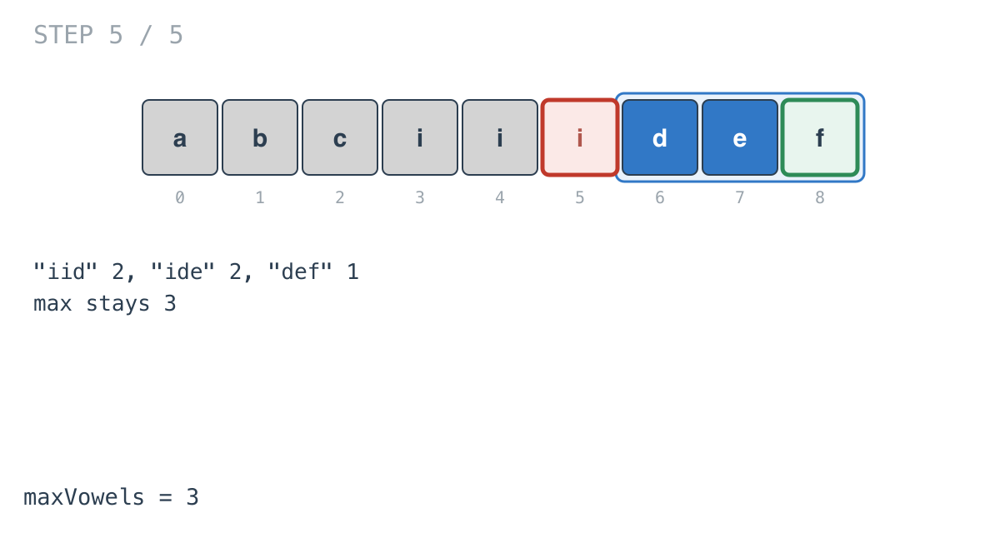

## Solution walkthrough

`maxVowels(s string, k int) int` in `main.go` keeps a count of vowels in a window of `k`
letters and tracks the largest count. `isVowel` checks a single byte.

We'll trace Example 1: `s = "abciiidef"`, `k = 3`, expected `3`.

1. **Offset and prime.** `k--` makes `k = 2`. The first loop counts vowels in `"ab"`:
   `count = 1`.

   

2. **Add, check, remove.** At `i = 2`, `c` isn't a vowel, so the window `"abc"` has 1.
   `max = 1`. Then `s[i-k] = 'a'` leaves, and since it's a vowel, `count` drops to 0.

   

3. **Slide.** `"bci"` has 1, `"cii"` has 2, so `max = 2`.

   

4. **The best window.** `"iii"` has 3. That's `k` vowels in a window of `k` letters, the
   most any window can hold.

   

5. **The rest can't beat it.** `"iid"`, `"ide"` and `"def"` have 2, 2 and 1. The loop
   checks them anyway; an early `return` once `max == k` would skip them.

   

**Complexity:** O(n) time, O(1) space.
