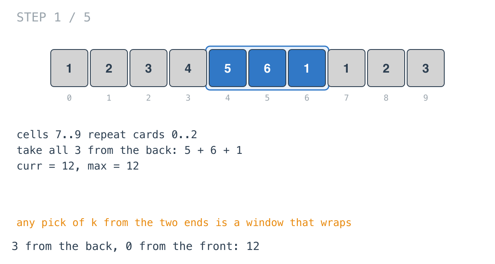
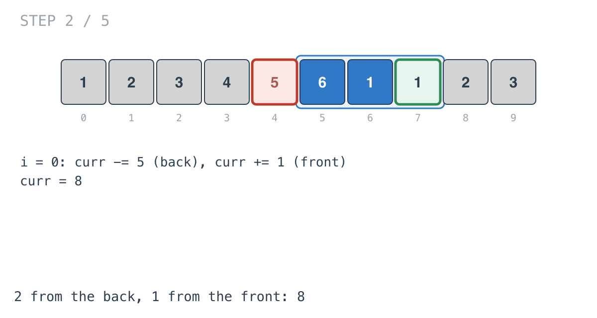
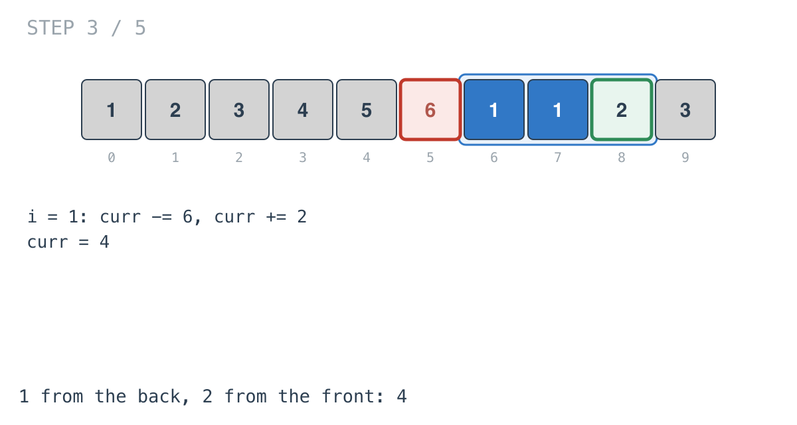
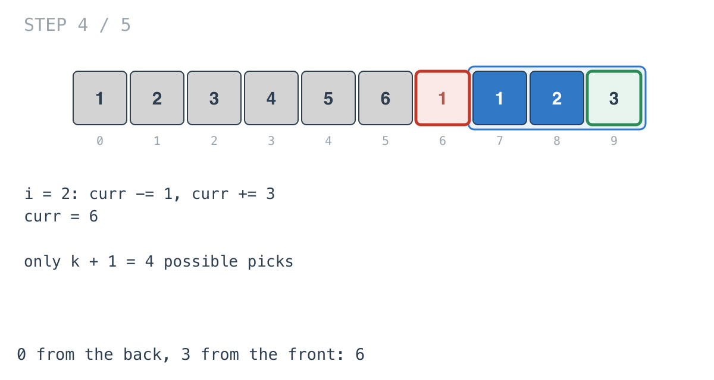
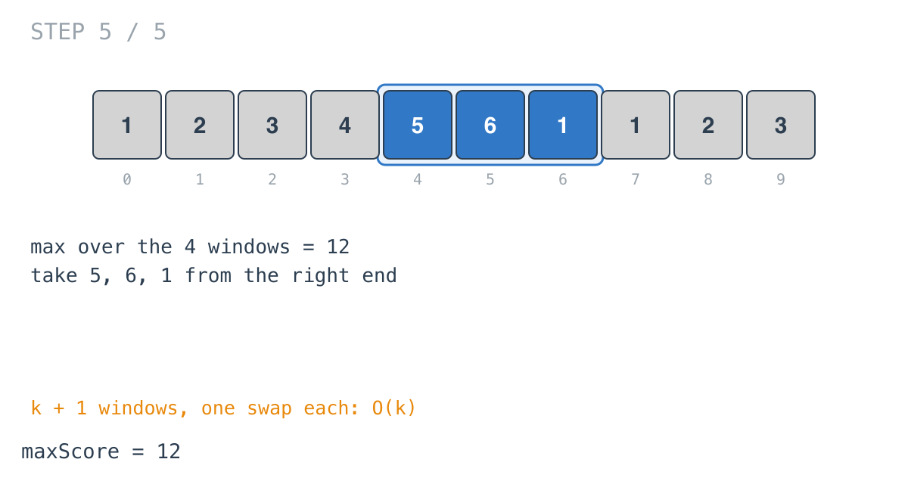

## Solution walkthrough

`maxScore(cardPoints []int, k int) int` in `maximum_points_you_can_obtain_from_cards.go` starts with the last `k`
cards and slides the taken set around the end of the array, one swap at a time.

We'll trace Example 1: `cardPoints = [1,2,3,4,5,6,1]`, `k = 3`, expected `12`. The
diagrams repeat the first three cards after the end (indices 7-9 are cards 0-2 again) so
each pick is one contiguous window.

1. **Start with everything from the back.** The first loop sums `cardPoints[n-k..n-1]`:
   `5 + 6 + 1 = 12`. That's `curr`, and `max` becomes 12.

   

2. **Swap one back card for one front card.**

   ```go
   curr -= cardPoints[(start+i)%n]
   curr += cardPoints[i]
   ```

   With `start = n - k = 4`, at `i = 0` the 5 goes back and the front 1 is taken:
   `curr = 8`. The hand is now two from the back, one from the front.

   

3. **Keep sliding.** `i = 1` swaps the 6 for the 2: `curr = 4`.

   

4. **All from the front.** `i = 2` swaps the last back card for the 3: `curr = 6`. That's
   the `k + 1`th and last configuration.

   

5. **The best was the first.** `max` stayed 12 throughout. The answer is the three cards
   on the right.

   

`start + i` never exceeds `n - 1`, so the `% n` never changes anything here; it just
spells out that the window is circular.

**Complexity:** O(k) time: `k` additions to prime and `k` swaps. O(1) space.
