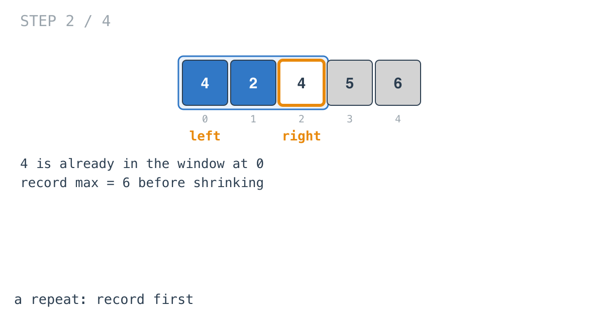
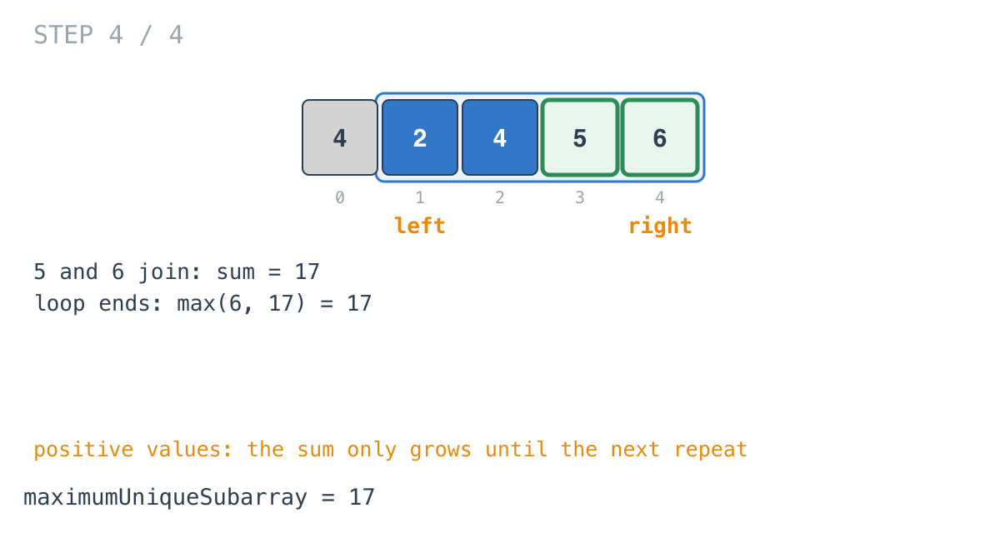

## Solution walkthrough

`maximumUniqueSubarray(nums []int) int` in `maximum_erasure_value.go` keeps a window of
distinct values, a map from each value in it to its index, and the window's sum.

We'll trace Example 1: `nums = [4,2,4,5,6]`, expected `17`.

1. **Grow.** `m[val] = right` and `sum += val`. After two elements the map is
   `{4:0, 2:1}` and `sum = 6`.

   ![Step 1: [4, 2], sum 6](images/walkthrough-1.png)

2. **A repeat: record first.** At index 2, `4` is already in `m`. Before shrinking,
   `max = maxVal(max, sum) = 6`. The window only grew since the last repeat, so this is its
   best sum.

   

3. **Remove through the earlier copy.**

   ```go
   for ; left <= m[val]; left++ {
       delete(m, nums[left])
       sum -= nums[left]
   }
   ```

   The earlier `4` is at index 0, so only it goes: `sum = 2`, `left = 1`. Then the new `4`
   is added: `sum = 6`.

   ![Step 3: [2, 4]](images/walkthrough-3.png)

   The loop bound reads `m[val]` on each pass, and `val`'s entry is deleted on the last
   pass. That's fine: by then `left` has moved past the old index, and the missing key
   reads as 0, which is also below `left`, so the loop stops.

4. **Finish.** `5` and `6` join: `sum = 17`. After the loop, `maxVal(max, sum)` records
   the final window. The answer is 17, the subarray `[2,4,5,6]`.

   

**Complexity:** O(n) time, O(n) space.
