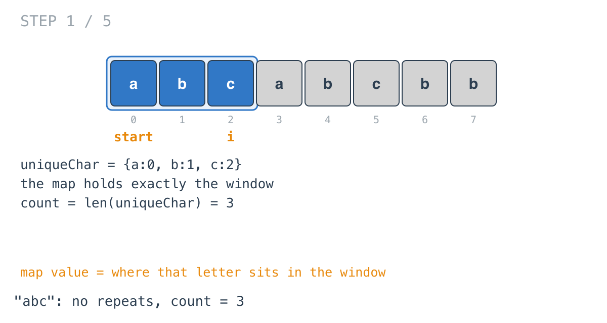
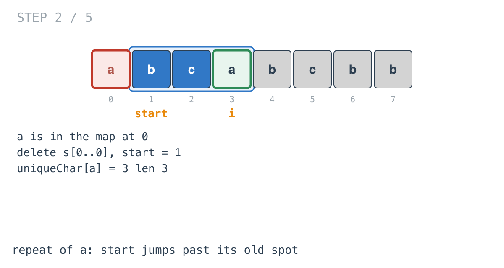
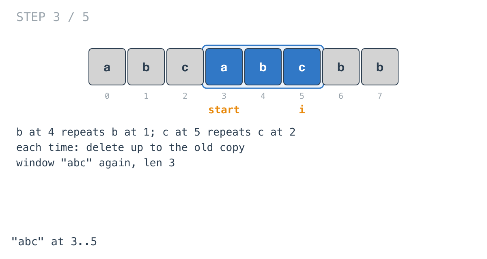
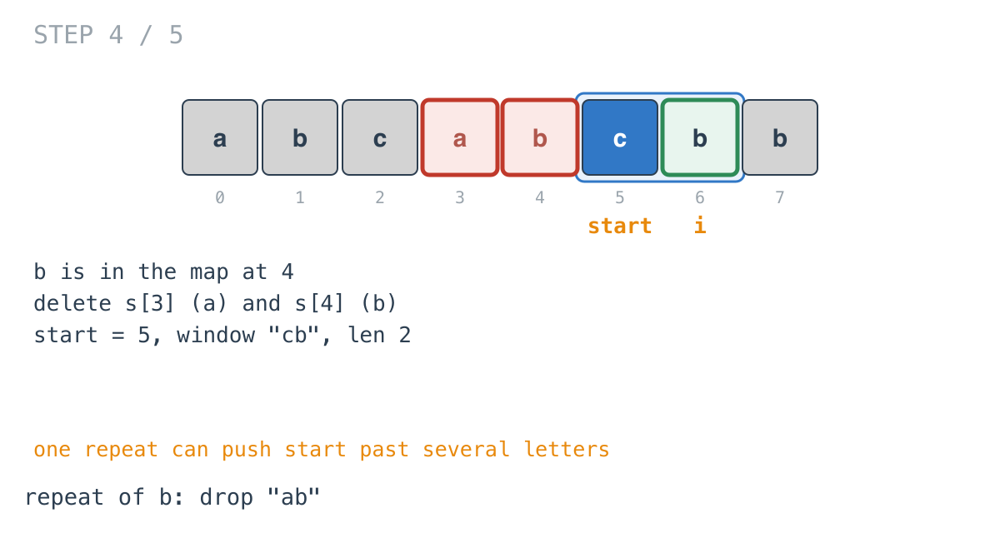
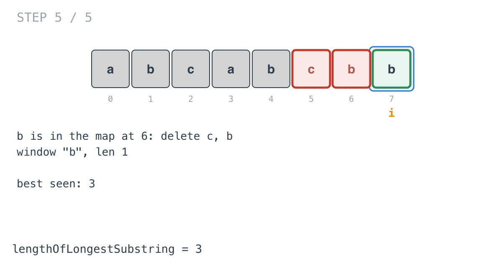

## Solution walkthrough

`lengthOfLongestSubstring(s string) int` in `main.go` keeps a map from each letter in the
current window to its index, and removes letters from the front whenever a repeat
arrives.

We'll trace Example 1: `s = "abcabcbb"`, expected `3`.

1. **Empty input.** `if len(s) == 0 { return 0 }`.

2. **Grow while nothing repeats.** For each `i`, if `s[i]` isn't in `uniqueChar`, it's
   added with its index: `uniqueChar[s[i]] = i`. After `"abc"`, the map is
   `{a:0, b:1, c:2}` and `count = len(uniqueChar) = 3`.

   

3. **A repeat: delete up to the old copy.**

   ```go
   if r, found := uniqueChar[s[i]]; found {
       for ; start <= r; start++ {
           delete(uniqueChar, s[start])
       }
   }
   ```

   At `i = 3`, `a` is in the map at 0. The loop deletes `s[0]` and leaves `start = 1`.
   Then `a` is re-added at index 3. The window is `"bca"`, length 3.

   

4. **The same for b and c.** Each repeat at 4 and 5 removes the letter's earlier copy.
   The window is `"abc"` again at 3..5.

   

5. **One repeat can remove several letters.** At `i = 6`, `b` was at 4. Everything from
   `start = 3` through 4 has to go, `a` and `b`, leaving `"cb"`. A substring can't skip
   the `a`.

   

6. **The end.** At `i = 7`, `b` was at 6: delete `c` and `b`, leaving `"b"`. `count` stays
   3, the answer.

   

**Complexity:** O(n) time: each letter is inserted once and deleted at most once. O(m)
space for the map.
