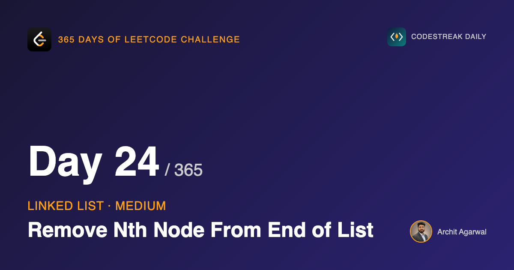
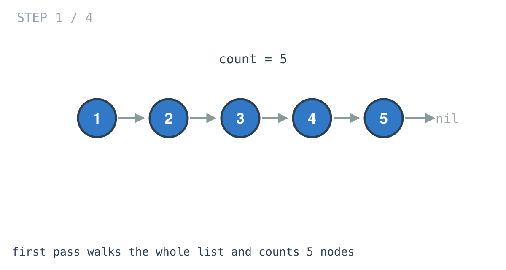
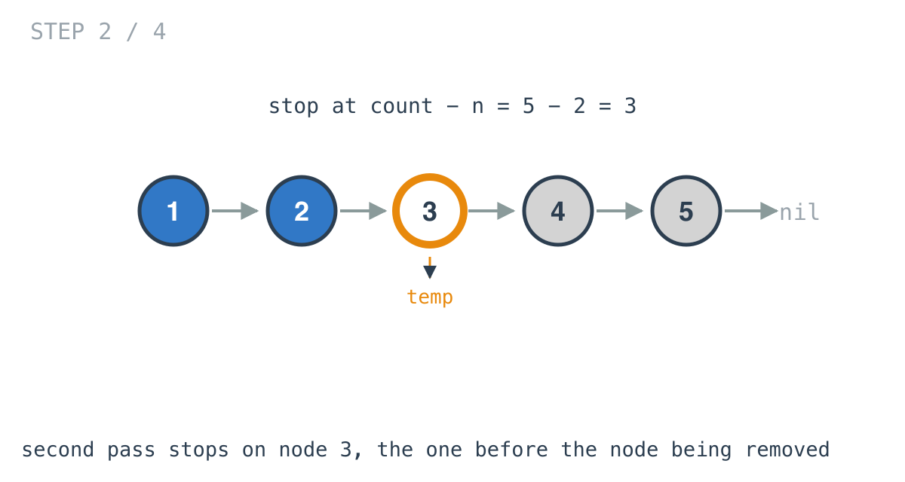
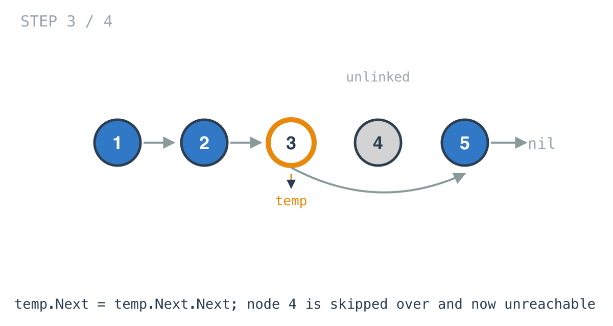
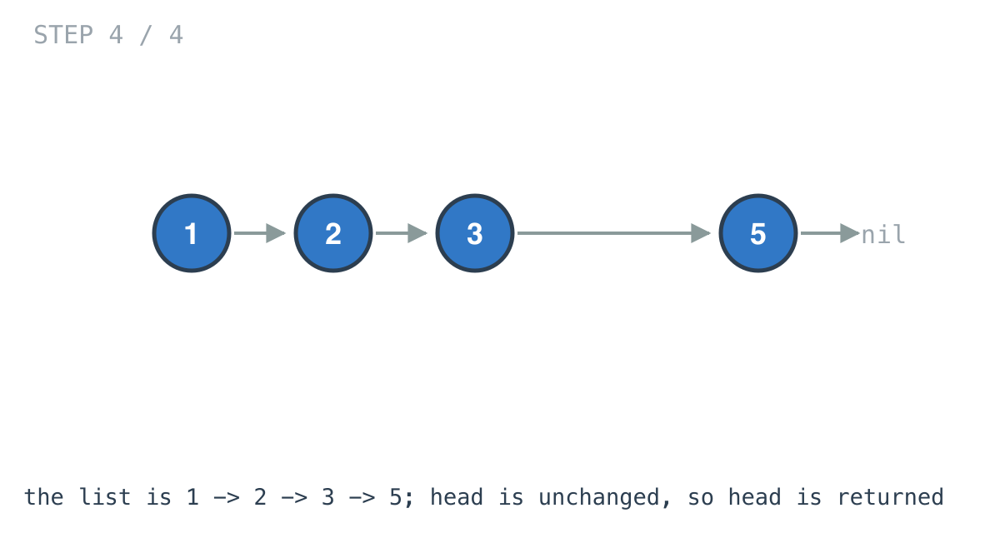

## 365 Days of LeetCode Challenge — Day 24/365

**[19. Remove Nth Node From End of List](https://leetcode.com/problems/remove-nth-node-from-end-of-list/)** (Medium)

Remove the nth node counting from the end, return the head.

## The position is measured from the wrong side

"nth from the end" is a position relative to a place you cannot start from. A singly linked list hands you the head, and the end only exists once you have walked there.

So the first job is translation: `count - n` converts the position into one measured from the front. After that, the problem is ordinary.

```go
temp := head
count := 0
for temp != nil {
	count++
	temp = temp.Next
}
```



Two passes, O(n) time, O(1) space. The follow-up asks for one pass, and I will come to it, but it is worth saying plainly that the one-pass version is not faster. It visits the same nodes. It is just nicer.

## The part that is actually hard

To remove a node from a singly linked list, you need the node *before* it.

A node cannot remove itself. It has no pointer to whatever is referring to it, so it cannot ask that thing to look elsewhere. Removal is always an operation performed by the predecessor.

Which means the second walk has to stop one node early, and that off-by-one is the whole problem.

```go
temp = head
x := 1
for x < count-n {
	x++
	temp = temp.Next
}
temp.Next = temp.Next.Next
```



With `[1,2,3,4,5]` and `n = 2`, the target is position 3, and `temp` stops there holding the node whose `Next` gets rerouted.

`x` starting at 1 rather than 0 is what makes that land correctly. It counts which node `temp` is on, one-based.



One assignment and node 4 is unreachable. It still exists in memory with its own `Next` intact; nothing in the list points at it any more, which is what "removed" means here.



## Removing the head is its own case

```go
} else if count == n {
	head = head.Next
}
```

If `n` equals the length, the node to remove is the head, and there is no predecessor to do the removing. So the removal gets expressed as moving the head instead.

This is precisely the special case day 22's dummy node erases. Put a throwaway node in front of the head and the head becomes an ordinary node with a predecessor like any other, and this branch folds into the general path.

This solution handles it explicitly instead. That is a legitimate choice. It is worth noticing it *is* a choice, because two days ago the same situation had a tidier answer.

## The one-pass version

Move one pointer `n` nodes ahead of another, then advance both until the leading one falls off the end. The trailing pointer is now `n` from the end.

It is day 20's idea with the gap set deliberately rather than produced by different speeds. Same number of node visits, one traversal instead of two.

## Complexity

- **Time: O(n)**. A full pass to count, then a partial pass to the predecessor.
- **Space: O(1)**. A pointer and two integers.

## Builds on

- [Day 20: Middle of the Linked List](https://github.com/architagr/leetcode_solutions/blob/main/easy_problems/801_900/middle_of_the_linked_list/) — the same problem shape: a position defined relative to the end of a list you can only walk forward

Full code and the step-by-step walkthrough:
[remove_nth_node_from_end_of_list](https://github.com/architagr/leetcode_solutions/blob/main/medium_problems/1_100/remove_nth_node_from_end_of_list/SOLUTION.md)

#DSA #LeetCode #Golang #LinkedList #TwoPointers #CodingInterview #Algorithms

---

*Solution and code by Archit Agarwal. Write-up drafted with AI assistance from the code and problem statement.*
