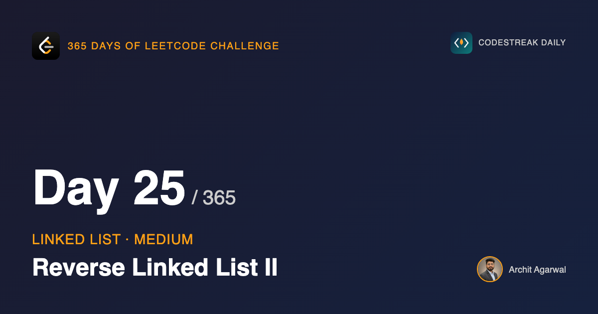

## 365 Days of LeetCode Challenge — Day 25/365

**[92. Reverse Linked List II](https://leetcode.com/problems/reverse-linked-list-ii/)** (Medium)

Reverse only the nodes between positions `left` and `right`. Leave the rest alone.

## Why this is a Medium and day 19 was an Easy

The reversal is identical. Character for character, it is the function from day 19.

What is harder is everything around it. A reversed run sitting in the middle of a list has to be sewn back in on both sides, and the two seams are different problems.

The front seam is a node you walked past and had to remember. The back seam is a node you can only find *after* reversing, because reversing is what decides which node ends up there.

## The approach

Make the middle run look like an ordinary standalone list, reverse it with the function you already have, then reattach it.

1. Walk to `left`, keeping a pointer one step behind.
2. Walk on to `right`, save what comes after, and cut.
3. Reverse the detached run with day 19's function, unchanged.
4. Reattach both ends.

Step 3 is the reason for step 2. Once the run is cut loose it is a complete nil-terminated list, so the reversal needs no idea that it is operating on part of something bigger. No bounds, no counter, no special cases. The Easy problem's function does the work.

## Watching it run

`[1,2,3,4,5]` with `left = 2`, `right = 4`.


`leftNode` trails one step behind, because it gets assigned before the pointer steps forward.


Node 5 is saved, then `tempHead.Next = nil` cuts the run loose.


One call to `reverse`. The run now starts at 4 and ends at 2.


Both seams stitched.


## The front seam, and a case that keeps coming back

```go
if leftNode == nil {
	head = leftSide
} else {
	leftNode.Next = leftSide
}
```

`leftNode` stays `nil` when `left` is 1, because the loop breaks before ever assigning it. That nil is not an oversight, it is the signal that the run starts at the head and there is nothing in front of it to reattach to.

This is the third time this arc has hit "the head has no predecessor". Day 22 erased it with a dummy node. Day 24 took an explicit branch. So does this. A dummy in front of `head` would collapse that `if` into its `else` here too.

## The back seam

```go
for leftSide.Next != nil {
	leftSide = leftSide.Next
}
leftSide.Next = rightNode
```

You cannot save a pointer to the run's tail before reversing, because which node ends up at the tail is exactly what the reversal decides.

So the code walks the reversed run to its end. That walk is the price of having reused `reverse` unchanged: a hand-written reversal could have tracked the tail as it went, and it would also have been a second copy of logic that already exists and is already known to be correct. I would pay the walk.

## Complexity

- **Time: O(n)**. One walk to `right`, one reversal, one walk across the reversed run.
- **Space: O(1)**. Five pointers and a counter.

## Builds on

- [Day 19: Reverse Linked List](https://github.com/architagr/leetcode_solutions/blob/main/easy_problems/201_300/reverse_linked_list/) — the reversal itself, reused here without a single change

Full code and the step-by-step walkthrough:
[reverse_linked_list_ii](https://github.com/architagr/leetcode_solutions/blob/main/medium_problems/1_100/reverse_linked_list_ii/SOLUTION.md)

#DSA #LeetCode #Golang #LinkedList #CodingInterview #SoftwareEngineering #Algorithms

---

*Solution and code by Archit Agarwal. Write-up drafted with AI assistance from the code and problem statement.*
