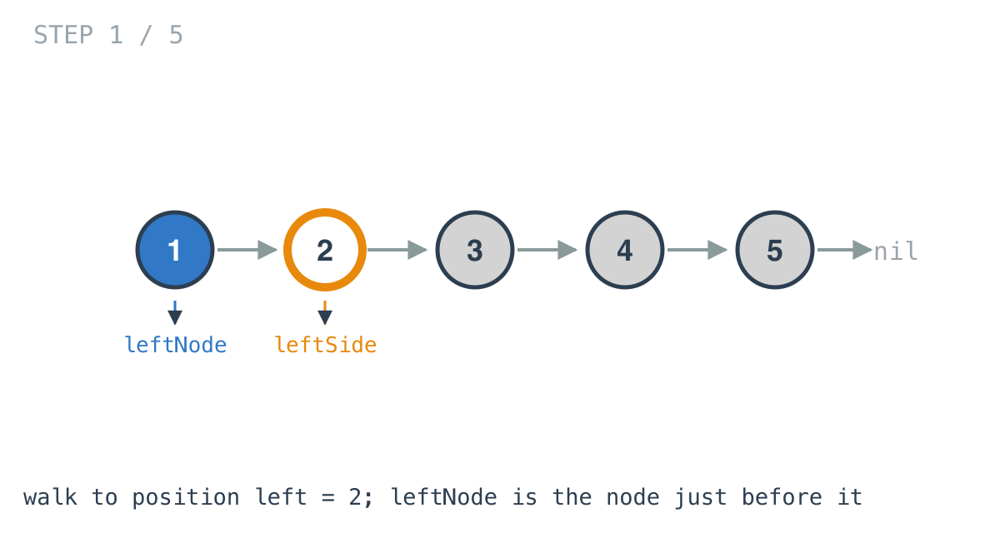
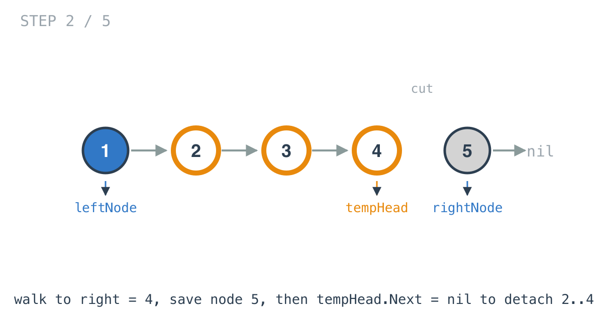
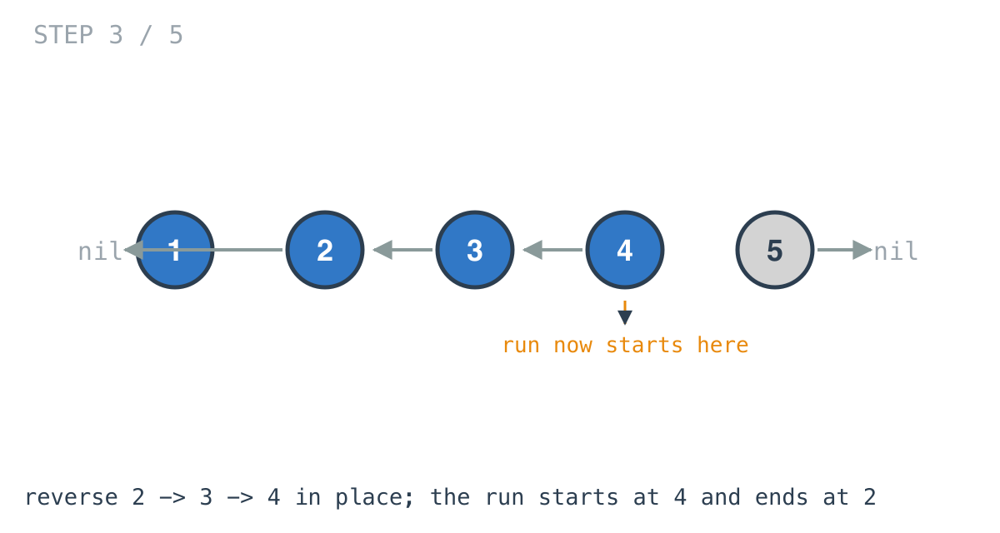
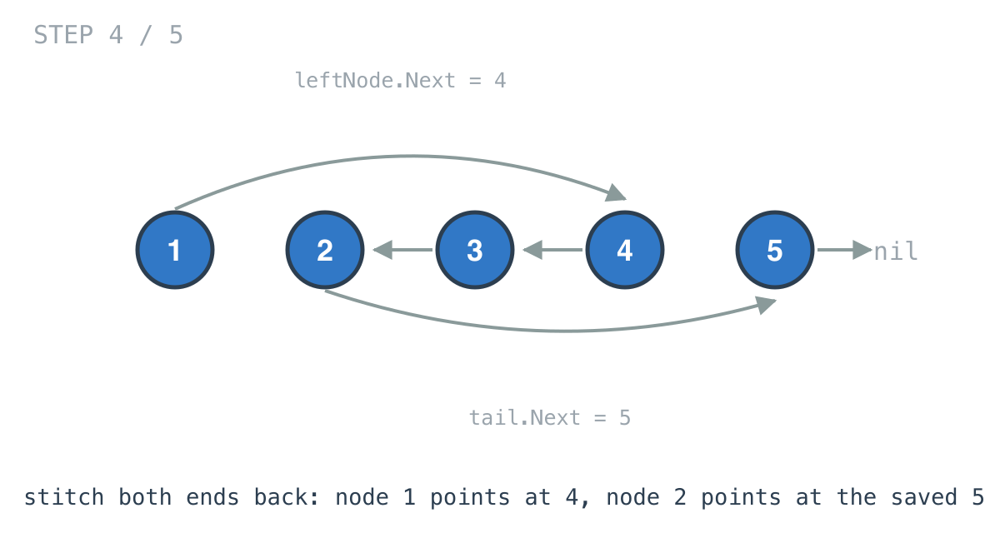
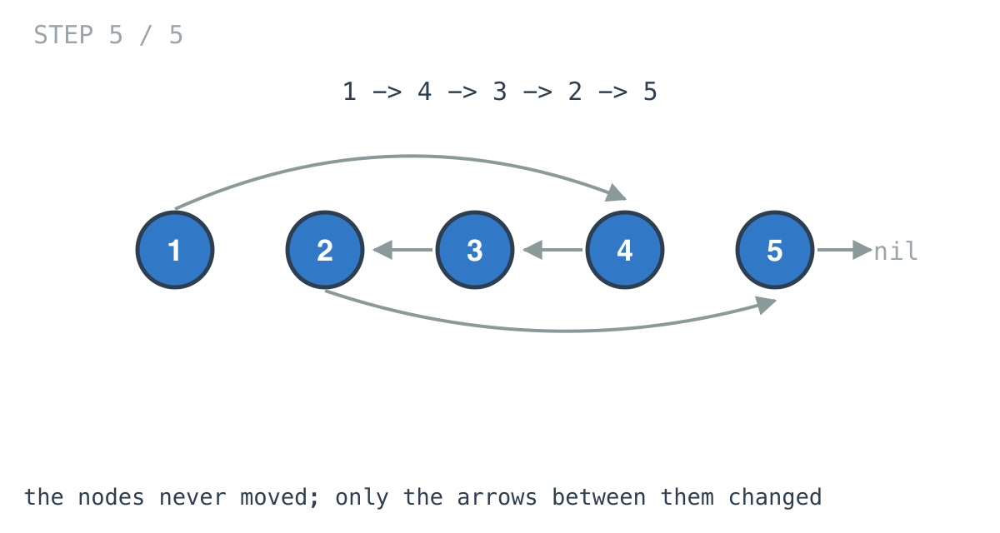

# Reverse Linked List II — solution walkthrough

From `reverse_linked_list_II.go`:

```go
func ReverseBetween(head *ListNode, left int, right int) *ListNode {
	if left == right {
		return head
	}
	tempHead := head
	var leftNode *ListNode = nil
	var rightNode *ListNode = nil
	count := 0
	for tempHead != nil {
		count++
		if count == left {
			break
		}
		leftNode = tempHead
		tempHead = tempHead.Next
	}
	leftSide := tempHead
	for tempHead != nil {
		if count == right {
			break
		}
		count++
		tempHead = tempHead.Next
	}

	rightNode = tempHead.Next
	tempHead.Next = nil
	leftSide = reverse(leftSide)
	if leftNode == nil {
		head = leftSide
	} else {
		leftNode.Next = leftSide
	}

	for leftSide.Next != nil {
		leftSide = leftSide.Next
	}
	leftSide.Next = rightNode
	return head
}
```

Plus `reverse`, which is day 19's function with nothing changed.

## The early exit

```go
if left == right {
	return head
}
```

A run of one node is already reversed. This also means everything below can assume at least two nodes in the run.

## Finding the front seam

```go
for tempHead != nil {
	count++
	if count == left {
		break
	}
	leftNode = tempHead
	tempHead = tempHead.Next
}
leftSide := tempHead
```



Two pointers come out of this loop. `tempHead` is on position `left`, the first node of the run. `leftNode` is the node before it, kept by assigning it *before* stepping forward.

`leftNode` stays `nil` when `left == 1`, because the loop breaks on the first iteration before any assignment. That nil is not an oversight, it is the signal that the run starts at the head and there is no predecessor to reattach to.

`leftSide` captures the run's first node, which will become its last.

## Finding the back seam and cutting

```go
for tempHead != nil {
	if count == right {
		break
	}
	count++
	tempHead = tempHead.Next
}

rightNode = tempHead.Next
tempHead.Next = nil
```



`tempHead` ends on position `right`. `rightNode` saves whatever follows the run, and then the run is cut loose.

That cut is the interesting decision. With `tempHead.Next` set to `nil`, the run from `leftSide` to `tempHead` is a complete, ordinary, nil-terminated list. Which means the next line can be day 19's reversal with no modification: no bounds, no counter, no notion that it is operating on part of something bigger.

## Reversing

```go
leftSide = reverse(leftSide)
```



`reverse` walks forward pointing each node at its predecessor, exactly as on day 19, and returns the node that ends up first.

Note what happens to the variable: `leftSide` was the run's first node and is now reassigned to the run's *new* first node. The node it used to name is now the run's tail, and finding it again is the next problem.

## Reattaching the front

```go
if leftNode == nil {
	head = leftSide
} else {
	leftNode.Next = leftSide
}
```



If the run started at the head, the run's new first node becomes the list's head. Otherwise the node before the run points at it.

This is the third time this arc has hit "the head has no predecessor". Day 22 erased it with a dummy node, day 24 took an explicit branch, and so does this. A dummy in front of `head` would collapse this `if` into its `else`.

## Reattaching the back

```go
for leftSide.Next != nil {
	leftSide = leftSide.Next
}
leftSide.Next = rightNode
```

You cannot save a pointer to the run's tail before reversing, because which node ends up at the tail is precisely what the reversal decides. So the code walks the reversed run to its end and attaches `rightNode` there.

The walk is the cost of having reused `reverse` unchanged. A hand-written reversal could have tracked the tail as it went, and it would also have been a second copy of logic that already exists and already works.



## Why `head` is returned

`head` is unchanged unless the `leftNode == nil` branch moved it. That branch is the only reason this function needs a return value at all.

## Complexity

- **Time: O(n).** One walk to `right`, one reversal of the run, one walk across the reversed run to find its tail. Three partial passes, linear overall.
- **Space: O(1).** Five pointers and a counter. Nothing allocated.

## Test

`reverse_linked_list_II_test.go` covers `[1,2,3,4,5]` with `left = 2, right = 4` producing `[1,4,3,2,5]`, which exercises both seams, and the single-node `[5]` with `left = right = 1`, which exercises the early exit.
