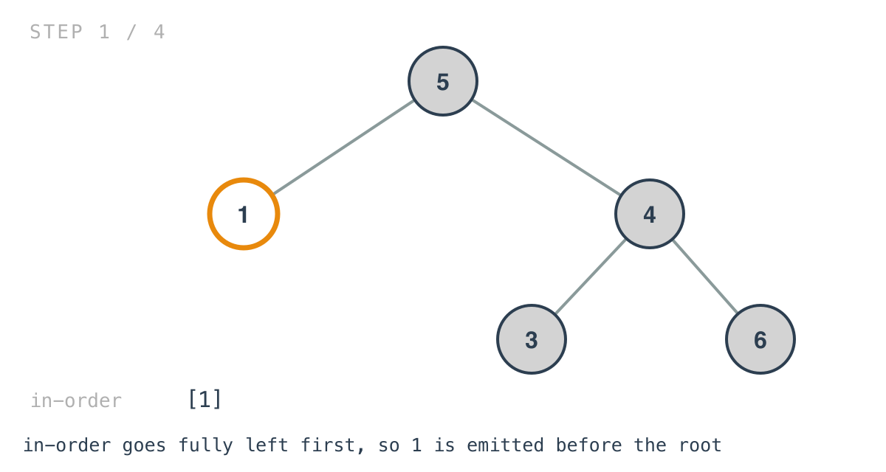
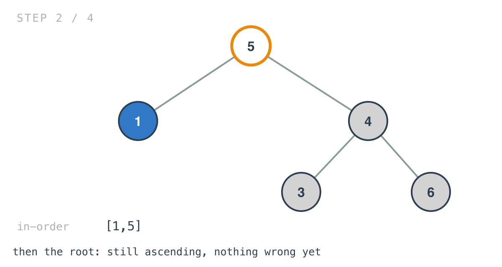
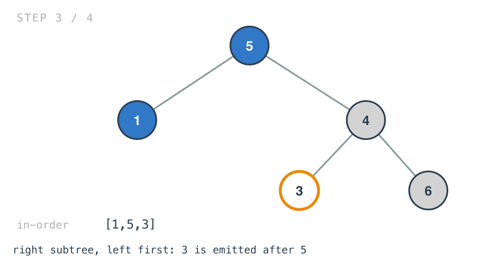
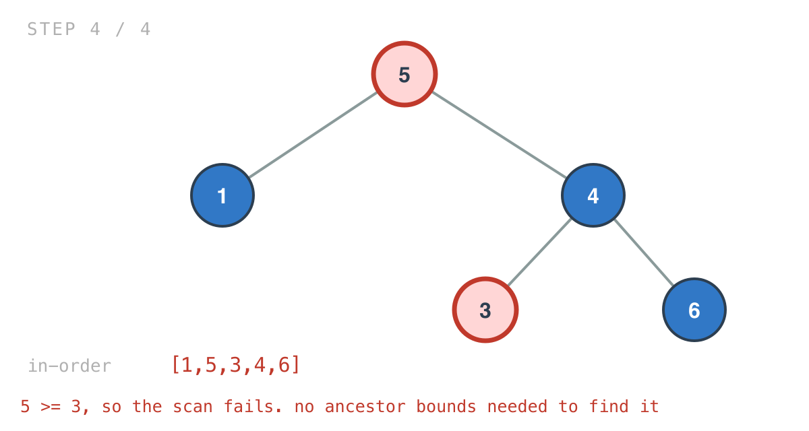

## 365 Days of LeetCode Challenge — Day 32/365

# Validate Binary Search Tree

🔗 https://leetcode.com/problems/validate-binary-search-tree/ · Difficulty: Medium

### The problem

Determine whether a binary tree is a valid BST: every node in a left subtree strictly
smaller, every node in a right subtree strictly greater, and both subtrees valid too.


### The intuition

The definition in the problem is recursive and local-sounding. Implement it literally and
it's easy to write the classic wrong answer — check each node against its two children
only. That accepts trees where a node deep in a left subtree is larger than an ancestor
several levels up. A BST constrains a node against every ancestor, not just its parent.

The usual fix is to thread a (min, max) bound pair down the recursion, tightening it at
each step. That works. There's a shorter route that uses a property this batch has already
leaned on twice.

In-order traversal of a BST yields its values in ascending order. That isn't a side effect,
it's equivalent to the definition — and equivalences run both ways. If in-order comes out
sorted, the tree is a BST; if it doesn't, it isn't.

So validation becomes: traverse in-order into a slice, then check the slice is strictly
increasing. No bounds threaded down, no min/max pairs, and the "deep node violating a
distant ancestor" case is handled without ever being thought about — that node simply lands
in the wrong place in the sorted order.

Strictly increasing, not merely non-decreasing. The problem says strictly less and strictly
greater, so duplicates are invalid, which is why the check is `>=` rather than `>`.

### Builds on

- [Day 30: Minimum Absolute Difference in BST](https://github.com/architagr/leetcode_solutions/blob/main/easy_problems/501_600/minimum_absolute_difference_in_bst/) — in-order traversal of a BST yields values in sorted order, which that problem relied on to compare only adjacent values
- [Day 29: Find Mode in Binary Search Tree](https://github.com/architagr/leetcode_solutions/blob/main/easy_problems/501_600/find_mode_in_binary_search_tree/) — the same property, noted there as the follow-up's constant-space route

### The solution

```go
func IsValidBst(root *TreeNode) bool {
	arr := InorderTraversal(root)

	for i := 0; i < len(arr)-1; i++ {
		if arr[i] >= arr[i+1] {
			return false
		}
	}
	return true
}

func inorderTraversal(A *TreeNode, arr []int) []int {
	if A == nil {
		return arr
	}
	arr = inorderTraversal(A.Left, arr)
	arr = append(arr, A.Val)
	arr = inorderTraversal(A.Right, arr)
	return arr
}
```

Tracing `[5,1,4,null,null,3,6]` — the invalid example. Root `5` with children `1` and `4`;
`4` has children `3` and `6`.

The walk descends fully left before emitting anything.





Node `3` sits in the root's right subtree, so it must be greater than `5`. It isn't, and in
the in-order sequence that means it's emitted straight after `5`.



The sequence is `[1,5,3,4,6]`, and the pair `(5,3)` fails the scan. Nothing compared `3`
against `5` deliberately — the out-of-place node just landed in the wrong slot.



The file also keeps a second approach, `IsValidBstApproch1`, which implements the local
definition honestly: at each node, scan the entire left subtree for a maximum and the
entire right subtree for a minimum. That's correct — it compares against whole subtrees
rather than immediate children — but it re-scans subtrees at every node, making it O(n^2)
on a skewed tree. It's there as the contrast rather than as the answer.

O(n) time, one traversal plus one linear scan. Space is O(n) for the collected slice plus
O(h) for the recursion stack. The standard improvement is comparing each value against the
previously visited one during the traversal rather than materialising the slice, dropping
space to O(h) — which is exactly what Day 30 already does, so the pieces are on the shelf.

Full code and the step-by-step walkthrough:
[validate_binary_search_tree](https://github.com/architagr/leetcode_solutions/blob/main/medium_problems/1_100/validate_binary_search_tree/SOLUTION.md)

#DSA #LeetCode #100DaysOfCode #CodingInterview #BinarySearchTree #Recursion #Golang

---

*Solution and code by Archit Agarwal. Write-up drafted with AI assistance from the code and problem statement.*
