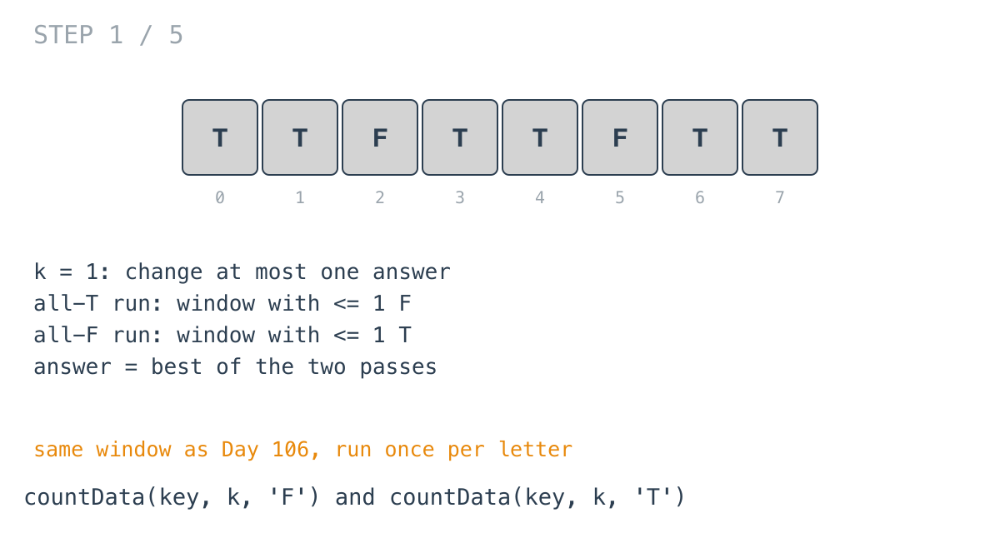
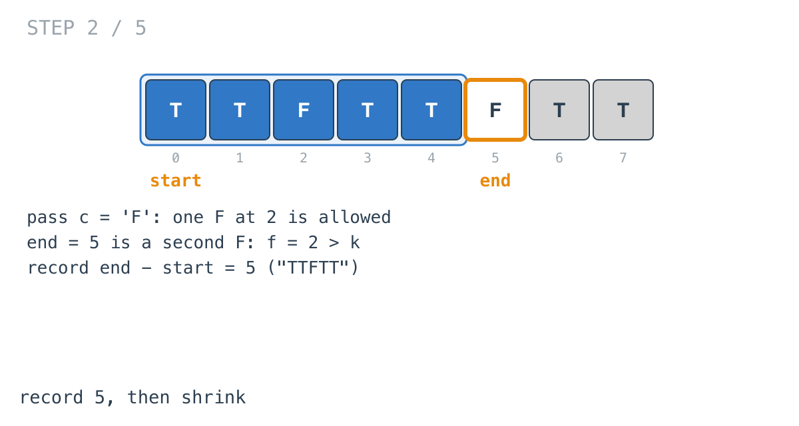
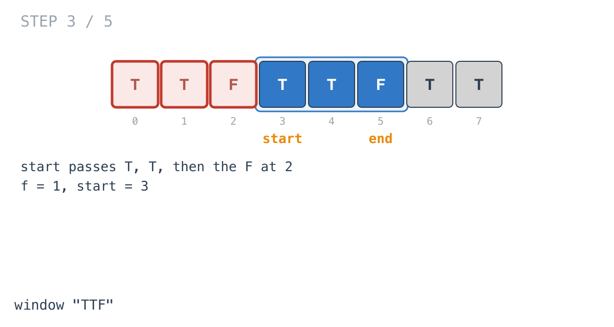
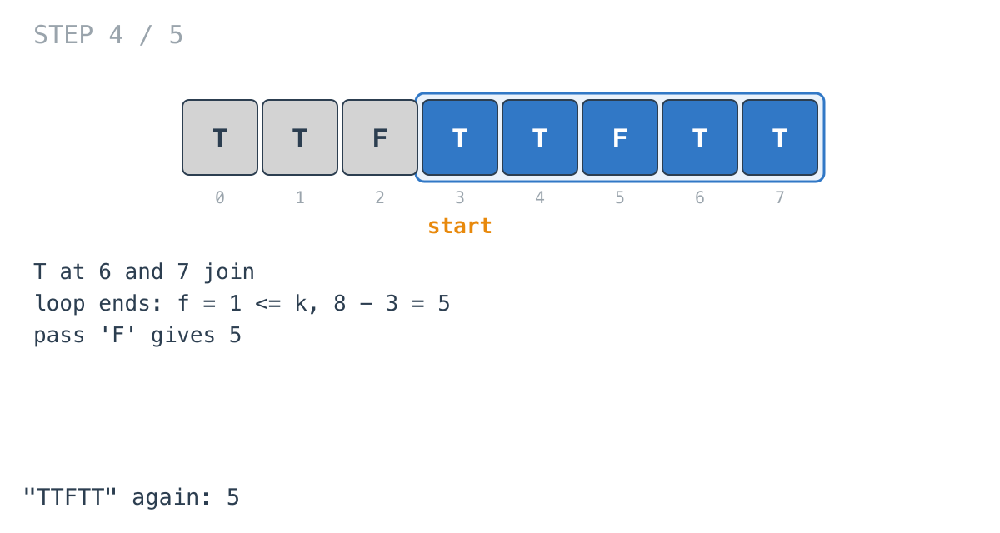
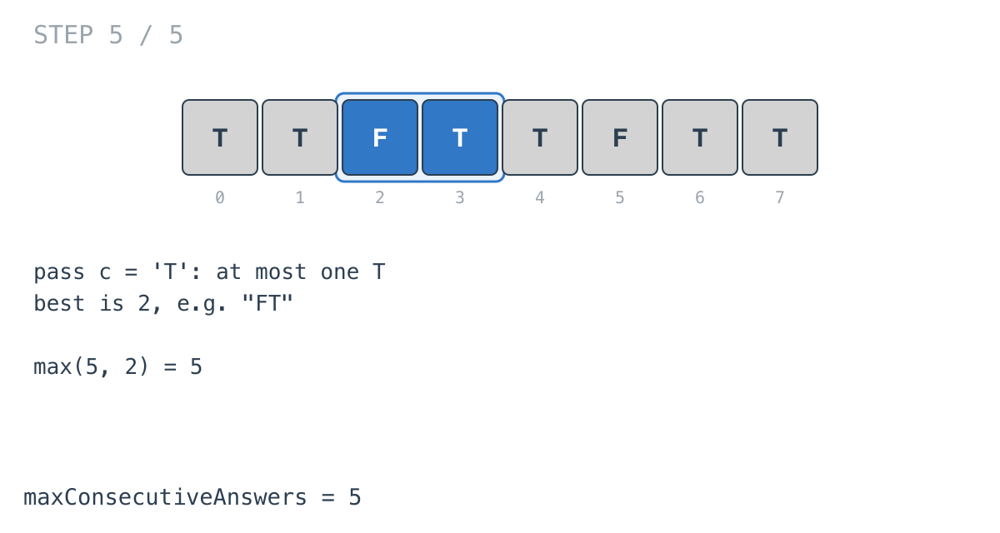

## Solution walkthrough

`maxConsecutiveAnswers(answerKey string, k int) int` in
`maximize_the_confusion_of_an_exam.go` calls `countData` once per letter and returns the
larger result. `countData(answerKey, k, c)` finds the longest window with at most `k`
copies of `c`.

We'll trace Example 3: `answerKey = "TTFTTFTT"`, `k = 1`, expected `5`.

1. **Two questions.** A run of Ts needs every F inside it changed, so the longest
   possible T run is the longest window with at most `k` Fs: `countData(answerKey, k,
   'F')`. Swap the letters for the longest F run. The answer is `findMax` of the two.

   

2. **Grow, counting `c`.** In the `'F'` pass, `f` counts Fs in `[start, end]`. The F at 2
   is within the budget. At `end = 5` a second F makes `f = 2 > k`. The window before it,
   `end - start = 5` (`"TTFTT"`), is recorded.

   

3. **Shrink past one F.**

   ```go
   for f > k {
       if answerKey[start] == c {
           f--
       }
       start++
   }
   ```

   `start` walks past T, T, and the F at 2, and stops at 3 with `f = 1`.

   

4. **Finish the pass.** The Ts at 6 and 7 join. The loop ends with `f = 1 <= k`, and the
   final check records `8 - 3 = 5`. This pass returns 5.

   

5. **The other pass, and the answer.** Allowing at most one T, the longest window is 2
   (for example `"FT"`). `findMax(5, 2) = 5`.

   

**Complexity:** O(n) time for two linear passes, O(1) space.
