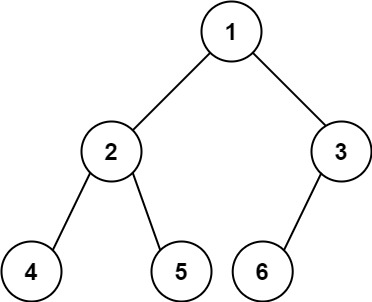
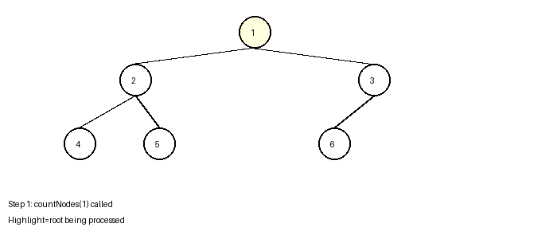
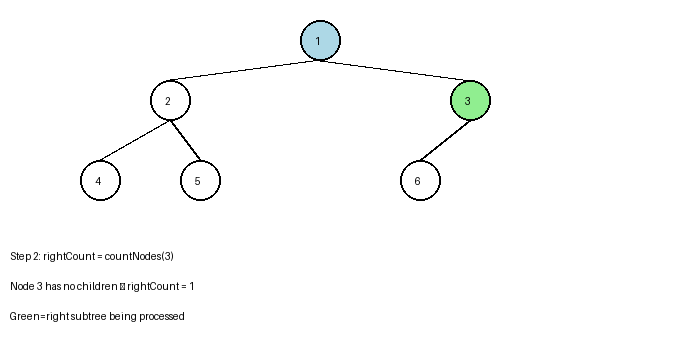
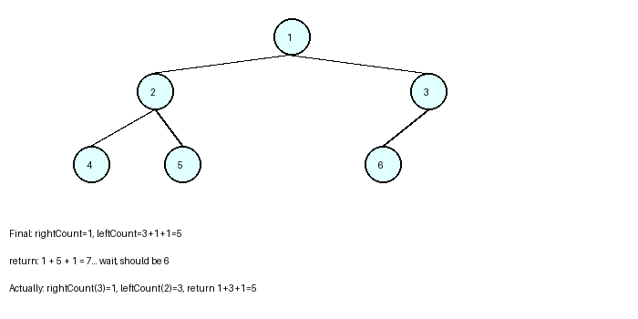

# 365 Days of LeetCode Challenge — Day 6/365

## Count Complete Tree Nodes

**LeetCode:** [#222 - Count Complete Tree Nodes](https://leetcode.com/problems/count-complete-tree-nodes/)  
**Solution:** [github.com/architagr/leetcode_solutions/blob/main/medium_problems/201_300/count_complete_tree_nodes/](https://github.com/architagr/leetcode_solutions/blob/main/medium_problems/201_300/count_complete_tree_nodes/)

---

## Related Easy Problems

If you haven't solved these yet, they build great intuition:

- [Day 1: Maximum Depth of Binary Tree](https://www.linkedin.com/pulse/365-days-leetcode-challenge-day-1365-archit-agarwal-tzfbe) — understanding height/depth
- [Day 5: Balanced Binary Tree](https://www.linkedin.com/pulse/365-days-leetcode-challenge-day-5365-archit-agarwal-pjgoc) — recognizing tree structure

---

## Intuition

The straightforward approach is to simply traverse every node and count them. While this runs in O(n) time, a complete binary tree has special structure we can exploit to do better.

The key insight: if we traverse down the left spine (always going left), and separately traverse down the right spine (always going right), we can tell whether the left subtree is a "perfect" binary tree (all levels completely filled).

If both spines have the same height, the left subtree is a perfect binary tree of that height, so it has exactly 2^h - 1 nodes. We can skip traversing it and recursively count only the right subtree.

If the left spine is taller, then the right subtree is a perfect binary tree, and we recursively count only the left subtree.

This binary search on height lets us do O(log^2 n) in the best case, since we skip entire subtrees.

The current implementation uses the simple O(n) approach, which is correct and sometimes more readable, especially for an interview when the constraint wasn't immediately clear.

---

## Solution Walkthrough

Trace through LeetCode's example `[1,2,3,4,5,6]`:



### Approach: Recursive Traversal

To count nodes in a tree, count the nodes in the right subtree, count the nodes in the left subtree, and add 1 for the root.

### Code

```go
func countNodes(root *TreeNode) int {
    if root == nil {
        return 0
    }

    // Count nodes in both subtrees
    rightCount := countNodes(root.Right)
    leftCount := countNodes(root.Left)
    // Include the root itself
    return rightCount + leftCount + 1
}
```

**Base case:** If we reach a nil node, there are no nodes to count, so return 0.

**Recursive case:**

1. Count all nodes in the right subtree by recursively calling `countNodes(root.Right)`
2. Count all nodes in the left subtree by recursively calling `countNodes(root.Left)`
3. Add 1 for the current node
4. Return the total

### Example Trace

Walking through `[1,2,3,4,5,6]`:

1. Start at node 1 (root):

   

2. Process right subtree (node 3): has one left child (node 6), so count is 2:

   

3. Process left subtree (node 2): has two children (4, 5), so count is 3.
   Final: rightCount=2, leftCount=3, return 2+3+1=6 ✓

   

### Complexity

- **Time:** O(n) — we visit every node once
- **Space:** O(h) where h is the height — recursion stack depth

---

#BinaryTree #BinarySearchTree #TreeTraversal #LeetCode #100DaysOfCode #Golang #CodingInterview

---

_Solution and code by Archit Agarwal. Write-up drafted with AI assistance from the code and problem statement._
