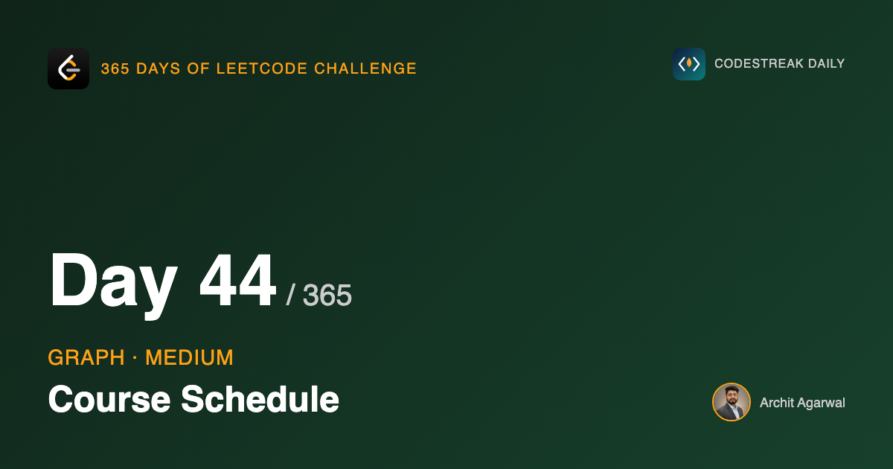

## 365 Days of LeetCode Challenge — Day 44/365

**[207. Course Schedule](https://leetcode.com/problems/course-schedule/)** (Medium)

Given courses and their prerequisites, can you finish all of them?

This closes the graph arc, and it closes it on the same trick day 43 used: a cycle detected without ever searching for one.

## The question is about cycles

You can finish everything unless some group of courses depends on itself. A needs B, B needs C, C needs A. Nobody in that group can start, ever.

So this is cycle detection in a directed graph, phrased as scheduling.

## Directed edges, and the direction is a decision

```go
inDegree[pre[0]]++
aj[pre[1]] = append(aj[pre[1]], pre[0])
```

Every graph in this arc so far has been undirected, and every adjacency list wrote each edge under **both** endpoints. This writes it under one, and which one matters.

`[a, b]` means `b` must come before `a`. The useful edge points from the prerequisite toward what it unlocks: `b -> a`. Finishing `b` brings `a` closer to available.

Build it the other way and the code runs perfectly and answers a different question.

## Kahn's algorithm

Count how many prerequisites each course still has — its in-degree.


Queue everything with in-degree 0: those can be taken right now. Same multi-source seeding as day 40.


## The one line that separates this from a BFS

```go
inDegree[de]--
if inDegree[de] == 0 {
	push(de)
}
```

In day 36, a node was enqueued the first time it was **reached**. Here, reaching a node only decrements its counter. It is enqueued when that counter hits **zero**.

A course with three prerequisites is reached three times and enters the queue only on the third, once everything it was waiting for is genuinely finished.

That `if` is not an optimisation. It is the scheduling rule.


## Cycle detection by absence

```go
return len(result) == numCourses
```


Nothing here looks for a cycle.

If every course came out of the queue, there was no cycle. If some never did, those are exactly the courses inside a cycle or downstream of one — their in-degree could only be reduced by a course that is itself still waiting, and in a cycle every member waits on another member. The counters never reach zero, so those courses never enter the queue and never appear in the result.

The cycle is detected by what fails to show up.

This is day 43's move again. There a cycle was inferred from an edge count; here from a completion count. Both times the inference is shorter than the search, and both times it comes from knowing a property rather than writing a cleverer traversal.

## Something this throws away

The function only uses `len(result)`, so an `int` would do.

But `result` holds a valid order to take the courses in — a topological ordering. Course Schedule II asks for exactly that, and this solution already computes it and discards it.

## Complexity

- **Time: O(V + E)**. One pass over the prerequisites, then each course dequeued once and each edge relaxed once.
- **Space: O(V + E)** for the graph and in-degree array.

## Builds on

- [Day 36: Find if Path Exists in Graph](https://github.com/architagr/leetcode_solutions/blob/main/easy_problems/1901_2000/find_if_path_exists_in_graph/) — building an adjacency list from a list of pairs, with the difference that these pairs are directed

Full code and the step-by-step walkthrough:
[course_schedule](https://github.com/architagr/leetcode_solutions/blob/main/medium_problems/201_300/course_schedule/SOLUTION.md)

#DSA #LeetCode #Golang #Graphs #TopologicalSort #CodingInterview #Algorithms

---

*Solution and code by Archit Agarwal. Write-up drafted with AI assistance from the code and problem statement.*
