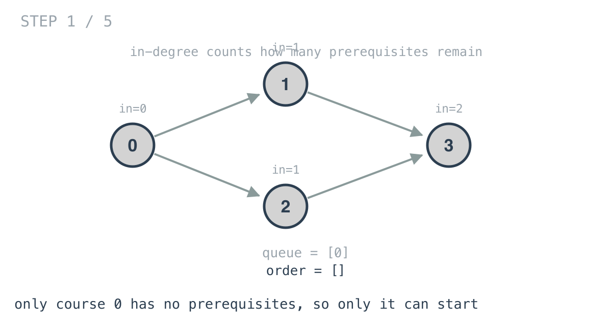
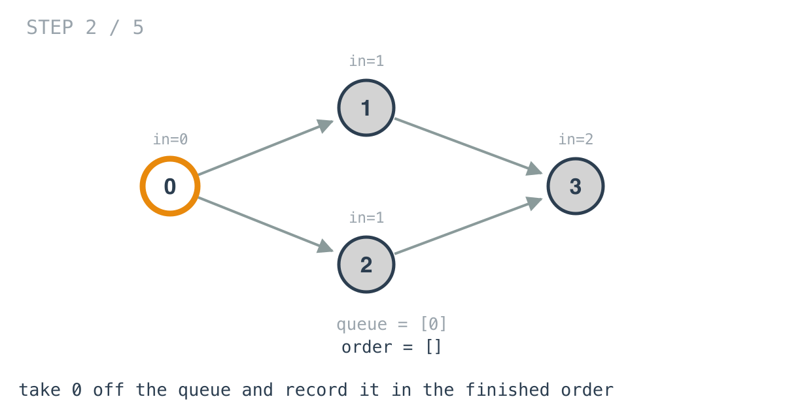
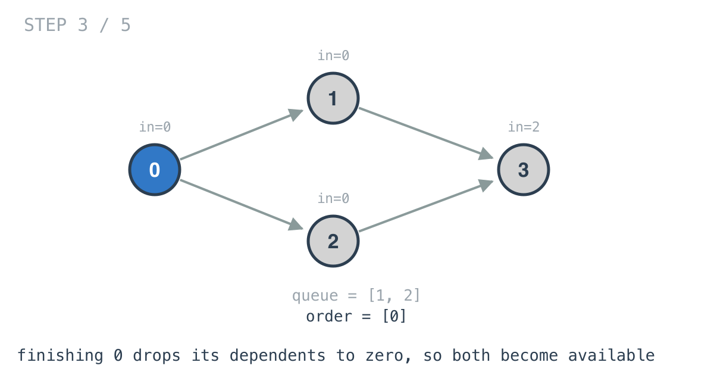
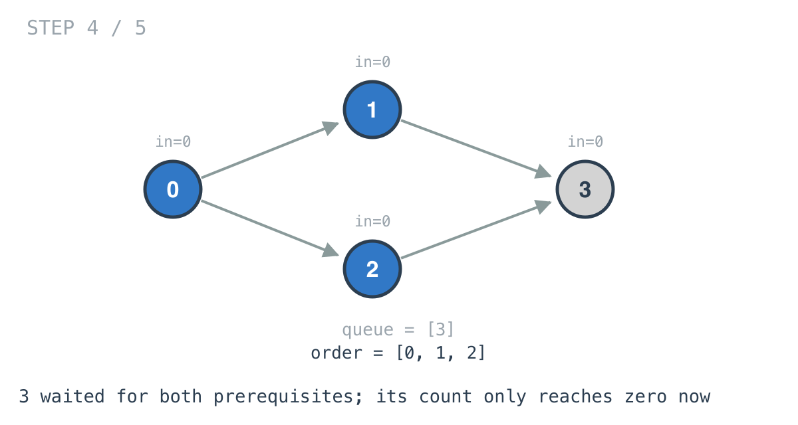
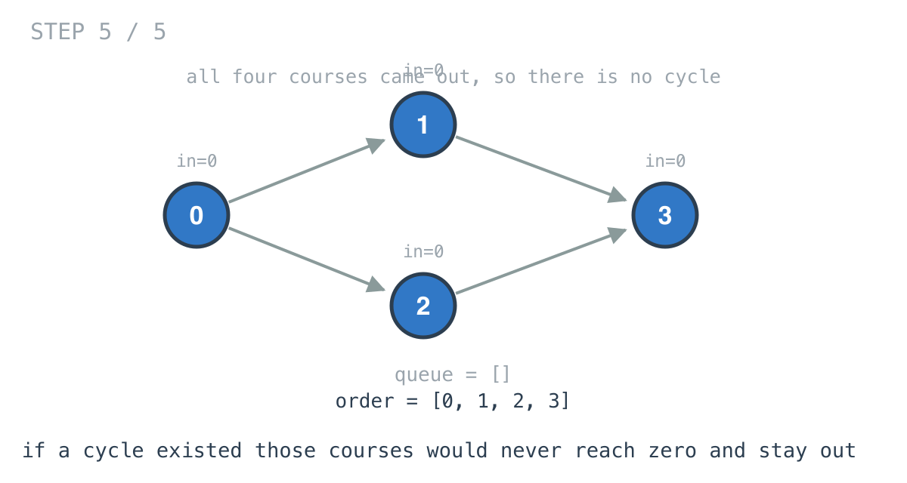

# Course Schedule — solution walkthrough

From `main.go`:

```go
func canFinish(numCourses int, prerequisites [][]int) bool {
	result := make([]int, 0, numCourses)

	aj := make(map[int][]int)
	inDegree := make([]int, numCourses)
	for _, pre := range prerequisites {
		inDegree[pre[0]]++
		aj[pre[1]] = append(aj[pre[1]], pre[0])
	}
	q := make([]int, 0, numCourses)
	push := func(c int) { q = append(q, c) }
	pop := func() int {
		x := q[0]
		q = q[1:]
		return x
	}
	for i := 0; i < numCourses; i++ {
		if inDegree[i] == 0 {
			push(i)
		}
	}
	for len(q) > 0 {
		c := pop()
		result = append(result, c)
		for _, de := range aj[c] {
			inDegree[de]--
			if inDegree[de] == 0 {
				push(de)
			}
		}
	}
	return len(result) == numCourses
}
```

## The question is about cycles

You can finish every course unless some group depends on itself: A needs B, B needs C, C needs A. No member of that group can ever be started.

So this is cycle detection in a directed graph, phrased as a scheduling question.

## Directed edges, and the direction matters

```go
inDegree[pre[0]]++
aj[pre[1]] = append(aj[pre[1]], pre[0])
```

Every graph in this arc so far has been undirected, and every adjacency list wrote each edge under both endpoints. This one writes it under one, and which one is a real decision.

`prerequisites[i] = [a, b]` means `b` must be taken before `a`. The edge that is useful points from the prerequisite toward what it unlocks: `b -> a`. Finishing `b` makes `a` closer to available, so `aj` is keyed by `pre[1]` and holds `pre[0]`.

At the same time `inDegree[pre[0]]` counts how many prerequisites `a` is still waiting on.

Build this the other way round and the code runs perfectly and answers a different question.



## Seeding with what is already available

```go
for i := 0; i < numCourses; i++ {
	if inDegree[i] == 0 {
		push(i)
	}
}
```

A course with no prerequisites can be taken immediately. Every such course goes into the queue before the walk starts.

This is day 40's multi-source seeding again: the queue begins with every valid starting point rather than one.

If this loop pushes nothing, every course has a prerequisite, which means there is a cycle, and the main loop never runs. The final count catches it.

## Enqueue when ready, not when reached

```go
for len(q) > 0 {
	c := pop()
	result = append(result, c)
	for _, de := range aj[c] {
		inDegree[de]--
		if inDegree[de] == 0 {
			push(de)
		}
	}
}
```





This is where Kahn's algorithm differs from the BFS in day 36, and the difference is the whole algorithm.

In day 36, a node was enqueued the first time it was reached. Here, reaching a node only decrements its counter. It is enqueued when that counter hits **zero**.

A course with three prerequisites is reached three times and enters the queue only on the third, once everything it was waiting for is genuinely done. The `if` is not an optimisation; it is the scheduling rule.



Course 3 waited for both 1 and 2. Its in-degree only reaches zero after both are finished.

## Cycle detection by absence

```go
return len(result) == numCourses
```



Nothing in this function looks for a cycle.

If every course came out of the queue, there was no cycle. If some never did, those courses are precisely the ones inside a cycle or downstream of one — their in-degree could only have been reduced by a course that was itself still waiting, and in a cycle every member is waiting on another member. The counters never reach zero, the courses never enter the queue, and they are missing from `result`.

The cycle is detected by what fails to appear.

This is day 43's move exactly. There, a cycle was inferred from an edge count rather than searched for. Here it is inferred from a completion count. Both times the inference is shorter and simpler than the search would have been, and both times the trick is knowing a property that makes the search unnecessary.

## `result` is more than a counter

The function only uses `len(result)`, so an `int` would do.

What the slice holds, though, is a valid order to take the courses in — a topological ordering. Course Schedule II asks for exactly that, and this solution already computes it and throws it away.

## Complexity

- **Time: O(V + E).** One pass over the prerequisites, then each course dequeued once and each edge relaxed once.
- **Space: O(V + E)** for the adjacency list and the in-degree array, plus O(V) for the queue.

## Test

`main_test.go` covers the two worked examples: two courses with one prerequisite returning true, and two courses that require each other returning false. The second is the minimal cycle, where the seeding loop finds no course with in-degree zero and the main loop never runs at all.
