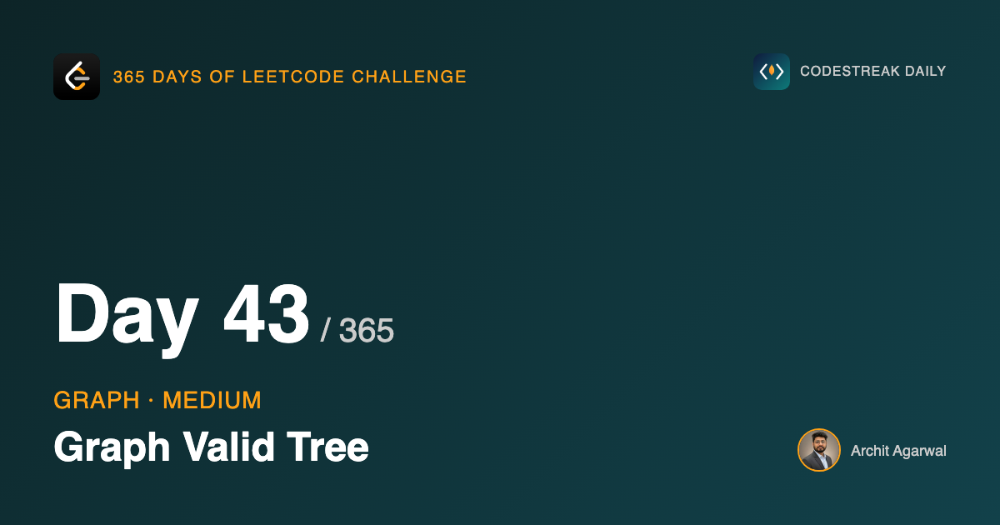

## 365 Days of LeetCode Challenge — Day 43/365

**[261. Graph Valid Tree](https://leetcode.com/problems/graph-valid-tree/)** (Medium)

Given `n` nodes and a list of undirected edges, is the graph a tree?

## Two conditions

A graph is a tree when it is **connected** and **acyclic**. Both are required. A forest of two trees is acyclic but disconnected; a triangle is connected but cyclic.

## The shortcut that removes the second check

A tree on `n` nodes has exactly `n - 1` edges.

That fact turns the acyclic test into arithmetic:

```go
if set.count > 1 {
	return false
}
return len(edges) == n-1
```

- Connected with exactly `n - 1` edges: a tree.
- Connected with more: there must be a cycle, because `n` nodes cannot be joined by more than `n - 1` edges without creating one.
- Fewer than `n - 1`: cannot be connected, so the first check already returned false.

The solution never searches for a cycle. It counts.

## A structure that does not traverse

Every previous problem in this arc built an adjacency list and walked it. This one does not build one at all.

Union-find consumes the edge list directly and maintains a single number — the component count — which is exactly the connectivity answer. It is the first structure in the arc whose shape is *merging* rather than *walking*.


Every node starts as its own root, so there are `n` components.


Each edge whose endpoints have different roots joins two components, so one root adopts the other and the count drops. That is what keeps `count` accurate without ever recomputing it.


## The cycle information is already there

```go
if root1 == root2 {
	return
}
```

When both endpoints already share a root, they were already connected, and this edge closes a cycle.

This solution does not use that fact, because the edge count catches it more cheaply. But it is worth noticing that it is sitting right there: if a problem asks *which* edge creates the cycle rather than whether one exists, that early return is the answer.

## Path compression is one line

```go
set.root[node] = set.Find(set.root[node])
```

`Find` does not just return the root, it **writes it back**. Every node on the path gets repointed directly at the root as the recursion unwinds, so a second lookup on any of them is one step.

Without it, a chain of unions can build a long path and every `Find` walks its whole length.

## Union by rank

The shallower tree is hung under the deeper one. Attach the deeper under the shallower and the result is one level taller, lengthening every future `Find`.

## What those two optimisations do not do

They change **nothing** about which answer comes out. Remove both and this solution is still correct, just slower.

What they buy is an amortised cost of O(α(n)) per operation, where α is the inverse Ackermann function — under 5 for any input that fits in a computer. That is why union-find is usually described as effectively constant time.

## Complexity

- **Time: O(E x α(n))**, effectively linear in the edges. No adjacency list built.
- **Space: O(n)** for the two arrays.

## Builds on

- [Day 36: Find if Path Exists in Graph](https://github.com/architagr/leetcode_solutions/blob/main/easy_problems/1901_2000/find_if_path_exists_in_graph/) — the same edge-list input, handled here without ever building an adjacency list

Full code and the step-by-step walkthrough:
[graph_valid_tree](https://github.com/architagr/leetcode_solutions/blob/main/medium_problems/201_300/graph_valid_tree/SOLUTION.md)

#DSA #LeetCode #Golang #UnionFind #Graphs #CodingInterview #Algorithms

---

*Solution and code by Archit Agarwal. Write-up drafted with AI assistance from the code and problem statement.*
