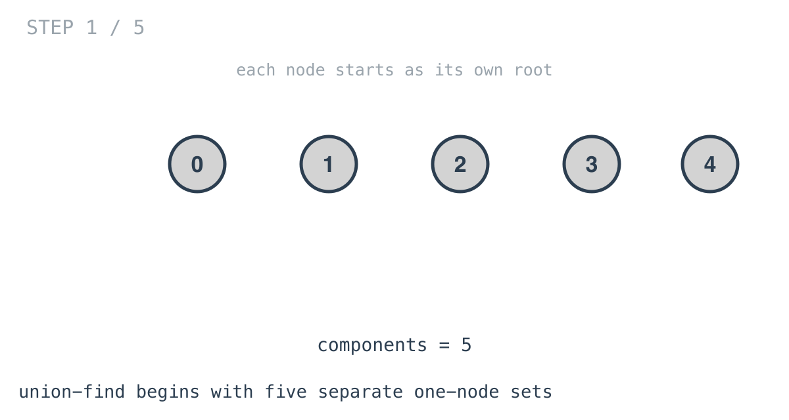
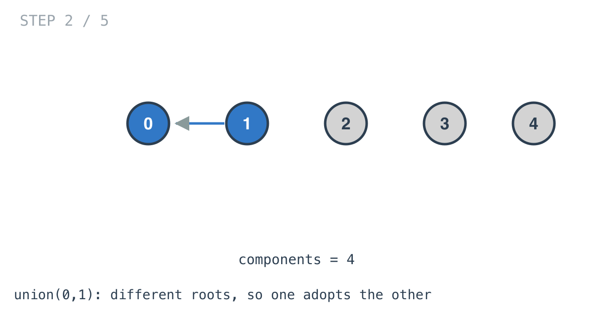
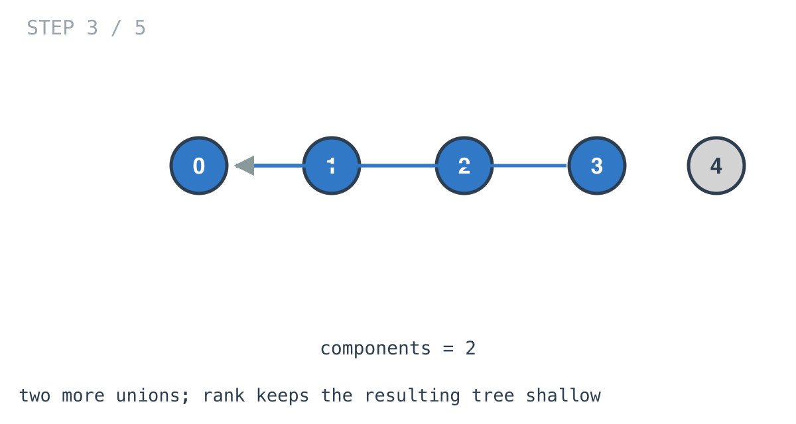
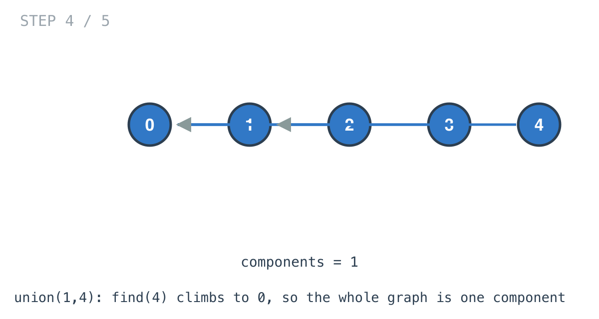
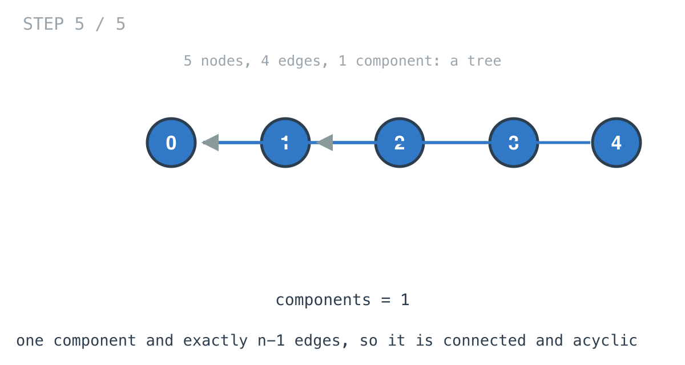

# Graph Valid Tree — solution walkthrough

From `main.go`:

```go
func validTree(n int, edges [][]int) bool {
	set := InitDisjoinSet(n)

	for _, e := range edges {
		set.Union(e[0], e[1])
	}
	if set.count > 1 {
		return false
	}
	return len(edges) == n-1
}
```

Four lines of logic, and all the work lives in the disjoint set.

## A tree is two conditions

A graph is a tree when it is **connected** and **acyclic**. Both matter: a forest is acyclic but disconnected, a triangle is connected but cyclic.

## The counting shortcut

A tree on `n` nodes has exactly `n - 1` edges. That fact turns the acyclic check into arithmetic.

```go
if set.count > 1 {
	return false
}
return len(edges) == n-1
```

Once connectivity is established, the edge count settles everything:

- Exactly `n - 1` and connected: a tree.
- More than `n - 1` and connected: there must be a cycle, because `n` nodes cannot be joined by more than `n - 1` edges without one.
- Fewer than `n - 1`: cannot be connected at all, so `count > 1` has already returned false.

Notice what the solution never does: it never looks for a cycle. It counts.

## Union-find, and why it fits

Every previous problem in this arc built an adjacency list and walked it. This does not build one.

Union-find consumes the edge list directly and maintains a single number, the component count, which is exactly the connectivity answer. It is the first structure in the arc that does not traverse anything — it merges.

## Initialisation

```go
func InitDisjoinSet(n int) *DisJointSet {
	root := make([]int, n)
	rank := make([]int, n)

	for i := range n {
		root[i] = i
		rank[i] = 1
	}
	return &DisJointSet{count: n, root: root, rank: rank}
}
```



Every node is its own root, so there are `n` components. `rank` starts at 1 everywhere.

## `Find` with path compression

```go
func (set *DisJointSet) Find(node int) int {
	if node == set.root[node] {
		return node
	}
	set.root[node] = set.Find(set.root[node])
	return set.root[node]
}
```

A node's root is found by following `root[node]` upward until a node that is its own root.

The middle line is the optimisation:

```go
set.root[node] = set.Find(set.root[node])
```

It does not just return the root, it **writes it back**. Every node on the path from `node` to the root gets repointed directly at that root as the recursion unwinds. A second lookup on any of them is one step.

This is why the structure stays flat. Without it, a chain of unions can build a long path and every `Find` walks its whole length.

## `Union`

```go
func (set *DisJointSet) Union(node1, node2 int) {
	root1 := set.Find(node1)
	root2 := set.Find(node2)

	if root1 == root2 {
		return
	}
	if set.rank[root1] > set.rank[root2] {
		set.root[root2] = root1
	} else if set.rank[root1] < set.rank[root2] {
		set.root[root1] = root2
	} else {
		...
	}
	set.count--
}
```



If the two roots are equal, both endpoints are already in the same component and the function returns without touching `count`.

That early return is where a cycle would be detected if this solution needed to detect one. It does not, because the edge count catches it, but the information is sitting right there — an edge whose endpoints already share a root is a cycle edge.



When the roots differ, the edge joins two separate components into one, so `count` drops by one. That is what makes `count` the number of components at all times without ever recomputing it.

**Union by rank** decides which root adopts which: the shallower tree is hung under the deeper one. Attaching the deeper under the shallower would make the result one level taller and lengthen every future `Find`.





## What the two optimisations do and do not do

Path compression and union by rank change **nothing** about which answer comes out. Remove both and this solution is still correct, just slower.

Together they bring the amortised cost of an operation to O(α(n)), where α is the inverse Ackermann function, which is less than 5 for any input that fits in a computer. That is why union-find is usually described as effectively constant time.

## Where the self-loop assumption sits

The solution relies on the problem's guarantee of no self-loops and no duplicate edges. A self-loop would be an edge whose endpoints share a root, so `Union` would ignore it, but it would still be counted by `len(edges)` and throw the arithmetic off.

Worth knowing before lifting this into a problem with looser constraints.

## Complexity

- **Time: O(E x α(n))**, effectively linear in the edges. No adjacency list is built.
- **Space: O(n)** for `root` and `rank`.

## Test

`main_test.go` covers the connected five-node tree returning true, and the case with an extra edge forming a cycle returning false. The second is the one the edge count catches.
