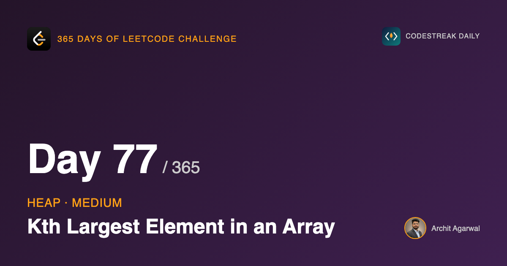
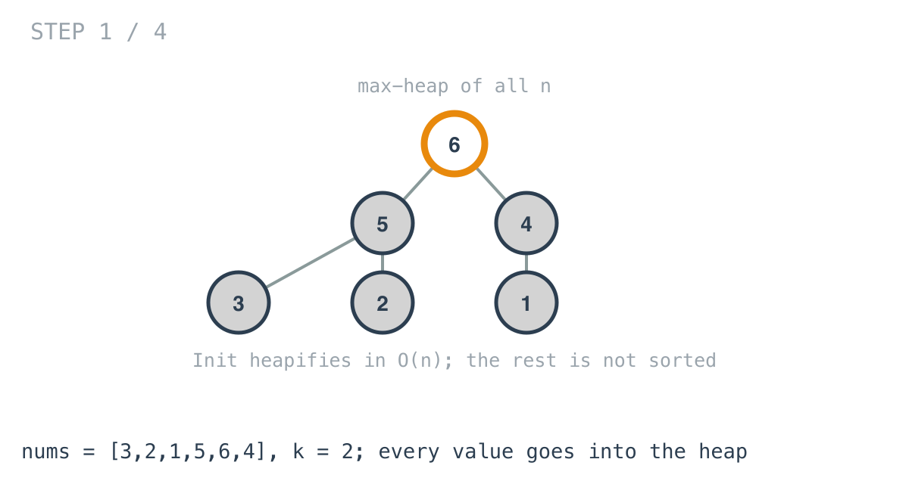
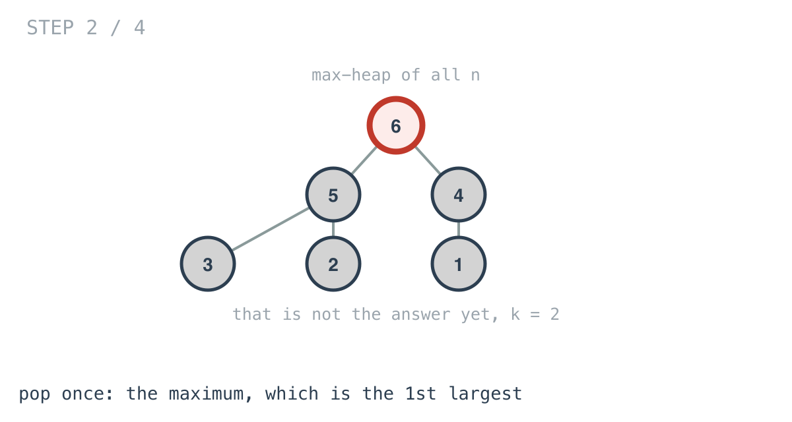
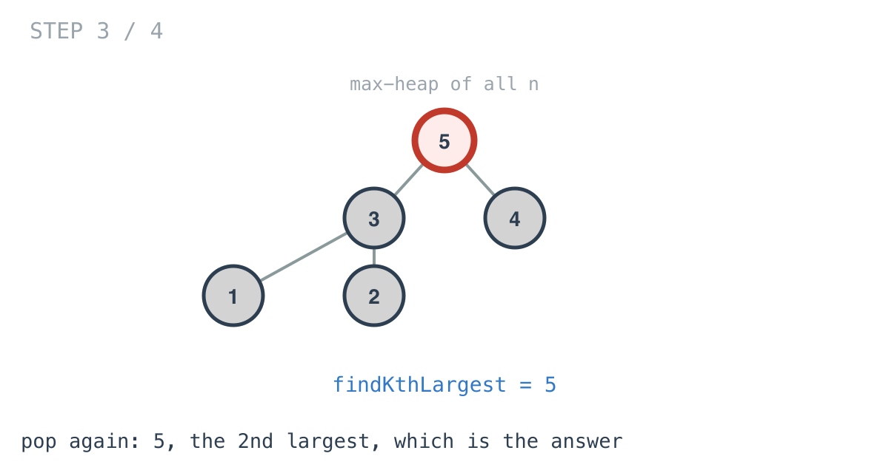
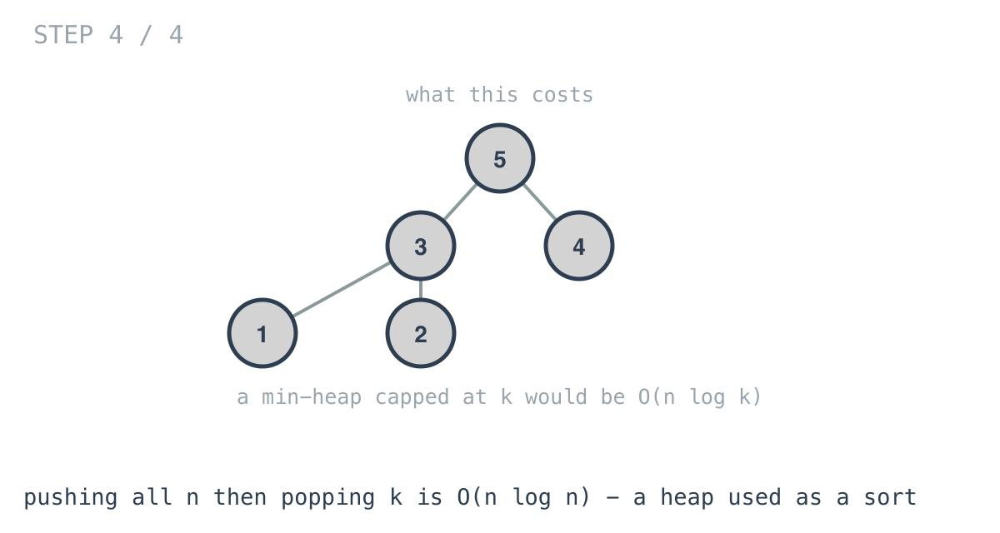

## 365 Days of LeetCode Challenge — Day 77/365

**[215. Kth Largest Element in an Array](https://leetcode.com/problems/kth-largest-element-in-an-array/)** (Medium)

Return the kth largest element, counting duplicates as separate positions.

## The definition first

"Kth largest" means **position k in sorted-descending order** — not the kth distinct value.

In `[5, 5, 4]` the 2nd largest is 5, not 4. Two fives occupy two positions. A solution that deduplicates passes every simple example and fails here.

## What this solution costs

```go
for _, v := range nums {
	heap.Push(mHeap, v)
}
var x int
for i := 0; i < k; i++ {
	x = (heap.Pop(mHeap)).(int)
}
return x
```







Pushing n elements one at a time is O(n log n). Popping k times adds O(k log n).

So this is **O(n log n)** — the same as sorting the array and indexing it. What the heap buys is stopping after k pops rather than ordering everything: a constant-factor saving, not an asymptotic one.



Worth saying plainly: this is a heap performing a sort, interrupted early.

## The version the question is really asking for

Keep a **min**-heap capped at k. Push each element; if the heap exceeds k, pop the smallest. After one pass the heap holds the k largest, and its root is the answer.

That is **O(n log k)**. With k of 5 and n of a million, log k is 2 and log n is 20.

## Why a min-heap, when you want the largest

This is the counter-intuitive part, and tomorrow's problem depends on it.

To retain the k largest, the element you need instant access to is **the smallest of the ones you kept** — because that is what an arriving element must beat to earn a place.

So the root has to be the minimum of the retained set. A max-heap of size k keeps the largest at the root, which tells you nothing about which element to evict.

## And quickselect, briefly

Partition around a pivot as in quicksort, and recurse only into the side containing position k. Average O(n), worst case O(n²) without care over the pivot.

Asymptotically the best of the three, and the fiddliest to get right under time pressure.

## Day 75 was this question with different constraints

There, values arrived one at a time and the answer was needed after each — so a size-k min-heap was the only workable structure. You cannot sort a stream that has not finished.

Here the whole array is present up front, which admits sorting, quickselect, and heaps of any shape. Same question; the constraints decide.

## Complexity

- **Time: O(n log n)** as written; O(n log k) capped; O(n) average with quickselect.
- **Space: O(n)** here, O(k) capped.

## Builds on

- [Day 75: Kth Largest Element in a Stream](https://github.com/architagr/leetcode_solutions/blob/main/easy_problems/701_800/kth_largest_element_in_a_stream/) — the same question asked of a fixed array rather than an arriving stream, which changes which heap is the right one

Full code and the step-by-step walkthrough:
[kth_largest_element_in_an_array](https://github.com/architagr/leetcode_solutions/blob/main/medium_problems/201_300/kth_largest_element_in_an_array/SOLUTION.md)

#DSA #LeetCode #Golang #Heap #PriorityQueue #CodingInterview #Algorithms

---

*Solution and code by Archit Agarwal. Write-up drafted with AI assistance from the code and problem statement.*
