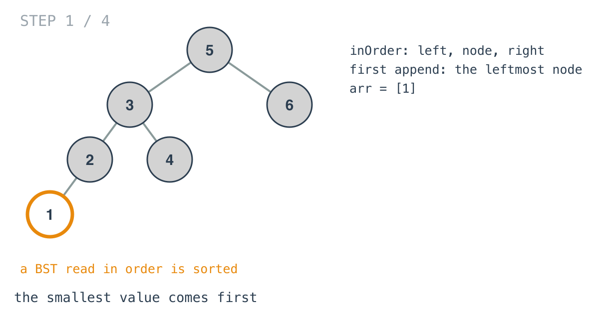
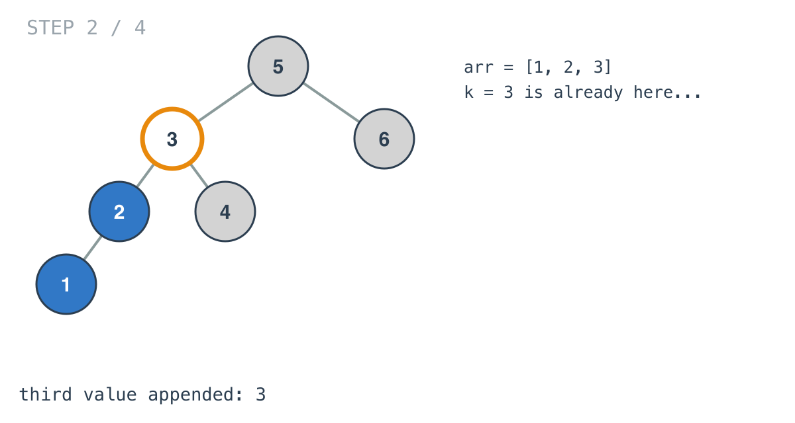
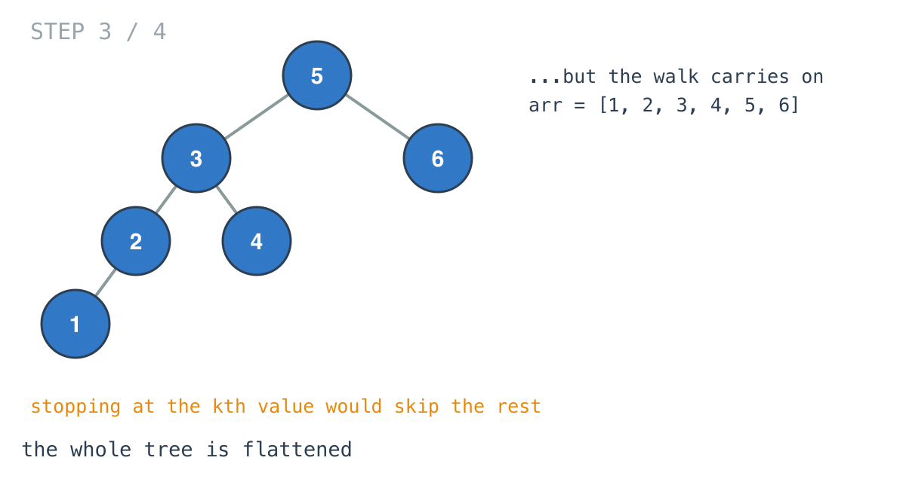

## Solution walkthrough

`kthSmallest(root *TreeNode, k int) int` in `main.go` flattens the BST in order into a
slice and indexes it.

We'll trace Example 2: `[5,3,6,2,4,null,null,1]`, `k = 3`, expected `3`.

1. **In order means sorted.** `inOrder` visits left, node, right and appends each value.
   The first value appended is the leftmost node, 1.

   

2. **The kth value arrives early.** After 2 and 3 the slice is `[1, 2, 3]`: the answer is
   already there.

   

3. **The walk still finishes.** This version keeps going until the whole tree is in the
   slice: `[1, 2, 3, 4, 5, 6]`. That's where an early stop would save work.

   

4. **Index.** `return arr[k-1]` is `arr[2] = 3`. The slice was allocated with capacity
   `10_000`, the maximum tree size, so the appends never reallocate.

   ![Step 4: arr[k-1]](images/walkthrough-4.png)

**Complexity:** O(n) time, O(n) space.
