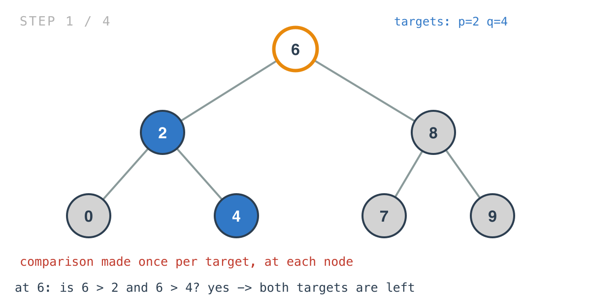
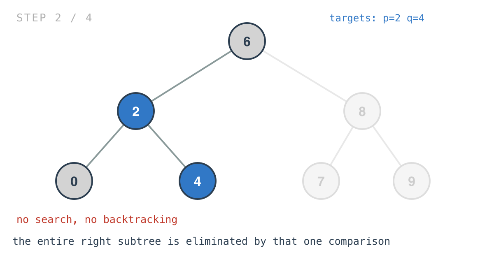
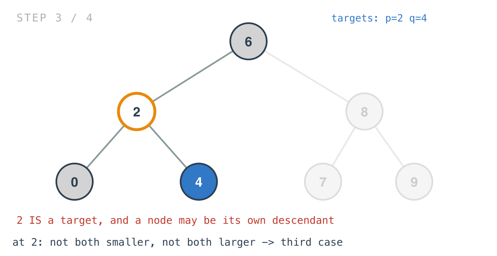
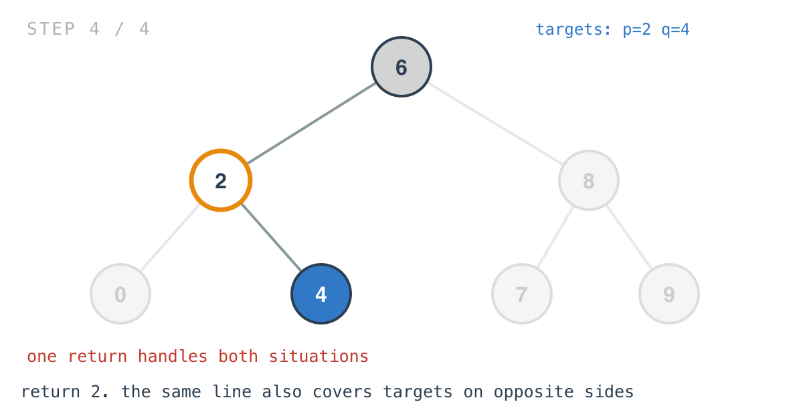

## 365 Days of LeetCode Challenge — Day 48/365

# Lowest Common Ancestor of a Binary Search Tree

🔗 https://leetcode.com/problems/lowest-common-ancestor-of-a-binary-search-tree/ · Difficulty: Medium

### The problem

Given a BST and two nodes `p` and `q`, return their lowest common ancestor — the lowest
node with both as descendants, where a node counts as a descendant of itself.


### The intuition

The general version of this problem needs a search. The BST version doesn't, and the
reason is the property Day 45 leaned on: comparing a value against a node tells you which
subtree it must be in, if it's anywhere at all.

Run that comparison for both targets at once and there are exactly three cases at any
node.

Both targets smaller than the node: both live in the left subtree, so the node they share
is in there too — it can't be this one.

Both larger: symmetric, the answer is further right.

Otherwise: this node is the answer.

That third case deserves a moment, because it covers two different situations in one line.
If `p` and `q` sit on opposite sides, this node is where the paths to them diverge, so
it's the lowest node with both below it. And if one target equals this node, the
definition of LCA allows a node to be a descendant of itself, so this node is again the
answer — its own path and the other target's path meet right here.

Nothing has to detect which of the two it is. "Not both smaller, not both larger" is
exactly the union of them, so one `return root` handles both.

There is no search for `p` or `q` anywhere in this code. The problem guarantees both exist
in the tree, so the walk never has to confirm it — it only has to find the point where
they stop agreeing on a direction.

### Builds on

- [Day 45: Search in a Binary Search Tree](https://github.com/architagr/leetcode_solutions/blob/main/easy_problems/601_700/search_in_a_binary_search_tree/) — a comparison in a BST is a direction, not a verdict. Here the same comparison is made twice, once per target

### The solution

```go
func lowestCommonAncestor(root, p, q *TreeNode) *TreeNode {
	if p == nil && q == nil {
		return root
	} else if p == nil || q == nil {
		return nil
	}
	if root.Val > p.Val && root.Val > q.Val {
		return lowestCommonAncestor(root.Left, p, q)
	} else if root.Val < p.Val && root.Val < q.Val {
		return lowestCommonAncestor(root.Right, p, q)
	}
	return root
}
```

Tracing `[6,2,8,0,4,7,9,null,null,3,5]` with `p = 2` and `q = 4`. Expected `2`.

At `6`, both targets are smaller.



One comparison per target eliminates the entire right subtree. Nothing is searched and
nothing is revisited.



At `2`, `p` is `2` itself, so neither directional case holds.





The nil guards at the top are for degenerate input rather than anything structural, and
neither fires on a valid call. Both targets nil means every node trivially qualifies, so
the current root comes back; one nil means there's nothing sensible to answer with.

One small choice worth flagging for tomorrow: the comparisons use `Val`, not pointer
identity. That's fine here because BST values are unique. The general-tree version makes
the same choice, where it matters more.

O(h) time, one comparison per level, never branching, never backtracking — O(log n) on a
balanced tree, O(n) on a skewed one. Space is O(h) for the recursion stack, and since every
recursive call is in tail position, rewriting it as a `for` loop would make it O(1).

Full code and the step-by-step walkthrough:
[lowest_common_ancestor_of_a_binary_search_tree](https://github.com/architagr/leetcode_solutions/blob/main/medium_problems/201_300/lowest_common_ancestor_of_a_binary_search_tree/SOLUTION.md)

#DSA #LeetCode #100DaysOfCode #CodingInterview #BinarySearchTree #Recursion #Golang

---

*Solution and code by Archit Agarwal. Write-up drafted with AI assistance from the code and problem statement.*
