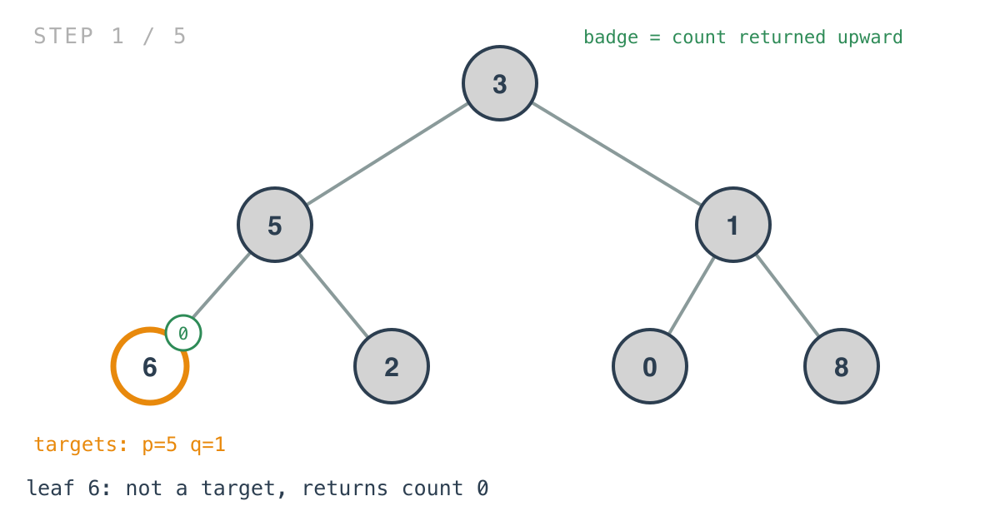
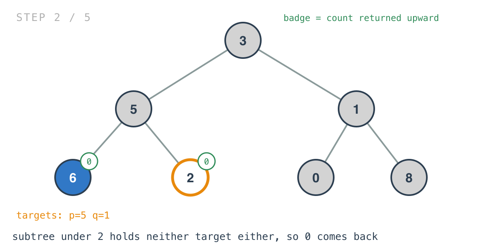
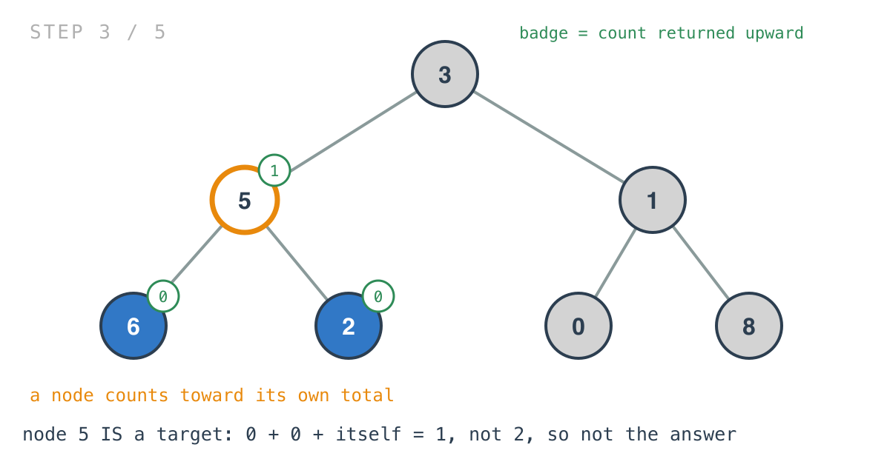
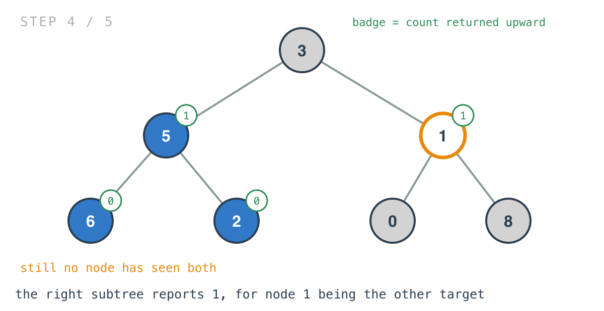
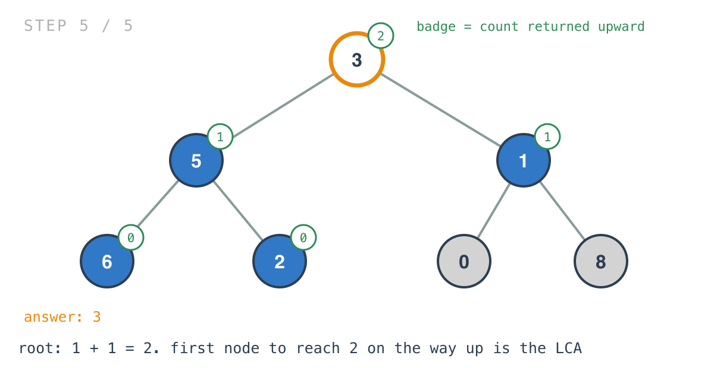

## 365 Days of LeetCode Challenge — Day 28/365

# Lowest Common Ancestor of a Binary Tree

🔗 https://leetcode.com/problems/lowest-common-ancestor-of-a-binary-tree/ · Difficulty: Medium

### The problem

Given a binary tree and two nodes `p` and `q`, return their lowest common ancestor, where
a node counts as a descendant of itself.


### The intuition

This is yesterday's problem with one guarantee removed, and it's worth seeing how much that
guarantee was doing.

In a BST, comparing a target against a node told you which subtree it was in, so the walk
went down one path and never looked at the rest of the tree. Here there is no ordering, so
a comparison tells you nothing about direction. The only way to know whether a target is
under a node is to go and look.

Which flips the whole shape. Yesterday's solution walked downward, deciding as it went.
This one has to walk everything and report upward: each subtree answers "how many of the
two targets are in me?", and the parent adds the reports together.

That count is the entire idea. A node whose subtrees between them contain both targets —
counting itself as part of its own subtree — is a common ancestor. The lowest such node is
the first one to reach a count of two on the way up, which is exactly what a post-order
traversal finds first.

### Builds on

- [Day 27: Lowest Common Ancestor of a Binary Search Tree](https://github.com/architagr/leetcode_solutions/blob/main/medium_problems/201_300/lowest_common_ancestor_of_a_binary_search_tree/) — the same question on a BST, where comparing values told you which way to walk. Take the ordering away and none of that survives

### The solution

```go
func lowestCommonAncestor(root, p, q *TreeNode) *TreeNode {
	n, _ := f(root, p, q)
	return n
}

func f(root, p, q *TreeNode) (n *TreeNode, count int) {
	if root == nil {
		return nil, 0
	}

	ln, lcount := f(root.Left, p, q)
	if ln != nil {
		n = ln
		return
	}
	rn, rcount := f(root.Right, p, q)
	if rn != nil {
		n = rn
		return
	}
	if root.Val == p.Val || root.Val == q.Val {
		lcount++
	}
	count = lcount + rcount
	if count == 2 {
		n = root
	}
	return
}
```

Tracing `[3,5,1,6,2,0,8,null,null,7,4]` with `p = 5` and `q = 1`. Expected `3`.





Node `5` is `p`. Its subtrees report `0` and `0`, and the node itself adds one.



Folding the node's own match into `lcount` rather than a separate variable is what makes "a
node can be a descendant of itself" work. If `p` were an ancestor of `q`, this is the
mechanism that makes `p` the answer: one for being `p`, one from the subtree holding `q`,
total two, right there.



At the root, one from each side.



Two details are easy to get wrong.

The early returns matter. After recursing left, if `ln != nil` the answer has already been
found deeper and is returned immediately without touching the right subtree. Without those,
an ancestor higher up would also see a count of two and overwrite the answer with itself —
producing a common ancestor, just not the lowest one.

And comparison is on `Val`, as it was yesterday. That relies on values being unique, which
the problem guarantees. With duplicates, a count of two could be reached by nodes that
merely share a value with the targets, and comparing pointers would be the fix.

O(n) worst case, since every node may be visited; the early returns prune real work once
the answer is found but don't change the bound. Space is O(h) for the recursion stack.
Compare yesterday's O(h) *time* — that gap is the entire cost of losing the ordering.

Full code and the step-by-step walkthrough:
[lowest_common_ancestor_of_a_binary_tree](https://github.com/architagr/leetcode_solutions/blob/main/medium_problems/201_300/lowest_common_ancestor_of_a_binary_tree/SOLUTION.md)

#DSA #LeetCode #100DaysOfCode #CodingInterview #BinaryTree #Recursion #Golang

---

*Solution and code by Archit Agarwal. Write-up drafted with AI assistance from the code and problem statement.*
