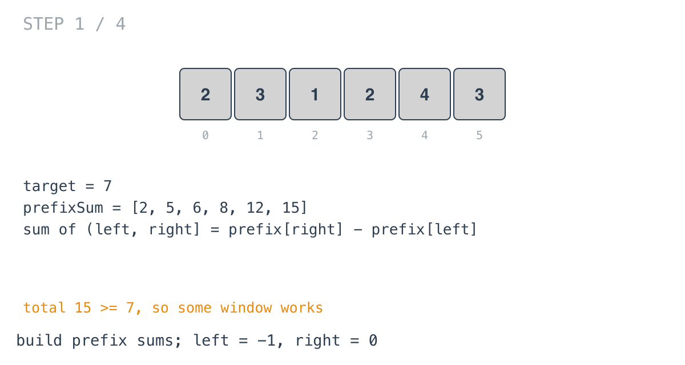
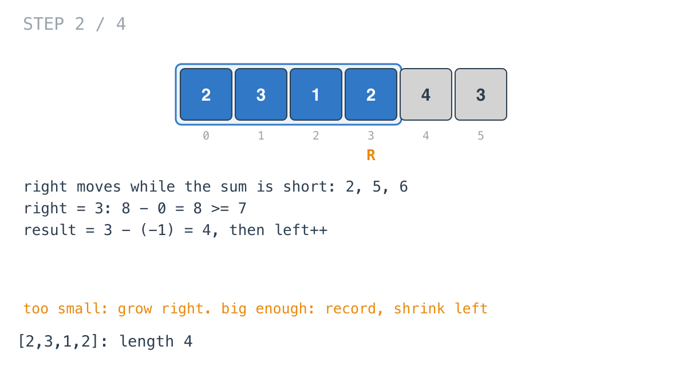

## Solution walkthrough

`minSubArrayeLen(target int, nums []int) int` in `minimum_size_subarray_sum.go` builds
prefix sums, then walks two pointers over them looking for the shortest window whose sum
reaches `target`.

We'll trace Example 1: `target = 7`, `nums = [2,3,1,2,4,3]`, expected `2`.

1. **Prefix sums, and an early exit.** `computePrefixSum` gives
   `[2, 5, 6, 8, 12, 15]`. If the last value (the total) were below `target`, no window
   could work and the function returns 0. Here it's 15.

2. **An exclusive left edge.** `left, right := -1, 0`. The window is `(left, right]`, its
   sum is `getValue(right) - getValue(left)`, and `getValue(-1)` is 0.

   

3. **Too small: move right. Big enough: record and move left.**

   ```go
   if rightValue-leftValue >= target {
       result = minValue(result, right-left)
       left++
   } else {
       right++
   }
   ```

   The sums 2, 5, 6 are short, so `right` advances to 3, where `8 - 0 = 8` is enough.
   `result = 4` for `[2,3,1,2]`, and `left` moves up.

   

4. **Shrinking finds shorter windows.** `[3,1,2]` sums to 6, so `right` moves to 4.
   `[3,1,2,4]` is 10 (length 4 again); shrink: `[1,2,4]` is exactly 7, `result = 3`.

   ![Step 3: [1,2,4], length 3](images/walkthrough-3.png)

5. **The answer.** `[2,4]` is 6, so `right` moves to 5. `[2,4,3]` is 9 (length 3), then
   `[4,3]` is `15 - 8 = 7`: `result = 2`. Shrinking to `[3]` falls short, `right` runs
   past the end, and the loop stops.

   ![Step 4: [4,3], length 2](images/walkthrough-4.png)

The function name has a typo (`minSubArrayeLen`); the tests call it that way, so it
stays.

**Complexity:** O(n) time, O(n) space for the prefix sums.
