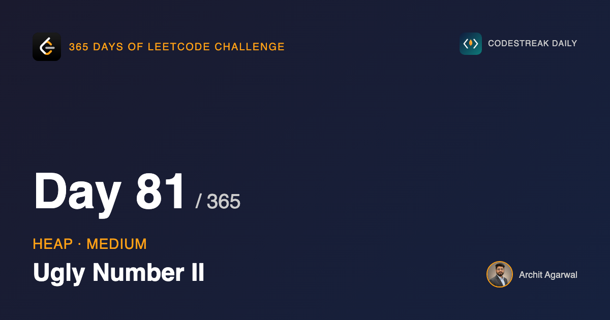
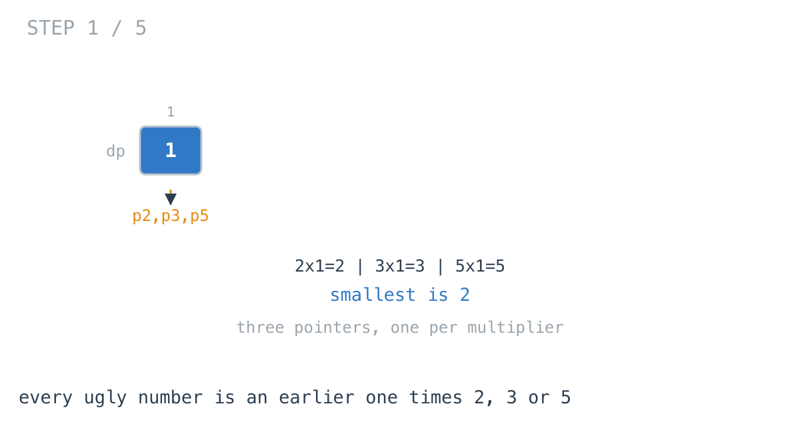
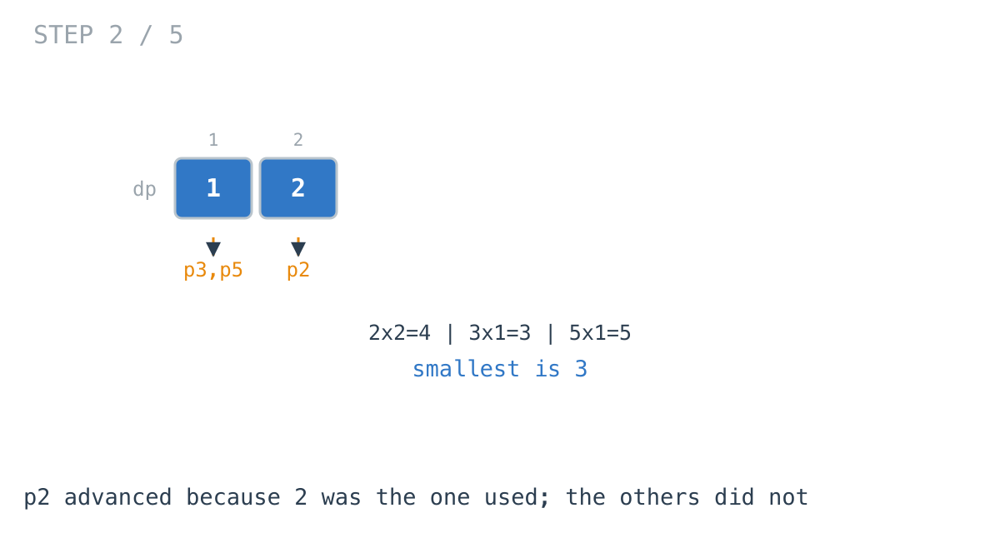
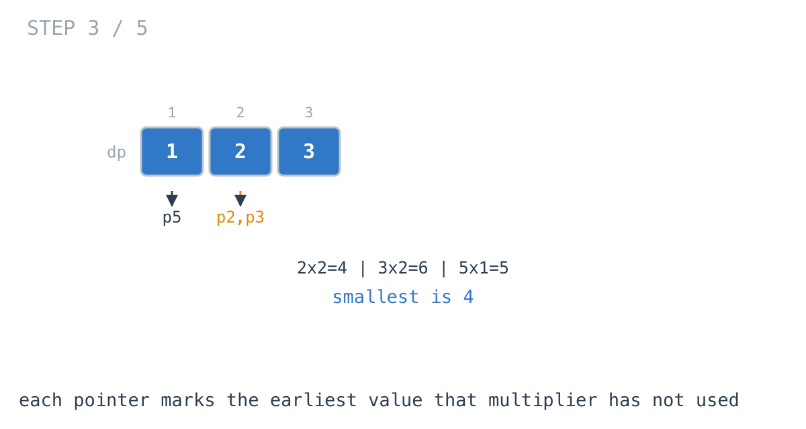
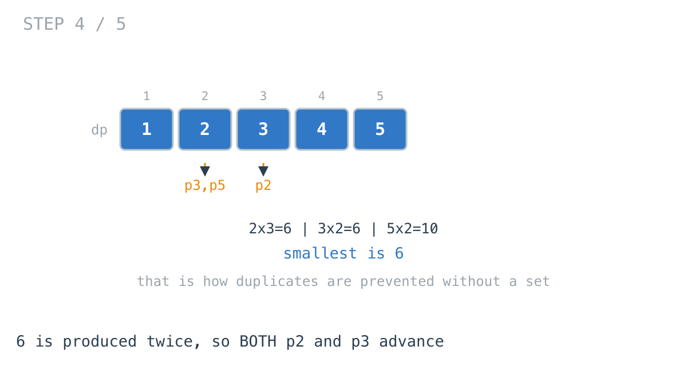
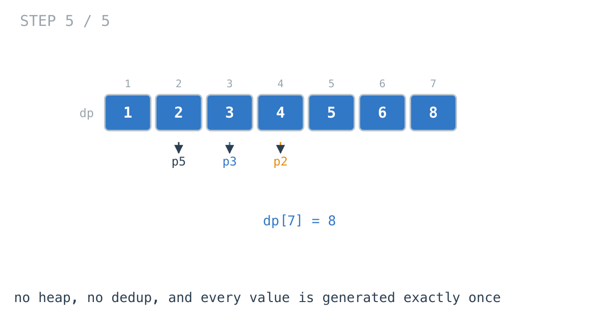

## 365 Days of LeetCode Challenge — Day 81/365

**[264. Ugly Number II](https://leetcode.com/problems/ugly-number-ii/)** (Medium)

Return the nth positive integer whose only prime factors are 2, 3 and 5.

## Why not test each integer

Walk upward from 1, divide out all the 2s, 3s and 5s, check whether 1 remains.

Correct, and hopeless. The 1690th ugly number is 2,123,366,400. Almost everything tested is a miss, and the misses dominate entirely.

Stop **testing** candidates. Start **generating** them.

## Read the definition forwards

An ugly number's only prime factors are 2, 3 and 5. Turned around: the only way to produce one is to multiply a smaller ugly number by 2, 3 or 5.

So the sequence builds out of itself — the next value is the smallest unused product of an earlier one.



## The heap solution, which this is not

"Repeatedly take the smallest" is what this whole arc has been about. Push 1, pop the smallest, push its three multiples, repeat n times. Correct, O(n log n).

It also needs a **set**. 6 arrives as 2×3 and again as 3×2, so without deduplication it is emitted twice and every count after it is wrong.

That set is the tell: the structure is generating work it then throws away.

## One pointer per multiplier

```go
val_2 = 2 * dp[count_2]
val_3 = 3 * dp[count_3]
val_5 = 5 * dp[count_5]
min_val = min(val_2, min(val_3, val_5))
```





Each pointer marks the earliest value its multiplier has not been applied to. Three candidates; the smallest is the next ugly number. Nothing else can be — any other product is either already in the array or larger than one of these three.

## The three ifs are not an else-if

```go
if min_val == val_2 { count_2++ }
if min_val == val_3 { count_3++ }
if min_val == val_5 { count_5++ }
```

This is the whole solution, and the separate `if`s are why.



When 6 comes up, `val_2` is 2×3 and `val_3` is 3×2. **Both equal 6.** Both pointers must advance.

Advance only one — which `else if` would do — and the other produces 6 again next iteration, and 6 appears twice.

**That is the deduplication.** No set, no lookup. Just the observation that a value produced by two multipliers has consumed both of them.



## Why this beats the heap

No heap, no set. Three integers, three multiplications, two comparisons per step.

Every candidate is generated exactly once, because a pointer never revisits a position. The heap generates 3n candidates and discards the duplicates.

**O(n) against O(n log n)**, with a smaller constant on top.

## Closing the arc on a problem the heap loses

This is deliberate as the last day.

Days 76 to 78 built the case for the heap. Day 79 found a problem where sorting reads better. Today the heap is the obvious answer and a plain array with three counters is strictly better.

Day 41 did the same to BFS, replacing it with a two-pass DP. Recognising the structure a problem suggests is most of the skill. Knowing when to put it down is the rest.

## Complexity

- **Time: O(n)**. Constant work per number.
- **Space: O(n)** for the sequence — unavoidable, since later terms are built from earlier ones.

Full code and the step-by-step walkthrough:
[ugly_number_ii](https://github.com/architagr/leetcode_solutions/blob/main/medium_problems/201_300/ugly_number_ii/SOLUTION.md)

#DSA #LeetCode #Golang #DynamicProgramming #Heap #CodingInterview #Algorithms

---

*Solution and code by Archit Agarwal. Write-up drafted with AI assistance from the code and problem statement.*
