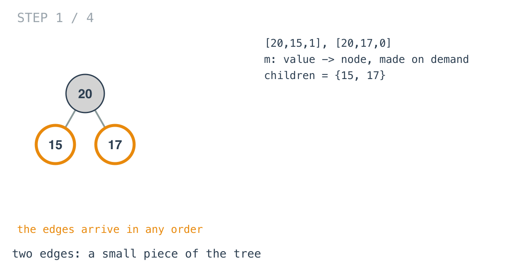
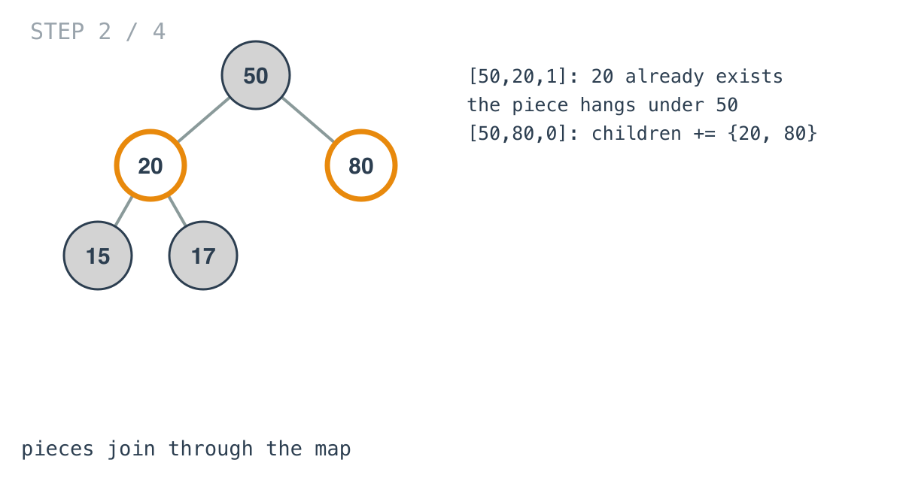
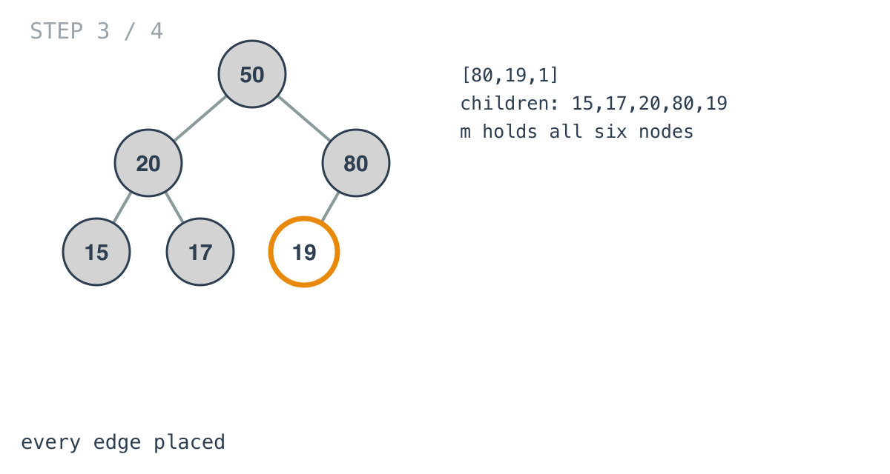
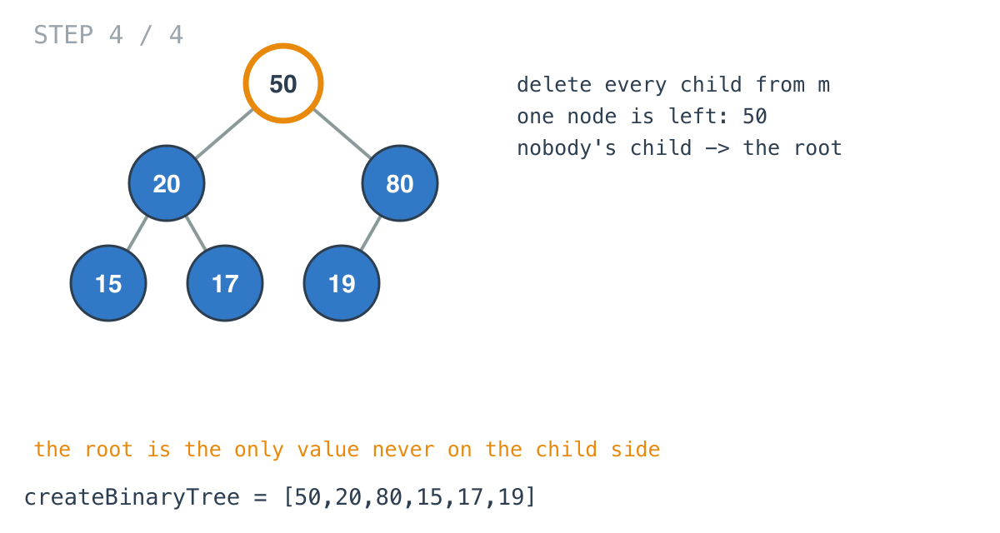

## Solution walkthrough

`createBinaryTree(descriptions [][]int) *TreeNode` in `main.go` builds nodes on demand in a
map, attaches each child, records every child value, and returns the node that's never a
child.


We'll trace Example 1: `[[20,15,1],[20,17,0],[50,20,1],[50,80,0],[80,19,1]]`.

1. **Find or create both ends of each edge.** For `[20,15,1]`, neither 20 nor 15 is in `m`
   yet, so both are created. `isLeft == 1` makes 15 the left child. `[20,17,0]` adds 17 on the
   right. The child values go into `c`.

   

2. **Order doesn't matter.** `[50,20,1]` finds 20 already in the map, subtree and all, and
   hangs it under the new node 50. `[50,80,0]` adds 80 on the right.

   

3. **Every edge placed.** `[80,19,1]` finishes the tree. `c` holds 15, 17, 20, 80 and 19.

   

4. **The root is the one that's nobody's child.**

   ```go
   for v := range c {
       delete(m, v)
   }
   for _, n := range m {
       root = n
   }
   ```

   Only 50 remains in `m`. Map iteration order is random in Go, but with one entry left there's
   only one answer.

   

**Complexity:** O(n) time, O(n) space.
