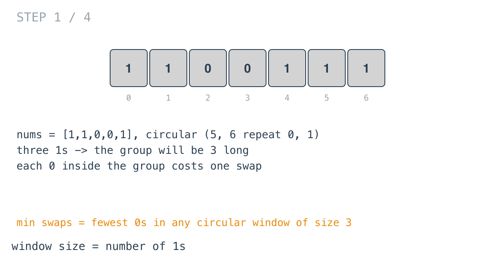
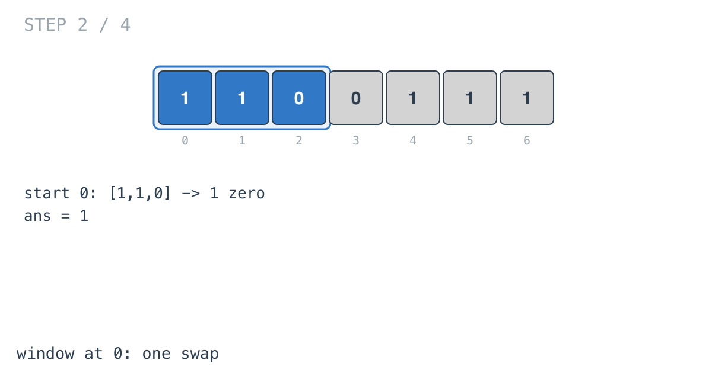
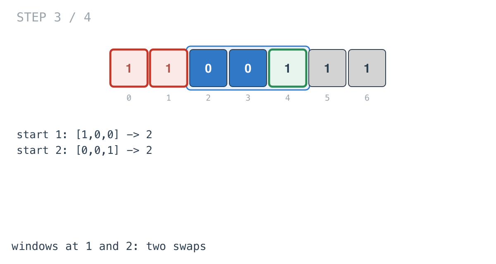
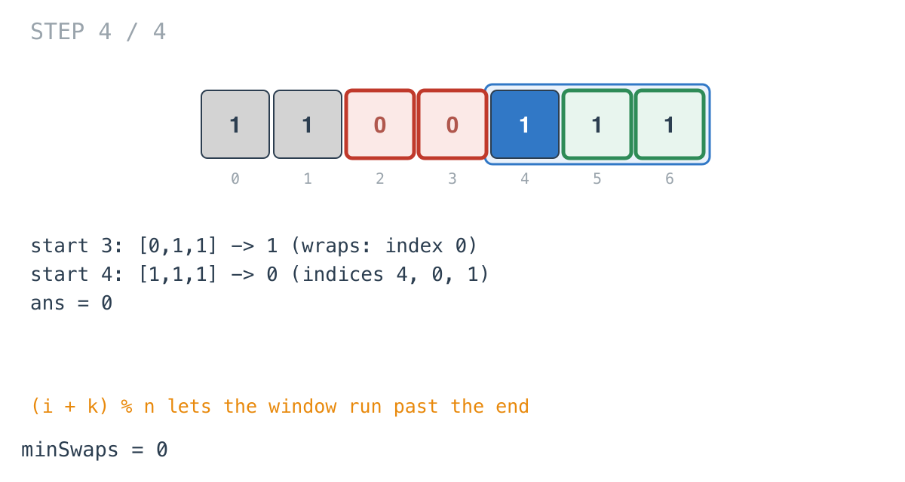

## Solution walkthrough

`minSwaps(nums []int) int` in `minimum_swaps_to_group_all_1s_together_ii.go` counts the
ones, then slides a circular window of that size and keeps the fewest zeros seen.

We'll trace Example 3: `nums = [1,1,0,0,1]`, expected `0`. The diagrams repeat the first
two elements after the end so wrapping windows appear in one piece.

1. **Window size = number of ones.** The first loop counts `maxOne = 3`. If it were 0,
   there'd be nothing to group, and the function returns 0. `ans` starts at `n`, more
   than any window can need.

   

2. **Prime one short.** `countZero` counts zeros in `nums[0..maxOne-2]`, then
   `k = maxOne - 1` becomes the offset to a window's last element.

3. **Add, check, remove, around the circle.**

   ```go
   if nums[(i+k)%n] == 0 {
       countZero++
   }
   if ans > countZero {
       ans = countZero
   }
   if nums[i] == 0 {
       countZero--
   }
   ```

   The window starting at 0 is `[1,1,0]`: one zero, `ans = 1`.

   

4. **The windows at 1 and 2** hold two zeros each.

   

5. **Wrapping.** The window at 3 reaches `(3+2)%5 = 0`: `[0,1,1]`, one zero. The window at
   4 covers indices 4, 0 and 1: `[1,1,1]`, no zeros. `ans = 0`: the ones are already
   together around the join.

   

**Complexity:** O(n) time, O(1) space.
