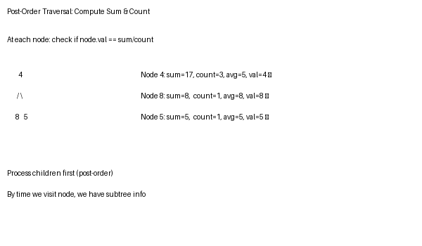

# 365 Days of LeetCode Challenge — Day 31/365

## Count Nodes Equal to Average of Subtree

**LeetCode:** [#2265 - Count Nodes Equal to Average of Subtree](https://leetcode.com/problems/count-nodes-equal-to-average-of-subtree/)  
**Solution:** [github.com/architagr/leetcode_solutions/blob/main/medium_problems/2201_2300/count_nodes_equal_to_average_of_subtree/](https://github.com/architagr/leetcode_solutions/blob/main/medium_problems/2201_2300/count_nodes_equal_to_average_of_subtree/)

---

## Related Easy Problems

- [Day 1: Maximum Depth of Binary Tree](https://github.com/architagr/leetcode_solutions/blob/main/easy_problems/101_200/maximum_depth_of_binary_tree/) — subtree traversal
- [Day 6: Minimum Depth of Binary Tree](https://github.com/architagr/leetcode_solutions/blob/main/easy_problems/101_200/minimum_depth_of_binary_tree/) — understanding subtree properties

---

## Intuition

To check if a node equals its subtree's average, we need to know the subtree's sum and node count. Use post-order traversal (visit children before parent) to compute these values bottom-up. As we return from recursion, we have all the information needed to check each node and count matches.

The key: process children first, so by the time we're at a node, we already know its subtree's sum and count.

---

## Solution Walkthrough

### Diagram



### Approach: Post-Order Traversal with Sum and Count

To count nodes equal to their subtree's average, compute each subtree's sum and count. A recursive function returns both values, allowing us to check each node.

### Code

```go
func averageOfSubtree(root *TreeNode) int {
    var count = 0
    var sumAndCountOfNodes func(node *TreeNode) (currentNodeSum, countNodes int)
    sumAndCountOfNodes = func(node *TreeNode) (currentNodeSum, countNodes int) {
        currentNodeSum, countNodes = 0, 0
        if node == nil {
            return
        }

        leftSubtreeNodeSum, leftSubTreeNodeCount := sumAndCountOfNodes(node.Left)
        rightSybTreeNodeSum, rightSubTreeNodeCount := sumAndCountOfNodes(node.Right)

        currentNodeSum = leftSubtreeNodeSum + node.Val + rightSybTreeNodeSum
        countNodes = leftSubTreeNodeCount + rightSubTreeNodeCount + 1
        if currentNodeSum/countNodes == node.Val {
            count++
        }
        return
    }
    sumAndCountOfNodes(root)
    return count
}
```

**Post-Order Traversal:** Process left and right subtrees before the current node.

1. Recursively get sum and count from left subtree
2. Recursively get sum and count from right subtree  
3. Compute current subtree's sum: left_sum + node.val + right_sum
4. Compute current subtree's count: left_count + right_count + 1
5. Check if node.val equals sum/count (integer division)
6. Return sum and count for parent to use

### Complexity

- **Time:** O(n) — visit each node once
- **Space:** O(h) — recursion depth

---

#BinaryTree #Recursion #PostOrderTraversal #LeetCode #DSA #Golang

---

*Solution and code by Archit Agarwal. Write-up drafted with AI assistance from the code and problem statement.*
