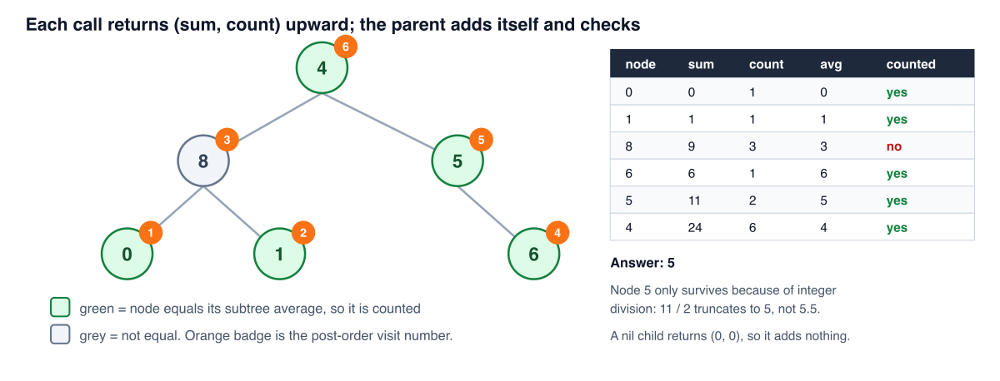

# Solution walkthrough

The whole thing lives inside `averageOfSubtree`, with a closure doing the traversal.

```go
func averageOfSubtree(root *TreeNode) int {
	var count = 0
	// Returns (sum of subtree, number of nodes in subtree)
	var sumAndCountOfNodes func(node *TreeNode) (currentNodeSum, countNodes int)
	sumAndCountOfNodes = func(node *TreeNode) (currentNodeSum, countNodes int) {
		...
	}
	sumAndCountOfNodes(root)
	return count
}
```

`count` sits outside the closure and is the answer. The closure captures it, so every matching node found anywhere in the tree increments the same variable. That's why the traversal's return value is discarded at the call site: the sum and count of the whole tree aren't interesting, only the side effect of the checks along the way.

The two-step declaration (`var sumAndCountOfNodes func(...)` and then the assignment) is Go's way of letting a function literal refer to itself. Declaring and assigning in one statement wouldn't compile, because the name isn't in scope inside its own initializer.

## Inside the closure

```go
currentNodeSum, countNodes = 0, 0
if node == nil {
	return
}
```

Named return values, zeroed and returned bare. A missing child reports `(0, 0)`, which is what lets the combine step below stay uniform whether a node has two children, one, or none.

```go
// Recursively compute sums and counts for both subtrees
leftSubtreeNodeSum, leftSubTreeNodeCount := sumAndCountOfNodes(node.Left)
rightSybTreeNodeSum, rightSubTreeNodeCount := sumAndCountOfNodes(node.Right)
```

Both children are fully processed before this node does anything. This is the post-order shape, and it's the reason a single pass is enough.

```go
// Combine subtree values with current node
currentNodeSum = leftSubtreeNodeSum + node.Val + rightSybTreeNodeSum
countNodes = leftSubTreeNodeCount + rightSubTreeNodeCount + 1
// Check if node value equals subtree average
if currentNodeSum/countNodes == node.Val {
	count++
}
return
```

Three things in order: fold the children's numbers together with this node's own value, run the check, then hand the pair up to the parent.

`currentNodeSum/countNodes` is integer division, and that's deliberate. The problem asks for the average rounded down, and Go's `/` on ints truncates. Since all values are non-negative, truncation is floor. `countNodes` is at least 1 by the time this line runs, because the `nil` case already returned, so there's no divide-by-zero to guard.

## Tracing it

The LeetCode example, `root = [4,8,5,0,1,null,6]`:



The orange badges are the order the closure finishes each node. Leaves resolve first, the root last.

- **0** is a leaf. Both children return `(0, 0)`, so sum is 0 and count is 1. `0 / 1 = 0`, which equals the node's value. `count` becomes 1.
- **1** is also a leaf. `1 / 1 = 1`. Match. `count` becomes 2.
- **8** now has both children's reports. Sum is `0 + 8 + 1 = 9`, count is `1 + 1 + 1 = 3`. `9 / 3 = 3`, and the node holds 8. No match, and it's the only node in this tree that misses.
- **6** is a leaf. `6 / 1 = 6`. Match. `count` becomes 3.
- **5** has no left child, so that side reports `(0, 0)`. Sum is `0 + 5 + 6 = 11`, count is `0 + 1 + 1 = 2`. `11 / 2` truncates to 5, which equals the node's value. Match, `count` becomes 4. With floating-point division this would be 5.5 and the node would be skipped.
- **4** is the root. Sum is `9 + 4 + 11 = 24`, count is `3 + 1 + 2 = 6`. `24 / 6 = 4`. Match, `count` becomes 5.

`sumAndCountOfNodes(root)` returns `(24, 6)` and both values are thrown away. The answer, 5, is in `count`.

## Complexity

**Time: O(n).** Each node is visited once and does a fixed number of additions plus one division.

**Space: O(h)** for the call stack, h being the height. Balanced gives O(log n), a chain gives O(n). No auxiliary structures, just the single captured `count`.
