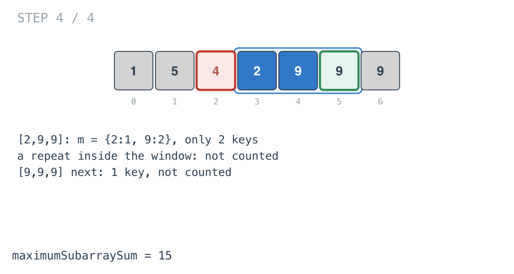

## Solution walkthrough

`maximumSubarraySum(nums []int, k int) int64` in
`maximum_sum_of_distinct_subarrays_with_length_k.go` slides a window of length `k`,
keeping its sum and a count of each value in it.

We'll trace Example 1: `nums = [1,5,4,2,9,9,9]`, `k = 3`, expected `15`.

1. **Offset and prime.** `k--` makes `k = 2`. The first loop adds `nums[0..1]` to both the
   map and the sum.

2. **Add, check, remove.** Each iteration adds `nums[i]`, and if the map now has
   `k+1 = 3` keys, the window is all-distinct and its sum is compared with `result`. The
   first window `[1,5,4]` qualifies: `result = 10`.

   ![Step 1: [1,5,4] is distinct](images/walkthrough-1.png)

3. **Remove the oldest, deleting at zero.** `m[nums[i-k]]--`, and if that reaches 0 the
   key is deleted, so `len(m)` stays equal to the number of distinct values. Then `sum`
   drops the same value. The next window `[5,4,2]` sums to 11.

   ![Step 2: [5,4,2], sum 11](images/walkthrough-2.png)

4. **The best.** `[4,2,9]` sums to 15.

   ![Step 3: [4,2,9], sum 15](images/walkthrough-3.png)

5. **Repeats don't count.** `[2,9,9]` has only two keys (`9` has count 2), so it's
   skipped, and so is `[9,9,9]`. The answer is 15.

   

**Complexity:** O(n) time, O(k) space.
