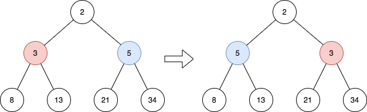
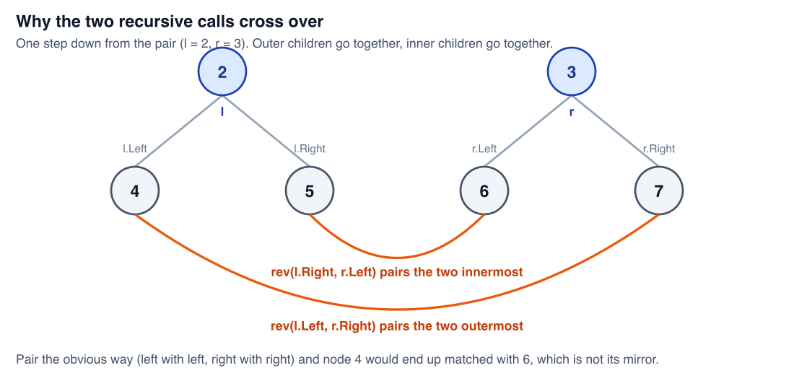
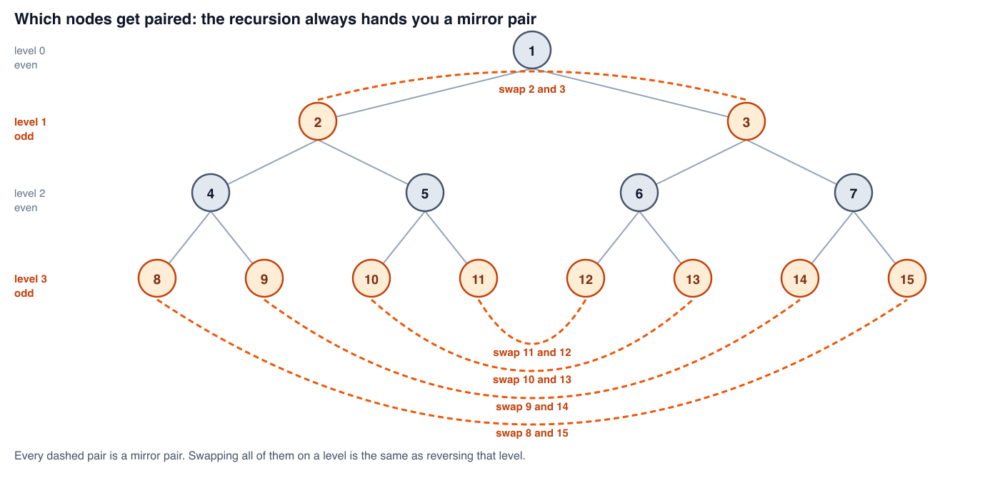

# Reverse Odd Levels of Binary Tree

*365 Days of LeetCode Challenge — Day 72/365*

🔗 [LeetCode #2415](https://leetcode.com/problems/reverse-odd-levels-of-binary-tree/) · Difficulty: Medium

The BFS solution is the one that comes to mind and it's perfectly reasonable — collect a level,
reverse it, write the values back.

It also allocates a slice per level, and in a perfect tree the widest level holds half the nodes.
Getting rid of that isn't a micro-optimisation; it comes from restating what "reverse a level"
actually means.

Given the root of a perfect binary tree, reverse the node values at each odd level.



## The answer everyone reaches for first

BFS. Collect each level into a slice, reverse the odd ones, write the values back. It works, it's easy to argue is correct, and it's a perfectly good interview answer.

It also allocates a slice per level, and the widest level of a perfect tree holds half the nodes. There's a version with no auxiliary storage at all, and finding it starts with restating what reversing a level actually means.

## Reversing a level is swapping mirror pairs

Take a level of eight nodes. Reversing sends position 0 to 7, 1 to 6, 2 to 5, 3 to 4. Every element trades with the element the same distance in from the other end.

So reversing a level is exactly: swap all four mirror pairs.

That's the whole solution, because mirror pairs are something recursion can hand you directly. Rather than materialising a level and reversing it, descend two nodes at a time, always holding a pair that mirrors across the centre, and swap whenever the level is odd.

The tree being perfect is what makes this safe. Every level is full, so every node genuinely has a mirror partner and the two sides descend in lockstep.

```go
func reverseOddLevels(root *TreeNode) *TreeNode {
	rev(root.Left, root.Right, 1)
	return root
}

func rev(l, r *TreeNode, d int) {
	if l == nil {
		return
	}
	// At odd levels, swap the mirrored nodes' values
	if d%2 == 1 {
		l.Val, r.Val = r.Val, l.Val
	}
	// Recurse into children, swapping pointers to maintain mirror
	rev(l.Left, r.Right, d+1)
	rev(l.Right, r.Left, d+1)
}
```

Note the entry point doesn't start at the root. It starts at the root's two children with depth 1. `rev` works on pairs, and the root has no partner. It never needs one either, since level 0 holds one node and reversing a one-element level does nothing. Starting at 1 also means the depth argument equals the real level number, so the parity test has no offset to remember.

Checking only `l == nil` is enough. The tree is perfect, so `l` and `r` are always at the same depth and are either both `nil` or both real. A second check would be dead code. A single-node tree hits this guard immediately and correctly does nothing.

## The part that's easy to get wrong

Given a mirror pair, their four children have to be regrouped into two mirror pairs, and the grouping is not the obvious one:



Node 4 is the leftmost of the four and node 7 is the rightmost, so those mirror each other: `rev(l.Left, r.Right, d+1)`. Nodes 5 and 6 are the middle two: `rev(l.Right, r.Left, d+1)`.

The second call crosses. Pair left-with-left and right-with-right instead and node 4 gets handed to node 6, which are not mirrors, and the level comes out permuted rather than reversed. The correct version looks asymmetric and the wrong version looks tidy, which is exactly why it's worth drawing once.

## Following it through

A four-level perfect tree numbered 1 to 15, so every position is distinguishable:



`rev(2, 3, d=1)` is odd, so 2 and 3 swap. Level 1 becomes `[3, 2]`, reversed.

`rev(4, 7, d=2)` is even, no swap, but it still recurses because level 3 is below it. That produces `rev(8, 15, d=3)` and `rev(9, 14, d=3)`, both odd, both swapping.

`rev(5, 6, d=2)` likewise passes through to `rev(10, 13, d=3)` and `rev(11, 12, d=3)`.

Level 3 started as `[8, 9, 10, 11, 12, 13, 14, 15]`. The four swaps exchange 8 with 15, 9 with 14, 10 with 13, 11 with 12, giving `[15, 14, 13, 12, 11, 10, 9, 8]`. Fully reversed, and not one node was moved.

Even levels still get traversed, since the odd levels underneath have to be reached. They just don't swap. That's fine, because every node has to be visited anyway to get to the bottom.

## Cost

**Time O(n).** Each node is reached once as half of a pair, and the work per pair is a parity check plus at most one swap.

**Space O(log n).** The stack goes as deep as the tree is tall, and a perfect binary tree of n nodes has height log2(n). Nothing is allocated per level, which is the win over BFS.

## Worth noting

Only values move. No pointers are rewired, which is legitimate because the problem only asks about values. If it had asked to restructure the tree the swap would be a very different piece of code.

The transferable idea is the reframing: "reverse this level" became "swap every mirror pair", and a mirror pair is a thing recursion can produce for free. Symmetric-tree and mirror-image problems tend to yield to the same move.

---

The perfect-tree guarantee is what makes the pair descent safe: every node genuinely has a
mirror partner, and both sides of a pair descend in lockstep. Take that guarantee away and this
approach breaks, which is a good reminder to check which constraint a clever solution is
standing on.

Full code and the step-by-step walkthrough:
[reverse_odd_levels_of_binary_tree](https://github.com/architagr/leetcode_solutions/blob/main/medium_problems/2401_2500/reverse_odd_levels_of_binary_tree/SOLUTION.md)

---

*Solution and code by Archit Agarwal. Write-up drafted with AI assistance from the code and problem statement.*
