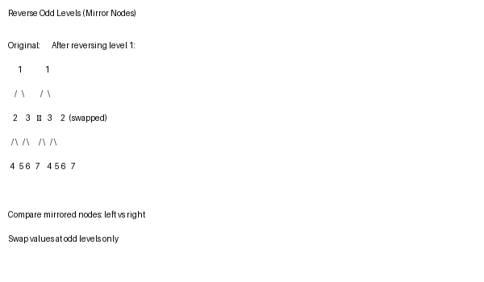

# Solution Walkthrough

## Approach: Level-Wise Recursion with Mirroring

Traverse the tree level-by-level, comparing nodes at mirrored positions. For odd levels, swap their values.

## Diagram



## Code

```go
func reverseOddLevels(root *TreeNode) *TreeNode {
    rev(root.Left, root.Right, 1)
    return root
}

func rev(l, r *TreeNode, d int) {
    if l == nil {
        return
    }
    // At odd levels, swap the mirrored nodes' values
    if d%2 == 1 {
        l.Val, r.Val = r.Val, l.Val
    }
    // Recurse into children, swapping the pointers to maintain mirror
    rev(l.Left, r.Right, d+1)
    rev(l.Right, r.Left, d+1)
}
```

**Algorithm:**
1. Start with the left and right children of root (level 1)
2. If the level is odd, swap their values
3. Recurse: pass left.Left and right.Right (continuing the mirror)
4. Recurse: pass left.Right and right.Left (swapped to maintain mirror relationship)

## Complexity

- **Time:** O(n) — visit each node once
- **Space:** O(h) — recursion depth
