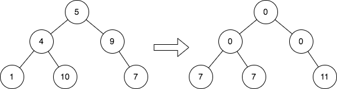
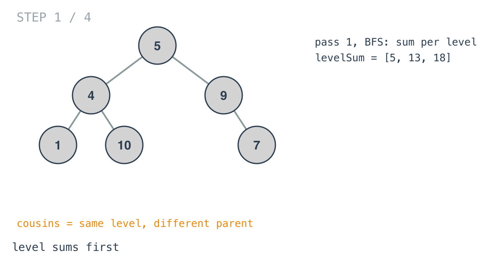
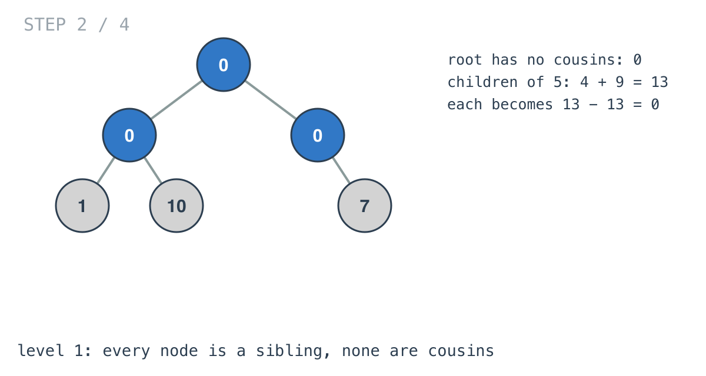
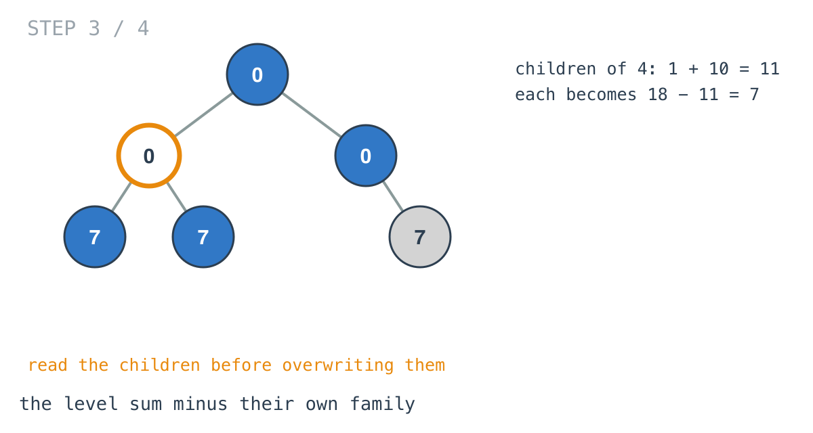
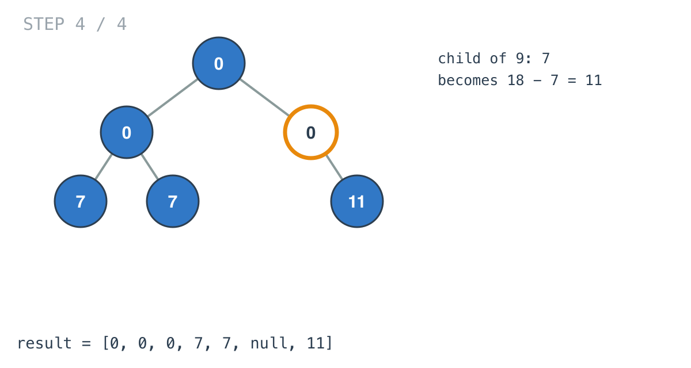

## Solution walkthrough

`replaceValueInTree(root *TreeNode) *TreeNode` in `main.go` computes each level's sum with
a BFS, then rewrites every node from the top with `parse`.

We'll trace Example 1: `[5,4,9,1,10,null,7]`, expected `[0,0,0,7,7,null,11]`.

1. **Level sums.** `levelOrderSum` is a BFS with a `nil` marker at the end of each level;
   when the marker comes out, the running sum is appended. Here `[5, 13, 18]`.

   

2. **The root has no cousins.** `root.Val = 0`, then `parse(root, 0, levelOrderSumArr)`.

3. **A parent computes its family's share.** In `parse`, `currSum` adds up the node's
   existing children. For the root those are 4 and 9: 13. Each child becomes
   `sumArr[level+1] - currSum = 13 - 13 = 0`. On level 1 everyone is a sibling of everyone,
   so nobody has cousins.

   

4. **Read before writing.** At node `4` (now showing 0), its children are still 1 and 10:
   `currSum = 11`, and both become `18 - 11 = 7`. The sum is taken before either child is
   overwritten, which is what keeps the arithmetic right.

   

5. **The last family.** Node `9`'s only child is 7: it becomes `18 - 7 = 11`, the sum of
   its cousins 1 and 10. Leaves return immediately from `parse`.

   

**Complexity:** O(n) time, O(n) space.
