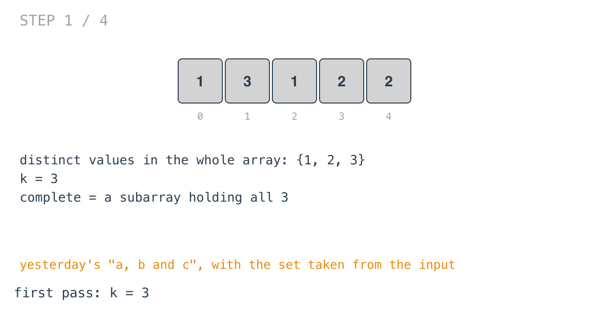
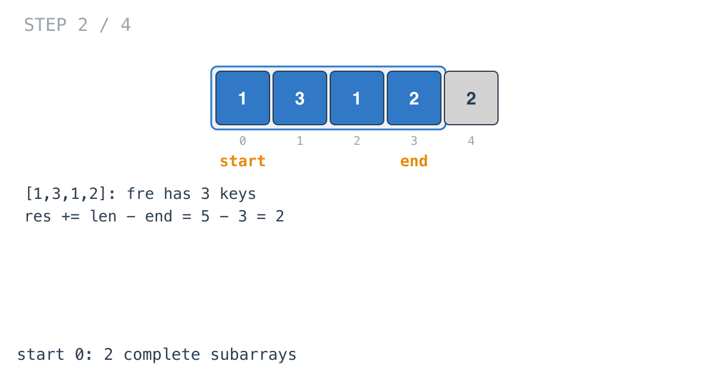
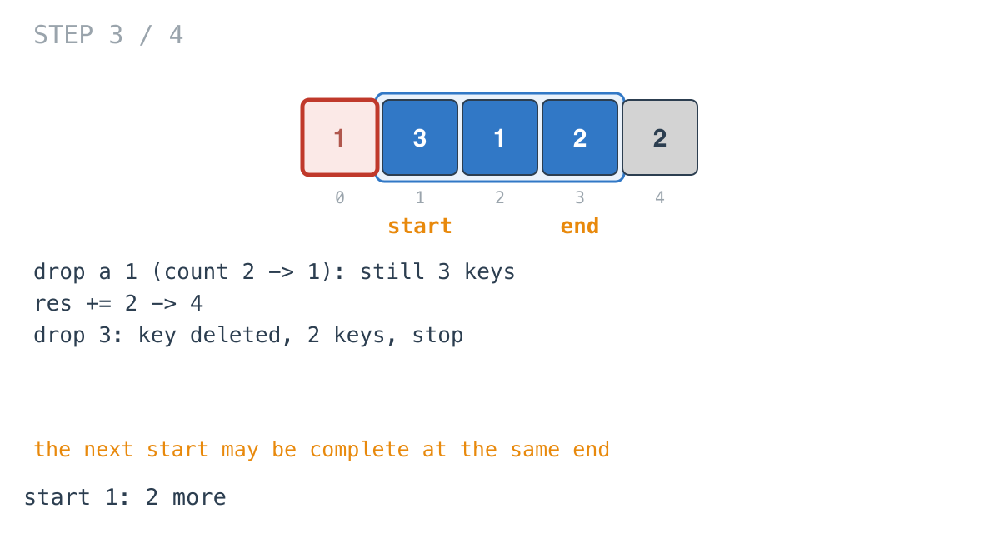
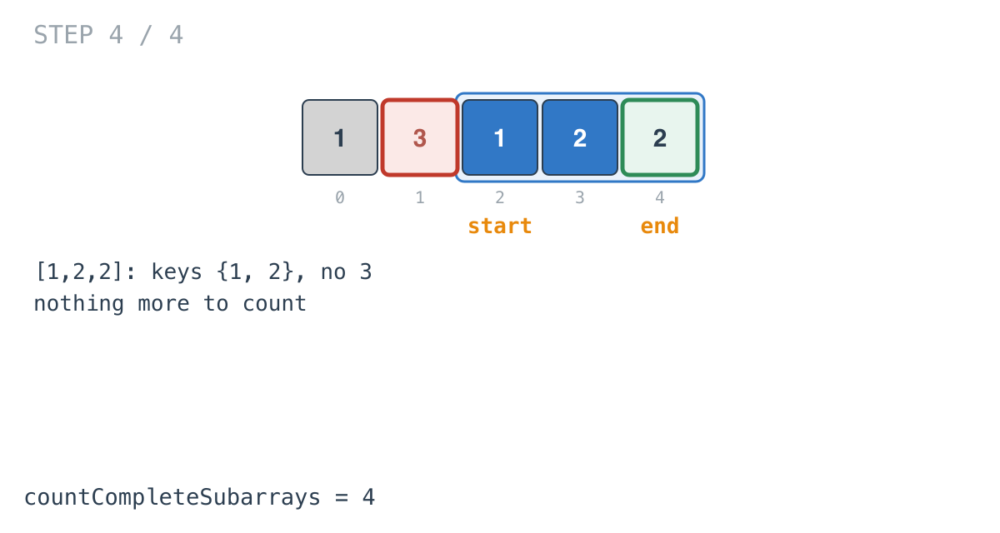

## Solution walkthrough

`countCompleteSubarrays(nums []int) int` in `count_complete_subarrays_in_an_array.go` finds
how many distinct values the array has, then counts windows containing all of them by
their start.

We'll trace Example 1: `nums = [1,3,1,2,2]`, expected `4`.

1. **How many distinct values?** The first loop fills a set `ele`; `k = len(ele) = 3`.

   

2. **Grow until complete.** `fre[nums[end]]++` for each element. At `end = 3` the window
   `[1,3,1,2]` has three keys.

3. **Count every extension, then shrink.**

   ```go
   for start <= end && len(fre) == k {
       res += len(nums) - end
       ...
       start++
   }
   ```

   Starting at 0 and ending at 3 or 4 both work: `res += 5 - 3 = 2`.

   

4. **The next start at the same end.** Removing a `1` leaves its count at 1, so the key
   stays and the window is still complete: `res += 2`, total 4. Removing `3` deletes its key;
   two keys remain and the loop stops.

   

5. **Nothing more.** The last `2` arrives, but there's no `3` left in the window. The
   answer is 4.

   

**Complexity:** O(n) time, O(n) space.
