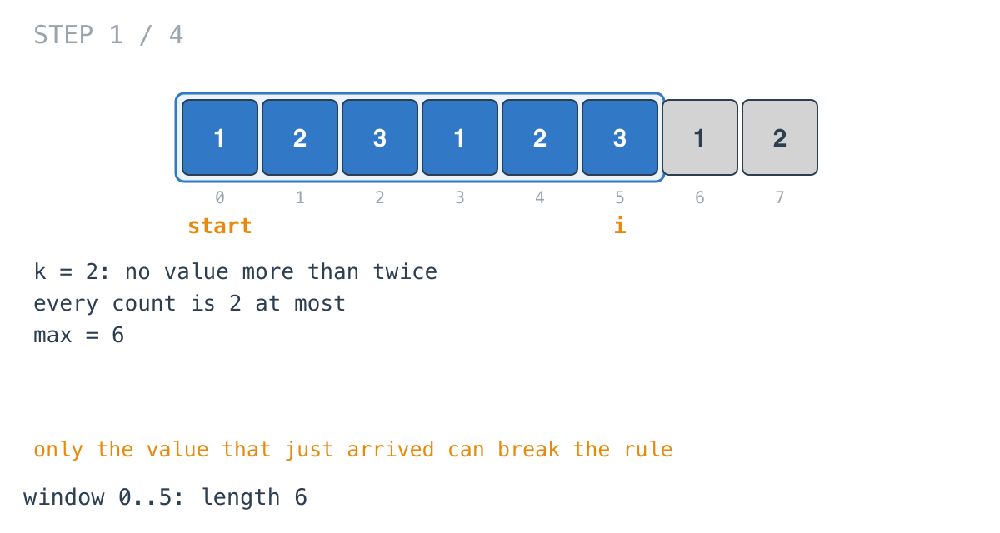
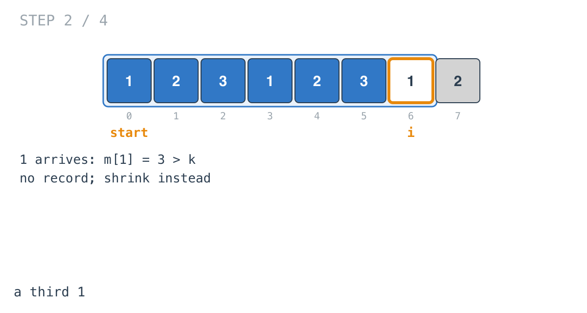
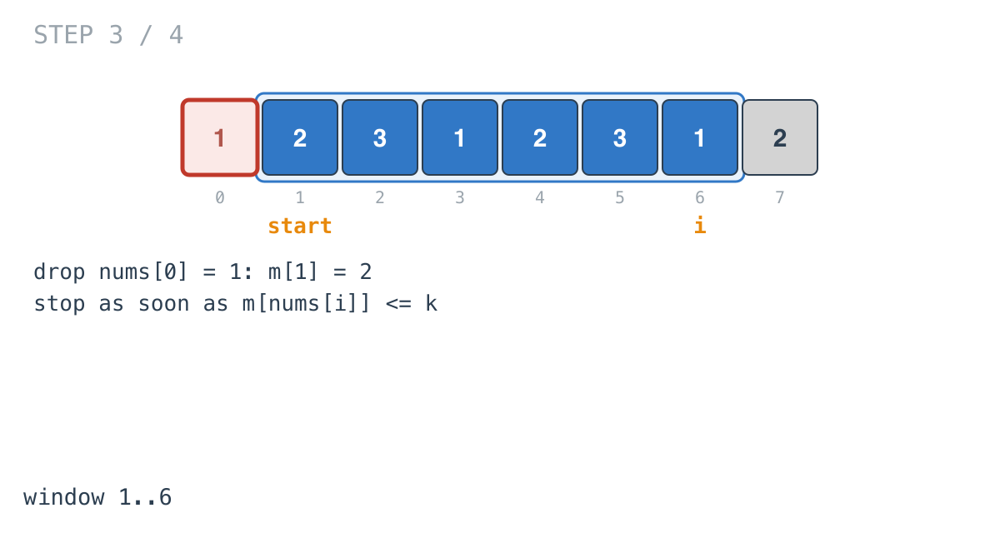
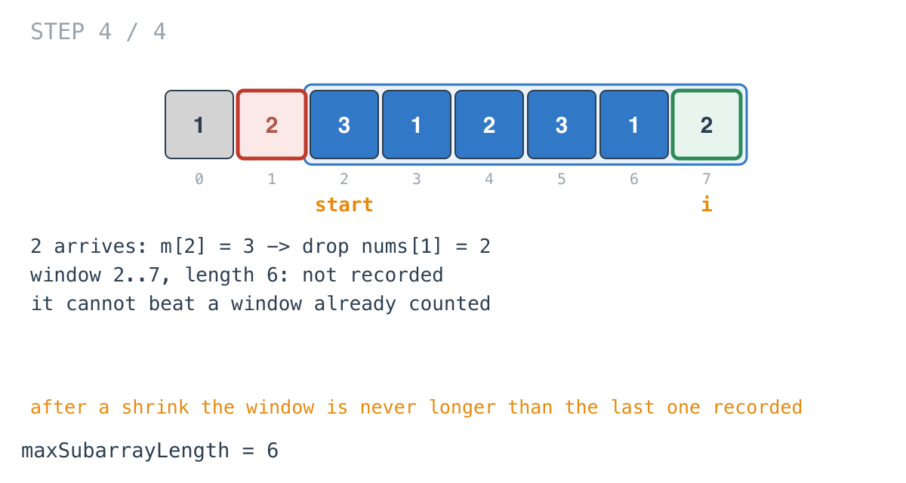

## Solution walkthrough

`maxSubarrayLength(nums []int, k int) int` in
`length_of_longest_subarray_with_at_most_k_frequency.go` grows a window, and when one
value's count passes `k`, shrinks it until that value is back within the limit.

We'll trace Example 1: `nums = [1,2,3,1,2,3,1,2]`, `k = 2`, expected `6`.

1. **Grow; check only the newcomer.**

   ```go
   m[nums[i]]++
   if m[nums[i]] <= k {
       max = maxVal(max, i-start+1)
       continue
   }
   ```

   Every other count was already within `k`, so only `nums[i]`'s can have broken the rule.
   The first six elements each appear at most twice: `max = 6`.

   

2. **Too many 1s.** The third `1` at index 6 makes `m[1] = 3`. No record; shrink.

   

3. **Shrink until the newcomer fits.** The loop decrements `m[nums[start]]` and advances
   `start` while `m[nums[i]] > k`. Dropping the `1` at index 0 is enough.

   

4. **The same for 2, and why skipping the record is safe.** Index 7 is a third `2`; the
   `2` at index 1 drops. The window `[2..7]` has length 6 but isn't recorded. It doesn't
   need to be: the window before this element arrived was valid and recorded, and
   shrinking made the start move forward, so this one can't be longer. The answer is 6.

   

**Complexity:** O(n) time. O(n) space for the map of counts.
