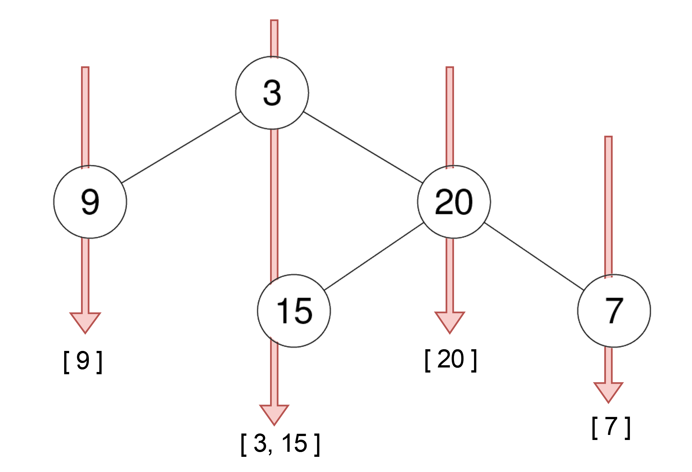
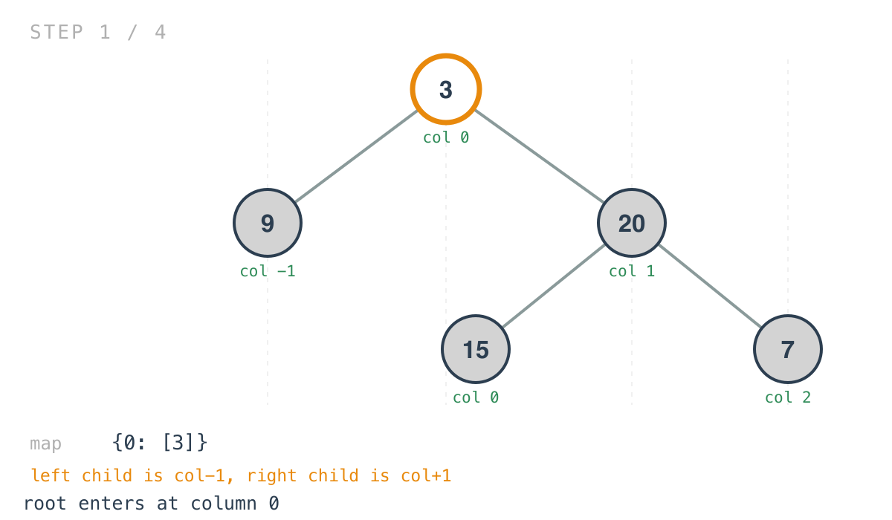
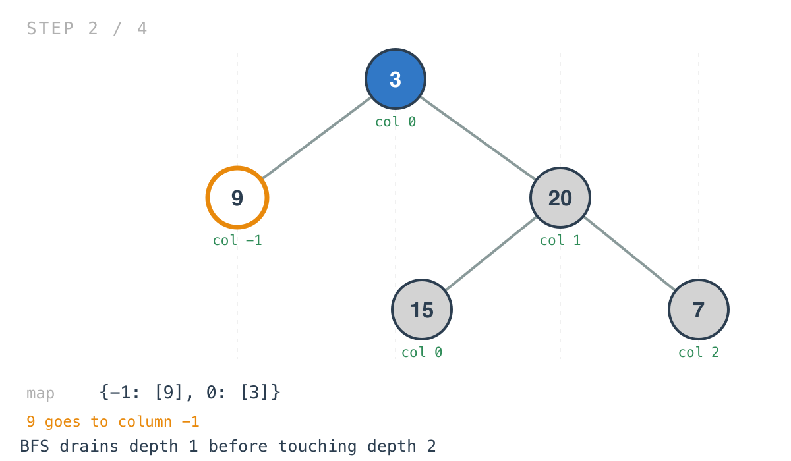
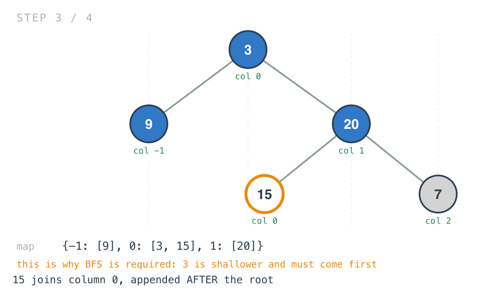
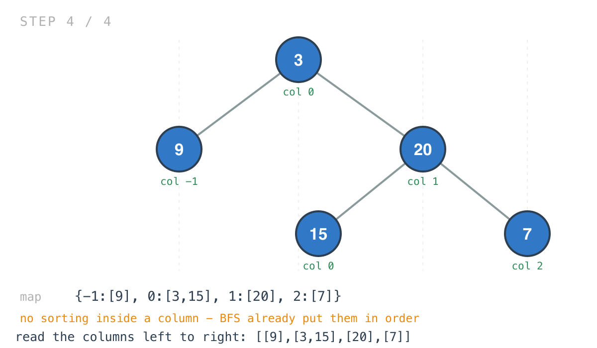

## 365 Days of LeetCode Challenge — Day 74/365

# Binary Tree Vertical Order Traversal

🔗 https://leetcode.com/problems/binary-tree-vertical-order-traversal/ · Difficulty: Medium

### The problem

Return the nodes' values column by column, left to right. Within a column, top to bottom;
among nodes in the same row and column, left to right.



### The intuition

Give every node a column number. The root is column `0`, a left child is one column to the
left of its parent, a right child one to the right. Group by that number and you have the
answer.

That much is a coordinate carried down the traversal, exactly like the depth parameter from
Day 29 — the only difference is that this one can go negative, because columns extend both
ways from the root.

The interesting part is that here the traversal has to be BFS, and Day 29's did not.

Day 29 grouped by depth, and within a level the required order — left to right — came from
recursing into `Left` before `Right`. Arrival order across branches never mattered, so a
depth-first walk worked.

This problem asks for each column top to bottom, and left to right among nodes tied in the
same row. Those are exactly the two orderings a breadth-first walk produces: it visits by
increasing depth, and within a depth, left to right. Append to a column's list as you go
and the list is already correct, with no sorting.

Swap in a DFS and it breaks. A depth-first walk would drive one branch to the bottom before
touching the other, so a deep node in the left subtree would be appended to its column
before a shallow node from the right subtree that belongs above it. Same grouping, wrong
order inside each group.

So the two problems land on opposite answers to the same question, and the deciding factor
isn't the grouping — it's whether the order within a group depends on when nodes are
reached.

### Builds on

- [Day 29: Binary Tree Level Order Traversal](https://github.com/architagr/leetcode_solutions/blob/main/medium_problems/101_200/binary_tree_level_order_traversal/) — grouping by a coordinate carried down the traversal, and the BFS-versus-DFS question that this problem answers the other way

### The solution

```go
func verticalOrder(root *TreeNode) [][]int {
	if root == nil {
		return [][]int{}
	}
	m := make(map[int][]int)
	q := make([]*customNode, 0)
	push := func(n *TreeNode, o int) {
		l, ok := m[o]
		if !ok {
			l = make([]int, 0)
		}
		l = append(l, n.Val)
		m[o] = l
		q = append(q, &customNode{TreeNode: *n, order: o})
	}
	// pop elided
	push(root, 0)

	for len(q) > 0 {
		n := pop()
		if n.Left != nil {
			push(n.Left, n.order-1)
		}
		if n.Right != nil {
			push(n.Right, n.order+1)
		}
	}

	result := make([][]int, 0)
	for i := -101; i <= 101; i++ {
		if l, ok := m[i]; ok {
			result = append(result, l)
		}
	}
	return result
}
```

Tracing `[3,9,20,null,null,15,7]`: root `3` with children `9` and `20`; `20` has children
`15` and `7`. Expected `[[9],[3,15],[20],[7]]`.

`push` does two jobs — it records the value into its column's list and enqueues the node
for expansion — so the map is built at discovery time rather than on pop.





Node `15` is the one that proves the point. It sits in column `0`, the same column as the
root, and must appear after it because it's lower down. BFS reaches `3` at depth 0 and `15`
at depth 2 in that order, so appending as it goes produces `[3, 15]` with no sorting.





One shortcut in the implementation is worth naming: the assembly loop runs `i` from `-101`
to `101`, leaning on the constraint that the tree holds at most 100 nodes, so no column
index can fall outside `[-100, 100]`. Collecting the map's keys and sorting them would be
the version that doesn't depend on the constraint holding.

And `customNode` embeds `TreeNode` by value, so constructing one copies the node. Harmless
here — only `Val` and the child pointers are read, and those pointers still refer to the
real children — but embedding a `*TreeNode` would avoid the copy.

O(n) for the traversal, every node pushed and popped once. The assembly loop is a fixed 203
iterations, O(1) under the constraint. Space is O(n) for the map and the queue.

Full code and the step-by-step walkthrough:
[binary_tree_vertical_order_traversal](https://github.com/architagr/leetcode_solutions/blob/main/medium_problems/301_400/binary_tree_vertical_order_traversal/SOLUTION.md)

#DSA #LeetCode #100DaysOfCode #CodingInterview #BinaryTree #BFS #Golang

---

*Solution and code by Archit Agarwal. Write-up drafted with AI assistance from the code and problem statement.*
