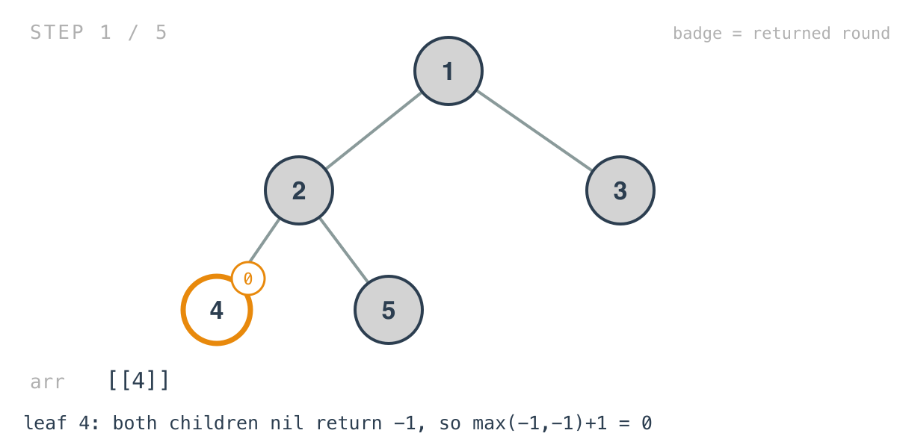
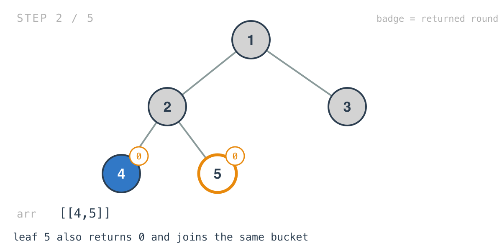
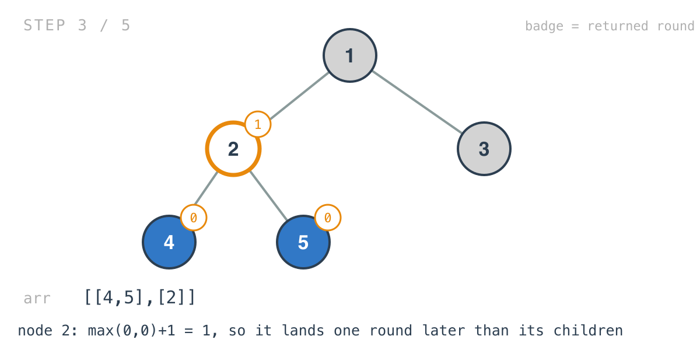
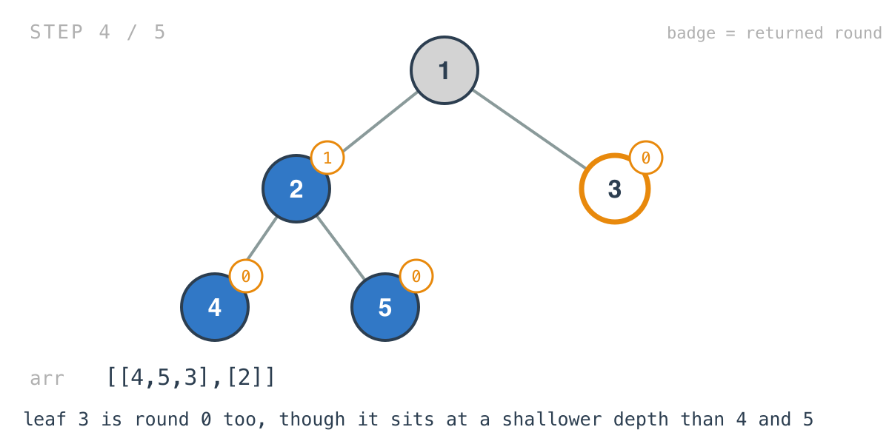
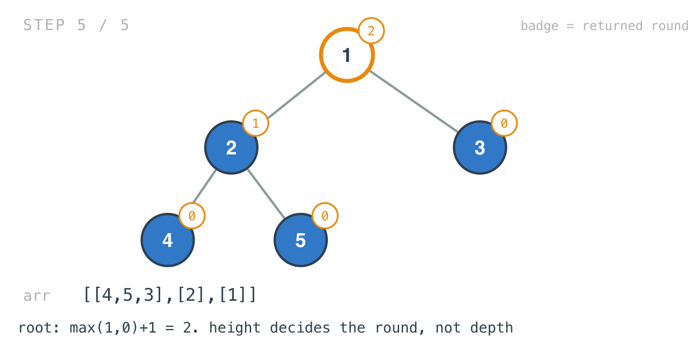

## 365 Days of LeetCode Challenge — Day 24/365

# Find Leaves of Binary Tree

🔗 https://leetcode.com/problems/find-leaves-of-binary-tree/ · Difficulty: Medium

### The problem

Collect the tree's nodes as if you were repeatedly collecting all the leaves and removing
them, until the tree is empty.


### The intuition

The problem describes a process: strip the leaves, strip the new leaves, repeat.
Simulating that literally means walking the whole tree once per round, which is O(n * h).

You don't have to. A node's round is decided before you remove anything, and it isn't the
node's depth.

Every per-level problem in this batch so far grouped nodes by depth from the root — level
order, right side view, level sums. This one groups by the opposite measurement: distance
down to the deepest leaf beneath a node. Its height, not its depth.

A leaf has nothing below it, so it goes in round 0. A node goes in the round after both of
its children have gone, which means its round is one more than the later of the two:

```
round(node) = max(round(left), round(right)) + 1
```

That's a height calculation, computed bottom-up in a single post-order pass. The recursion
returns each node's round to its parent, and on the way past, appends the node's value
into the bucket for that round.

The nil case returns `-1`, not `0`, and that looks off by one until you follow it: a leaf's
two children are both nil, so `max(-1, -1) + 1` is `0`, and leaves land in round 0 where
they belong. Return `0` for nil and every round shifts up by one, leaving an empty bucket
at the front.

### Builds on

- [Day 1: Maximum Depth of Binary Tree](https://github.com/architagr/leetcode_solutions/blob/main/easy_problems/101_200/maximum_depth_of_binary_tree/) — the height recursion this is, with the height put to a different use
- [Day 21: Diameter of Binary Tree](https://github.com/architagr/leetcode_solutions/blob/main/easy_problems/501_600/diameter_of_binary_tree/) — the same post-order shape, where each call returns a height to its parent and does its own work on the way past

### The solution

```go
func findLeaves(root *TreeNode) [][]int {
	arr := make([][]int, 0)
	_ = parse(root, &arr)
	return arr
}

func parse(root *TreeNode, arr *[][]int) int {
	if root == nil {
		return -1
	}
	leftIndex := parse(root.Left, arr)
	rightIndex := parse(root.Right, arr)
	index := maxVal(leftIndex, rightIndex) + 1
	if len(*arr) <= index {
		*arr = append(*arr, []int{})
	}
	(*arr)[index] = append((*arr)[index], root.Val)
	return index
}
```

Tracing `[1,2,3,4,5]`: root `1` with children `2` and `3`; `2` has children `4` and `5`.
Expected `[[4,5,3],[2],[1]]`.

Both children are visited before the current node does anything, and that ordering isn't a
preference — a node's round depends on its children's rounds, so they have to report
first.





It's `max` rather than `min` or a sum, because a node is removed the round after *both* its
children have gone. It waits for the slower side.



Node `3` is where height and depth visibly part company. It sits at depth 1, shallower than
`4` and `5` at depth 2, and still lands in round 0 with them, because it's a leaf.





Two smaller notes. The wrapper discards `parse`'s return value with the blank identifier,
because the round number matters to a parent and not to the caller — the answer accumulated
inside `arr` as a side effect. And `arr` is passed as a `*[][]int` so that growing the outer
slice inside one call is visible to every other; Day 8 solved the same reallocation problem
the other way, by threading the slice through as a return value.

The order within a bucket is whatever the traversal produced, and the problem explicitly
allows that — `[[3,5,4],[2],[1]]` is equally correct — so nothing sorts.

O(n) time, every node visited exactly once. Space is O(h) for the recursion stack plus O(n)
for the output.

Full code and the step-by-step walkthrough:
[find_leaves_of_binary_tree](https://github.com/architagr/leetcode_solutions/blob/main/medium_problems/301_400/find_leaves_of_binary_tree/SOLUTION.md)

#DSA #LeetCode #100DaysOfCode #CodingInterview #BinaryTree #Recursion #Golang

---

*Solution and code by Archit Agarwal. Write-up drafted with AI assistance from the code and problem statement.*
