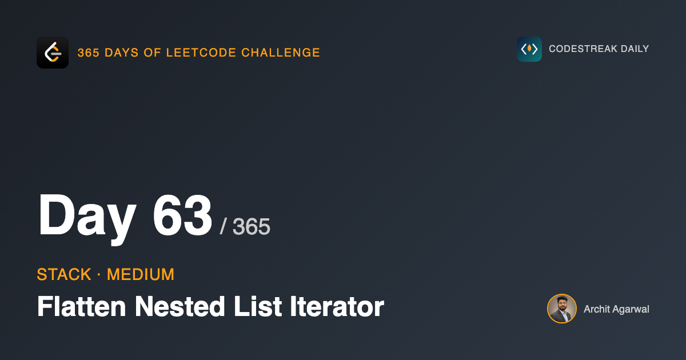
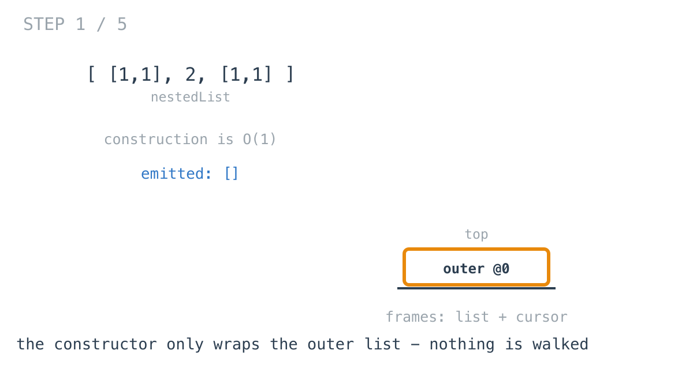
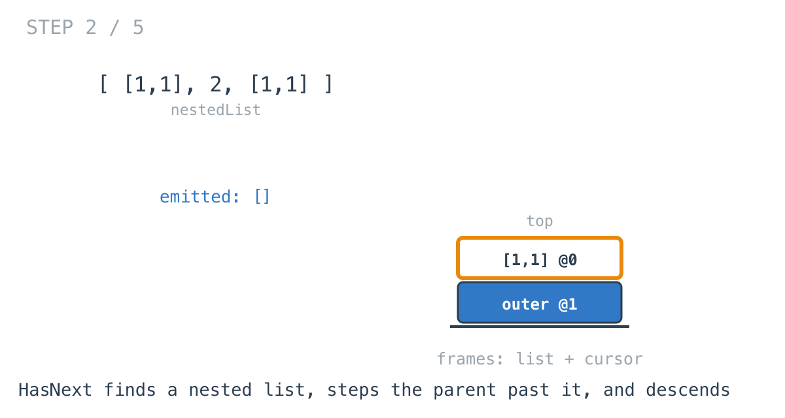
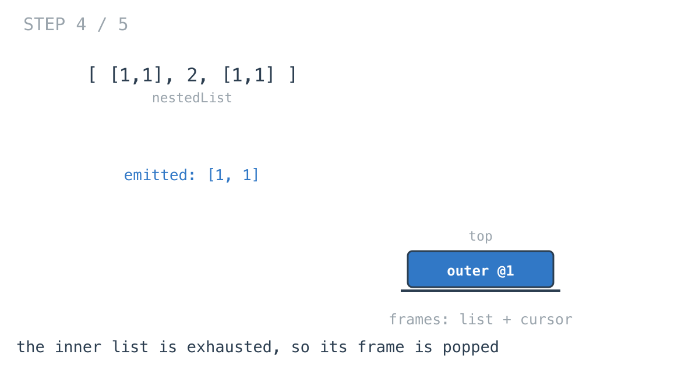
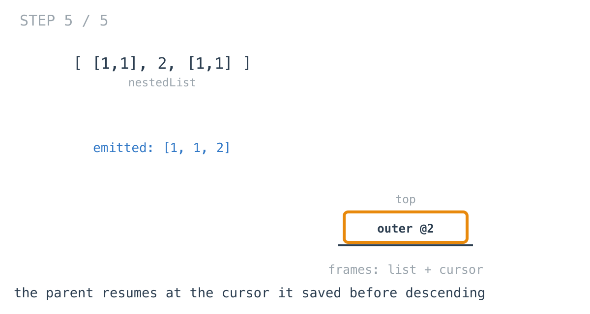

## 365 Days of LeetCode Challenge — Day 63/365

**[341. Flatten Nested List Iterator](https://leetcode.com/problems/flatten-nested-list-iterator/)** (Medium)

Given a nested list of integers, iterate the integers in order.

## The solution that is not an iterator

Walk the whole structure in the constructor, copy every integer into a slice, index it in `Next`.

It returns the right values. It is not an iterator, and that distinction is the entire problem.

A flatten-then-index does all the work up front whether the caller wants one element or all of them, and holds a copy of every integer for the object's lifetime. Fine on a small input; wrong in exactly the situations iterators exist for — a structure too big to copy, or a caller that stops after three elements.

## What an iterator has to do instead

Do nothing until asked, and keep only enough state to resume.

For a nested list, "enough state to resume" is the path from the outer list down to the cursor: which list you are in, and how far into it, at every level of nesting.

```go
type frame struct {
	list []*NestedInteger
	i    int
}
```

A stack of those. Which is exactly what a BST iterator holds — the path from the root to the current node — so day 55 and today are the same design wearing different data.



Construction wraps the outer list and stops. O(1), however deep or wide the structure.

## HasNext is where the work happens

This surprises people. `HasNext` sounds like a passive question, and it is the method that moves the iterator.

```go
for len(this.stack) > 0 {
	top := this.stack[len(this.stack)-1]

	if top.i == len(top.list) {
		this.stack = this.stack[:len(this.stack)-1]
		continue
	}

	item := top.list[top.i]
	if item.IsInteger() {
		return true
	}

	top.i++
	this.stack = append(this.stack, &frame{list: item.GetList()})
}
return false
```

Three cases: a finished list is popped, an integer stops the loop, a nested list is descended into.




Once the cursor is on an integer the loop returns immediately — which is why calling `HasNext` repeatedly is free and consumes nothing.





## The line that prevents an infinite loop

```go
top.i++
this.stack = append(this.stack, &frame{list: item.GetList()})
```

The parent's cursor steps past the nested list **before** descending into it.

Descend first and the parent's cursor still points at the list just entered. When that inner list finishes and its frame is popped, the parent looks at its cursor, sees the same nested list, and descends again. Forever.

Third appearance of one idea in this series. Day 37 sank a grid cell before recursing into its neighbours. Day 42 recorded a cloned node in the map before cloning its neighbours. All three work because the thing is marked as handled *before* it is entered.

## Next positions itself

```go
func (this *NestedIterator) Next() int {
	this.HasNext()
	...
}
```

The problem promises a value exists when `Next` is called. It does not promise `HasNext` was asked first — a caller who knows there are three elements may call `Next` three times directly.

It costs nothing when the cursor is already positioned.

## Complexity

- **Time: O(1)** construction; `Next` amortised O(1) across a full iteration.
- **Space: O(d)**, the nesting depth. Not O(n) — nothing is copied.

## Builds on

- [Day 55: Binary Search Tree Iterator](https://github.com/architagr/leetcode_solutions/blob/main/medium_problems/101_200/binary_search_tree_iterator/) — the same design: a stack holding the path to the cursor, advanced only when the caller asks

Full code and the step-by-step walkthrough:
[flatten_nested_list_iterator](https://github.com/architagr/leetcode_solutions/blob/main/medium_problems/301_400/flatten_nested_list_iterator/SOLUTION.md)

#DSA #LeetCode #Golang #Stack #Iterators #CodingInterview #Algorithms

---

*Solution and code by Archit Agarwal. Write-up drafted with AI assistance from the code and problem statement.*
