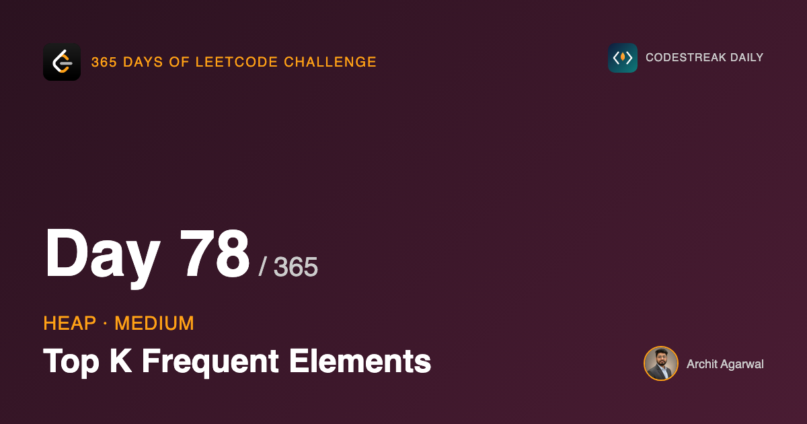
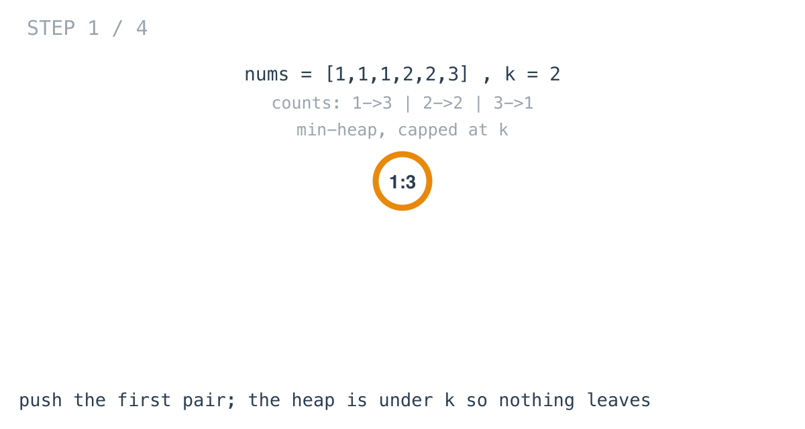
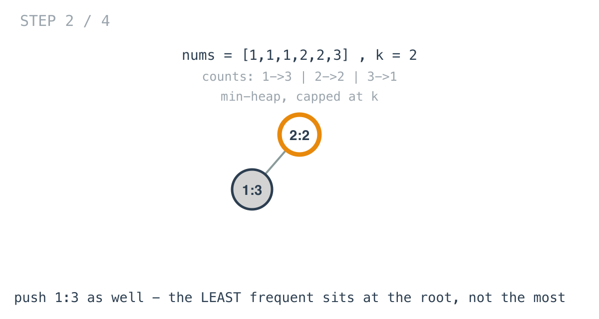
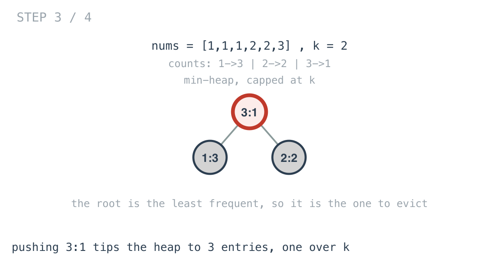
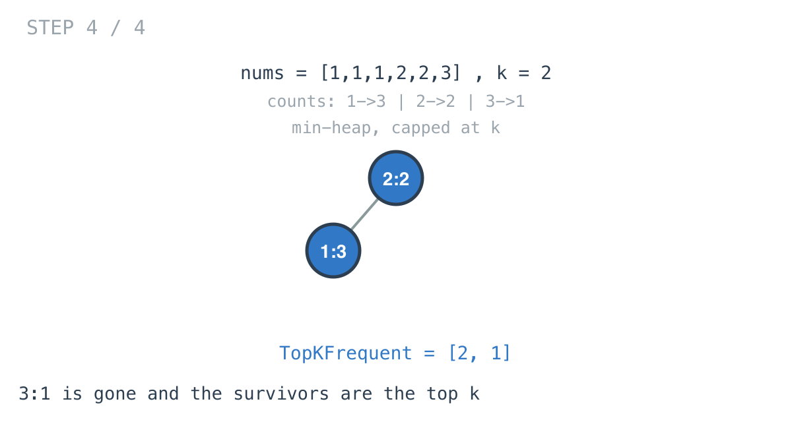

## 365 Days of LeetCode Challenge — Day 78/365

**[347. Top K Frequent Elements](https://leetcode.com/problems/top-k-frequent-elements/)** (Medium)

Return the `k` most frequent values in an array, in any order.

## Two steps, one decision

**Count.** A map from value to occurrences. O(n), unavoidable, nothing to decide.

**Select the top k by count.** All the interest is here.

## Why not sort the counts

Build a slice of `(value, count)`, sort by count, take the first k. Correct, and O(d log d) in the number of distinct values.

The follow-up on the problem page asks explicitly for better than O(n log n), which rules it out when d approaches n.

And the day 77 objection applies again: sorting computes a total ordering when only the top k is wanted. The 7th most frequent element gets its position worked out and then discarded.

## The heap, capped at k

```go
heap.Push(h, entry{ele: ele, count: count})
if h.Len() > k {
	heap.Pop(h)
}
```

Push, and if that tips the heap over k, evict. Every operation runs on a heap of at most k entries, so this is **O(d log k)**.







## The line that does the work

```go
func (h minHeap) Less(i, j int) bool { return h[i].count < h[j].count }
```

It compares `count`, not `ele` — the heap is ordered by frequency and the value is cargo.

And it is `<`, not `>`. Day 76 got a max-heap by writing `>` and lying to `container/heap`. Here the honest `<` is what is wanted, and **this is the problem where that choice earns its keep.**

## Why a min-heap when you want the most frequent

It reads backwards every time. Day 77 stated the rule; today is where getting it wrong costs you.

Ask what the structure has to do on each arrival: decide which incumbent the new entry displaces.

The one displaced is always **the least frequent of those currently kept** — the weakest member, the one on the boundary. So that is the entry you need instant access to, which means it must be at the root, which makes it a min-heap.

A max-heap of size k holds the *most* frequent at the root. That entry is in no danger at all, and finding the one to evict would mean scanning — O(k), which throws away the reason for using a heap.



Get this backwards and nothing crashes. It silently returns the k **least** frequent elements.

## The output order

Draining a min-heap gives ascending frequency, so the least frequent of the top k comes out first. The problem accepts any order, so it is returned as it comes.

Worth noticing: tomorrow's problem **does** specify an order, and that one difference changes which tool fits.

## Complexity

- **Time: O(n + d log k)**. Counting, then d operations on a heap of size at most k.
- **Space: O(d)** for the counts, O(k) for the heap.

## Builds on

- [Day 77: Kth Largest Element in an Array](https://github.com/architagr/leetcode_solutions/blob/main/medium_problems/201_300/kth_largest_element_in_an_array/) — the size-k min-heap that day named but did not use, applied here to frequencies rather than values

Full code and the step-by-step walkthrough:
[top_k_frequent_elements](https://github.com/architagr/leetcode_solutions/blob/main/medium_problems/301_400/top_k_frequent_elements/SOLUTION.md)

#DSA #LeetCode #Golang #Heap #PriorityQueue #CodingInterview #Algorithms

---

*Solution and code by Archit Agarwal. Write-up drafted with AI assistance from the code and problem statement.*
